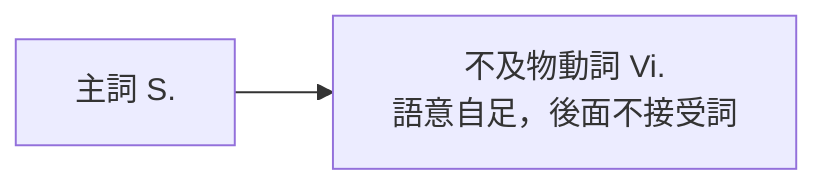

---
tags:
  - 文法/句型
  - 句型公式
book: 圖表解構英文文法
chapter: 01 五大句型
page: 13
difficulty: ⭐
status: 學習中
review: []
related:
  - "[[02 主詞＋不及物動詞＋主詞補語]]"
---

# 句型 1：主詞 + 不及物動詞（S. + Vi.）

> [!IMPORTANT]
> **一句話核心**
> 不及物動詞（Vi.）本身語意就完整，**後面不接受詞**，主詞＋動詞就是一個完整句子。

## 📊 圖表解構

| 縮寫 | 詞性 | 說明 |
| --- | --- | --- |
| S. | 主詞 | 動作者 |
| Vi. | 不及物動詞（intransitive） | 可單獨存在、不需接受詞，又稱「**完全不及物動詞**」 |

## 🎯 核心觀念
- Vi. 後面**不接受詞**，句子就成立：`She smiled.`
- 可在動詞後加**修飾語**（副詞、介系詞片語）讓句子更豐富，但**句型不變**。
- 有些「片語式動詞」整組當 Vi. 用，其後一樣不接受詞。

## 📐 用法規則
**1-1　片語式動詞當 Vi.（其後不接受詞）**

| 片語 | 意思 | 片語 | 意思 |
| --- | --- | --- | --- |
| break down | 故障 | set out | 出發 |
| calm down | 冷靜 | settle down | 安頓 |
| give up | 放棄 | sit down | 坐下 |
| dress up | 盛裝打扮 | stand up | 站起來 |
| get up | 起床 | stay up | 熬夜 |
| go off | （鬧鐘）響、爆炸 | look out | 小心 |

**1-2　加修飾語**：`S. + Vi. + 修飾語（副詞／介系詞片語）`

## ✏️ 例句
| 英文例句 | 中文翻譯 | 重點 |
| --- | --- | --- |
| She **smiled**. | 她笑了。 | 最單純的 S.+Vi. |
| The children **play**. | 孩子們在玩耍。 | 後面不接受詞 |
| The students **stood up**. | 學生們站了起來。 | 片語式動詞當 Vi. |
| The firecrackers **went off**. | 鞭炮爆了。 | go off＝爆炸 |
| The children **played** *happily in the yard*. | 孩子們在庭院愉快地玩耍。 | Vi.＋修飾語 |

## ⚠️ 易錯點分析　💬 AI 補充
*（書中句型 1 未列易錯，以下為 AI 依常見錯誤補充）*

> [!WARNING]
> **把 Vi. 後的修飾語誤當受詞**
> `played happily` 的 happily 是副詞（修飾語），不是受詞——句型仍是 S.+Vi.。

> [!WARNING]
> **常見 Vi. 要接受詞須加介系詞**
> - ❌ listen ~~the music~~ → ✅ listen **to** the music
> - ❌ wait ~~me~~ → ✅ wait **for** me
> **為什麼：** listen／wait／look 是不及物動詞，接對象要靠介系詞。

## 🔗 延伸與對比
- 若動詞後需要「補充說明主詞」的字，就進到 [[02 主詞＋不及物動詞＋主詞補語]]（連綴動詞）。

## 🧠 自我測驗　💬 AI 補充
*（以下題目由 AI 出題，非書本內容）*

- [ ] Q1：判斷句型 — The old man sat down slowly.
- [ ] Q2：改錯 — Please listen me carefully.

✅ 解答

A1：S. + Vi.（sat down 片語式 Vi.，slowly 為修飾語）
A2：Please **listen to** me carefully.

