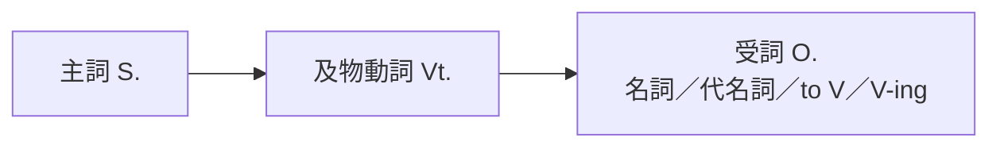

---
tags:
  - 文法/句型
  - 句型公式
  - 對比辨析
  - 易錯點
book: 圖表解構英文文法
chapter: 01 五大句型
page: 16
difficulty: ⭐⭐
status: 學習中
review: []
related:
  - "[[02 主詞＋不及物動詞＋主詞補語]]"
  - "[[04 主詞＋及物動詞＋間接受詞＋直接受詞]]"
---

# 句型 3：主詞 + 及物動詞 + 受詞（S. + Vt. + O.）

> [!IMPORTANT]
> **一句話核心**
> 及物動詞（Vt.）後面**一定要接受詞**，句意才完整，又稱「完全及物動詞」。

## 📊 圖表解構

## 🎯 核心觀念
- Vt. 一定要有受詞承接動作：`I love you.`
- 受詞的形式很多元：名詞、代名詞、**不定詞片語（to V）**、**動名詞片語（V-ing）**。
- 片語動詞當 Vt. 時分兩種：**可分離**與**不可分離**。

## 📐 用法規則
**3-1　片語式動詞（Vt.）**

**❶ 可分離**：`動詞 + 介副詞 + 受詞` 或 `動詞 + 受詞 + 介副詞`
- 受詞若是**代名詞**，⭐**只能放中間**。
- 例字：turn on、call up、bring back、carry out、find out、give up、look up、put on、throw out、try on、use up、write down

**❷ 不可分離**：`動詞 + 介系詞 + 受詞`（不可拆開）
- 例字：come across、care about、look after、look for、look down on、get on、run into、talk about、think about、wait for、call on、end up

**3-2　動詞片語**：`及物動詞 + 名詞 + 介系詞 + 名詞／動名詞`
- make use of（利用）、take advantage of（利用、佔便宜）、take care of（照顧）、take a look at（看一看）

## ✏️ 例句
| 英文例句 | 中文翻譯 | 受詞類型 |
| --- | --- | --- |
| Toby **ate** everything on his plate. | 托比把盤裡的都吃光了。 | 名詞片語 |
| Vicky never **remembers** to turn off the lights. | 薇琪從不記得關燈。 | 不定詞片語 |
| Thomas **considered** looking for a new job. | 湯瑪斯考慮找新工作。 | 動名詞片語 |
| The secretary **looked up** the phone number. | 秘書查了電話號碼。 | 可分離片語動詞 |
| The archaeologists **came across** a ruined city. | 考古學家偶然發現一座廢城。 | 不可分離片語動詞 |
| Con artists **take advantage of** people's kindness. | 詐騙者利用人的善心。 | 動詞片語 |

## ⚠️ 易錯點分析
> [!WARNING]
> **錯誤 1：可分離片語動詞 + 代名詞，代名詞必須放中間**
> - ❌ put on ~~it~~ → ✅ put **it** on
> - ❌ turn on ~~it~~ → ✅ turn **it** on

> [!WARNING]
> **錯誤 2：不可分離片語動詞不可拆開**
> - ❌ ~~look the children after~~ → ✅ look after the children ✅ look after **them**

## 🔗 延伸與對比
- 可分離 vs 不可分離：`look up it`（可分離要拆→ look **it** up）／ `look after them`（不可分離不拆）。
- 動詞後接 to V 還是 V-ing 意思常不同 → 見 [[08 不定詞/README|不定詞]]、[[09 動名詞/README|動名詞]]。

## 🧠 自我測驗　💬 AI 補充
*（以下題目由 AI 出題，非書本內容）*

- [ ] Q1：改寫（代名詞）— She tried on the dress. → She tried ___ ___.
- [ ] Q2：可分離或不可分離 — I will look after the baby. 能否說 look the baby after？

✅ 解答

A1：tried **it** on（可分離＋代名詞放中間）
A2：不行。look after 為不可分離片語動詞，受詞須放在後面。

