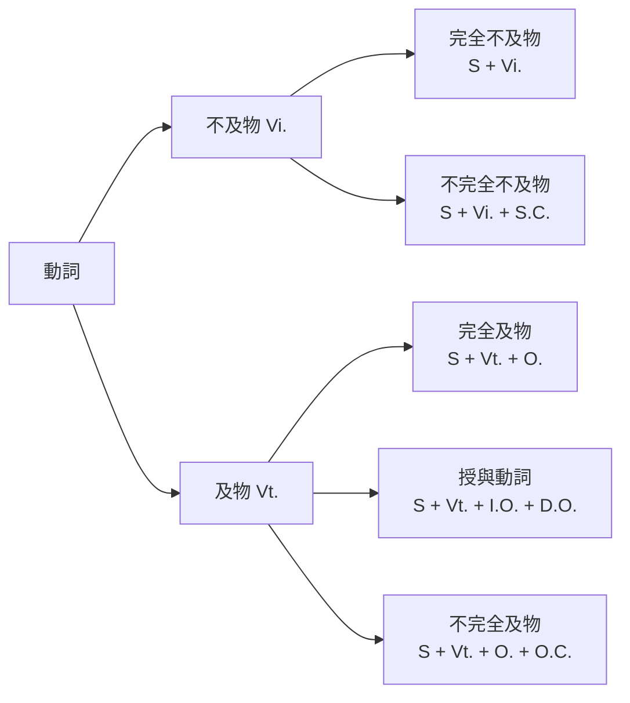

---
tags:
  - 章節索引
  - 文法/句型
book: 圖表解構英文文法
chapter: 01 五大句型
page: 11
---

# 第一章　五大句型

> [!NOTE]
> **本章導讀**
> 所有英文句子都是這五種基本結構的變化。關鍵：先分清動詞是「及物 / 不及物」，再看它需不需要「補語」。

## 🧱 本章基礎：句型符號
| 縮寫 | 名稱 | 說明 |
| --- | --- | --- |
| S. | 主詞 | 動作者 |
| Vi. | 不及物動詞 | 後不接受詞 |
| Vt. | 及物動詞 | 後須接受詞 |
| S.C. | 主詞補語 | 補充說明「主詞」 |
| O.C. | 受詞補語 | 補充說明「受詞」 |
| O. | 受詞 | 動作接受者 |
| I.O. | 間接受詞 | 通常是「人」 |
| D.O. | 直接受詞 | 通常是「物」 |

## 📊 五大句型一覽
| 句型 | 公式 | 例句 |
| --- | --- | --- |
| 1 | S. + Vi. | She smiled. |
| 2 | S. + Vi. + S.C. | He is a good teacher. |
| 3 | S. + Vt. + O. | I love you so much. |
| 4 | S. + Vt. + I.O. + D.O. | He shows me his new wallet. |
| 5 | S. + Vt. + O. + O.C. | The gifts make me very happy. |

## 🎯 重點整理：動詞分類（判斷句型的鑰匙）

## 小節導航
| # | 主題 | 頁碼 | 狀態 |
| --- | --- | --- | --- |
| 1 | [[01 主詞＋不及物動詞]] | 13 | ⬜ |
| 2 | [[02 主詞＋不及物動詞＋主詞補語]] | 14 | ⬜ |
| 3 | [[03 主詞＋及物動詞＋受詞]] | 16 | ⬜ |
| 4 | [[04 主詞＋及物動詞＋間接受詞＋直接受詞]] | 19 | ⬜ |
| 5 | [[05 主詞＋及物動詞＋受詞＋受詞補語]] | 21 | ⬜ |

## ⚠️ 本章易錯點速覽
- 連綴／感官動詞後接**形容詞**不是副詞：tastes **good**（✅）／tastes ~~well~~。
- 可分離片語動詞 + **代名詞**受詞要放中間：put **it** on（✅）。
- 授與動詞改寫的介系詞：give→**to**、buy→**for**；cost/envy/wish **不可**改寫。
- 「視為」動詞要加 **as**：regard him **as** a hero；但 consider/think 不加 as。

## 學習驗收
- [ ] 完成書中「學習驗收」練習（p. 25）
- [ ] 錯題回填到對應主題筆記的 ⚠️ 區塊

## 相關
- [[01 圖表解構英文文法/README|回全書目錄]]
