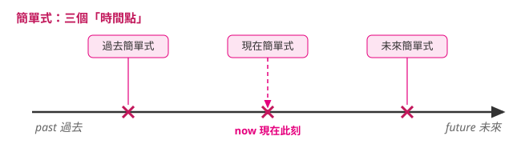
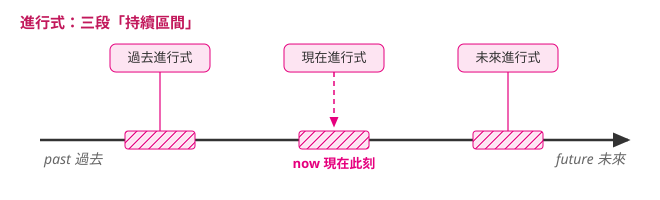
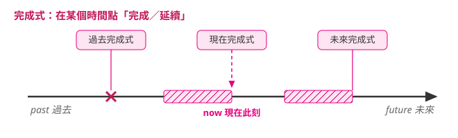
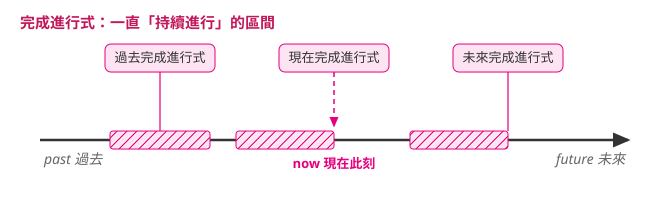

---
tags:
  - 文法/時式
  - 句型公式
  - 圖表
page: 27
difficulty: ⭐
status: 未讀
related: []
---

# 本章總覽　時式

> [!IMPORTANT]
> **一句話核心**
> 十二種時式＝「時間（現在／過去／未來）」×「動作形式（簡單／進行／完成／完成進行）」的組合；先定時間，再定動作形式，就能拼出任何一格。

## 📊 認識英文動詞時態

| 分類角度 | 分出的類別 |
| --- | --- |
| 因**時間**不同而分 | 現在式、過去式、未來式 |
| 因**動作形式**不同而分 | 簡單式、進行式、完成式、完成進行式 |

> 因「時間」和「動作形式」不同，而組成的十二種變化，就稱為動詞的時式。

## 🗂️ 十二時式一覽（以 He + write 為例）

| 動詞時式 | 現在式 | 過去式 | 未來式 |
| --- | --- | --- | --- |
| **簡單式** | He **writes**. | He **wrote**. | He **will write**. |
| **進行式** | He **is writing**. | He **was writing**. | He **will be writing**. |
| **完成式** | He **has written**. | He **had written**. | He **will have written**. |
| **完成進行式** | He **has been writing**. | He **had been writing**. | He **will have been writing**. |

## 1️⃣ 簡單式

| 時態 | 結構公式 | 說明 |
| --- | --- | --- |
| 現在簡單式 | V. ／ V-s、V-es（第三人稱單數） | 表習慣性的事情。 |
| 過去簡單式 | V-ed | 表過去發生的事情。 |
| 未來簡單式 | will／shall ＋ 原形動詞；be going to ＋ 原形動詞 | 表未來發生的事情。 |

- 現在：Michelle often **cooks** dinner for her family. 米雪兒常煮晚餐給家人吃。
- 過去：He **ordered** a pizza for dinner last night. 他昨天晚上點了一份披薩當作晚餐。
- 未來：Nobody can tell what **will happen** in the future. 沒有人能預測將來會發生什麼事情。

### 🕒 時間軸

> 圖例：`✕` 代表**一個時間點**（簡單式）、斜線陰影長條代表**持續區間**（進行、完成、完成進行）；`now` 虛線是「說話當下」。

## 2️⃣ 進行式

| 時態 | 結構公式 | 說明 |
| --- | --- | --- |
| 現在進行式 | am／is／are ＋ V-ing | 現在的某一個時間點，正在持續進行的動作。 |
| 過去進行式 | was／were ＋ V-ing | 過去的某一個時間點，持續進行的動作。 |
| 未來進行式 | will be／shall be ＋ V-ing | 未來的某一個時間點，持續進行的動作。 |

- 現在：**I'm reading** a storybook. 我正在看故事書。
- 過去：He **was working** at McDonald's at that time. 那段時間他正在麥當勞工作。
- 未來：The band **will be performing** on this coming Saturday and Sunday. 這支樂團將在這星期六和星期天表演。

### 🕒 時間軸

## 3️⃣ 完成式

| 時態 | 結構公式 | 說明 |
| --- | --- | --- |
| 現在完成式 | has／have ＋ p.p. | 動作從過去開始，一直延續到現在（說話當下）所完成的動作或經驗。 |
| 過去完成式 | had ＋ p.p. | 搭配過去式一起使用，較早發生的用過去完成式，較晚發生的則用過去簡單式。 |
| 未來完成式 | will／shall ＋ have ＋ p.p. | 表示在未來某個時間點之前會完成的動作，常配合表未來時間的時間副詞或子句。 |

- 現在：Ed **has been** off work since last Thursday. He **has been** sick for a whole week! 艾德上星期四之後就沒來上班了。他已經病了整整一個星期！
- 過去：Dad **had finished** his dinner by the time I **got** home. 爸爸在我到家前就吃完晚餐了。（`had finished` 較早發生；`got` 較晚發生）
- 未來：By the time we get there, he **will have** already **left**. 我們到那裡之前，他將已經離開了。

### 🕒 時間軸

## 4️⃣ 完成進行式

| 時態 | 結構公式 | 說明 |
| --- | --- | --- |
| 現在完成進行式 | has／have ＋ been ＋ V-ing | 表示發生在過去的動作一直延續到現在，且現在仍正在進行的動作。 |
| 過去完成進行式 | had been ＋ V-ing | 過去某動作在過去某個時間點之前就已經在進行，並配合另一個過去簡單式的動作。 |
| 未來完成進行式 | will／shall ＋ have been ＋ V-ing | 未來的動作在未來某個時間點會完成前一直持續，並配合另一個表未來的時間點。 |

- 現在：He **has been studying** Russian for five years. 他學俄文已經持續五年了。
- 過去：Before he went to college, he **had been working** as a lifeguard. 他在上大學之前，已經在當救生員了。
- 未來：By the end of the month, this power plant **will have been producing** power for six years. 到這個月底，這座發電廠將持續生產電力六年了。

### 🕒 時間軸

## 相關
- [[01 圖表解構英文文法/02 時式/README|回本章目錄]]
