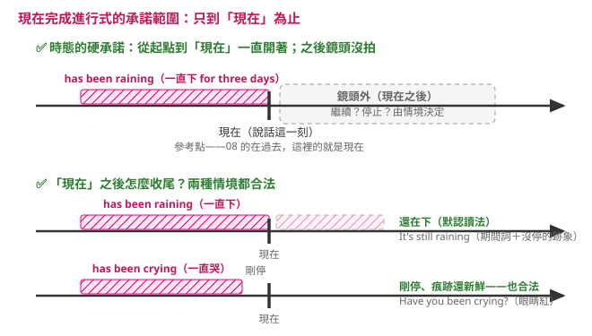

---
tags:
  - 文法/時式
  - 句型公式
  - 對比辨析
  - 圖表
page: 39
difficulty: ⭐⭐
status: 已複習
related:
  - "[[03 現在完成式]]"
  - "[[02 現在進行式]]"
---

# 現在完成進行式

> [!IMPORTANT]
> **一句話核心**
> 結構 **主詞＋have／has been＋V-ing**（＝完成式 have＋p.p. 疊上進行式 be＋V-ing）；表示過去開始、一直延續到現在的動作，特別**強調持續性**，中文常用「一直在……」。

## 🧭 心智圖

```markmap
# 現在完成進行式
## 結構：have／has been ＋ V-ing
- 完成式（have＋p.p.）＋ 進行式（be＋V-ing）
### 肯定 → have／has been ＋ V-ing
- This statue **has been standing** for one thousand years.
### 否定 → haven't／hasn't been ＋ V-ing
### 疑問 → Have／Has ＋ 主詞 ＋ been ＋ V-ing
## 用法
### 4-1 過去延續到現在（強調持續，「一直在…」）
- I've **been looking** for the exit ever since I got here.
### 4-2 強調事情的持續性
- 持續意味的動詞：live／sleep／study／rain／work
- He **has been studying** for the past week.
### 4-3 常配 for／since
- She **has been practicing** yoga for five years.
## 對比：完成式 vs 完成進行式
### It has rained.（可能已停）↔ It has been raining.（現在還在下）
```

## 📊 圖表解構

> 範例：**This statue**（S.）**has been standing**（have／has been ＋ V-ing）for one thousand years.

完成進行式結合了**完成式**（have ＋ p.p.）和**進行式**（be ＋ V-ing），即為：

```
   have ＋ p.p.
＋         be ＋ V-ing
─────────────────
   have ＋ been ＋ V-ing
```

| 句型 | 結構 |
| --- | --- |
| 肯定句 | 主詞 ＋ have／has ＋ been ＋ V-ing |
| 否定句 | 主詞 ＋ have／has ＋ not been ＋ V-ing<br>主詞 ＋ haven't／hasn't ＋ been ＋ V-ing |
| 疑問句 | Have／Has ＋ 主詞 ＋ been ＋ V-ing？<br>Haven't／Hasn't ＋ 主詞 ＋ been ＋ V-ing？ |

## 📐 用法規則（現在完成進行式用於下列情況）

### 4-1　表示發生在過去的事一直延續到現在（類似「現在完成式」）
現在完成進行式尤其**強調這件事情的持續性**，或是說話當下那個動作在進行，中文通常會用「一直在……」來表示。

> Ex.
> - I've **been looking** for the exit ever since I got here. 我從到這裡就一直在找出口。
> - This statue **has been standing** for one thousand years. 這座雕像已經矗立了一千年。

#### 🔍 比較：現在完成式 vs 現在完成進行式

| 例句 | 語意（說話當下） |
| --- | --- |
| I **have lived** in Tainan for about 20 years, but I'll move to Taipei next month.<br>我已經在台南住了大約二十年，但我下個月要搬去台北了。 | 已經住了二十年，但**即將不住**在這裡 |
| I **have been living** in Tainan for about 20 years.<br>我在台南住了大約二十年。 | 之後**還繼續住**在這裡 |
| It **has rained** for three days.<br>雨已經下了三天。 | 說話時雨**已經停了** |
| It **has been raining** for three days.<br>雨一連下了三天。 | 說話時雨**還在下** |

> [!TIP]
> **💬 AI 補充｜這個時態保證到哪裡——只保證「到現在為止一直在進行」**
>
> 上表把 have been living 那格寫成「之後**還繼續住**」，很容易讀成「這個時態規定了以後也會繼續」。**它沒有規定。** 一句話就驗證得出來：
>
> - I **have been living** in Tainan for 20 years, **but I'm moving to Taipei next month.** 我在台南住了二十年，但我下個月要搬去台北。
>
> 這句英文完全正常、母語者天天在講。如果「之後還繼續住」真是 have been living 的意思，後半句「我要搬走了」就會跟前半句前後矛盾——但它不矛盾，所以那個意思**不是這個時態給的**。
>
> **那上表第一行的「即將不住」又是哪來的？** 是句尾 **but I'll move to Taipei next month** 白紙黑字寫出來的，不是 have lived 變出來的：把那半句刪掉，`I have lived in Tainan for 20 years.` 完全沒有要搬走的意思。**上表兩行的差別有一半來自那半句 but，不是兩個時態的對比**——這是那張表最容易誤導人的地方。
>
> 
>
> - **一定成立的部分**：從動作開始到「現在」（說話這一刻），動作一路都在進行。
> - **它沒有說的部分**：現在之後還做不做，這個時態沒有規定，要看句子的情境。
> - **那「還在下／還繼續住」是怎麼冒出來的？** 因為這個時態強調動作到說話這一刻還在跑，人自然會多猜一句「那應該還會繼續吧」。那是合理的猜測，不是文法的保證——Your eyes are red. **Have you been crying?**（哭已經停了、痕跡還新鮮）就證明「剛停」也是合法讀法。
>
> **兩個時態真正的差別**（兩句都同意「到現在為止住了二十年」）：
>
> | 句子 | 它強調的是 |
> | --- | --- |
> | I **have been living** in Tainan for 20 years. | 「住」這個動作一路進行到說話這一刻，**現在還住著** |
> | I **have lived** in Tainan for 20 years. | **到目前為止累積了二十年**，沒有特別說此刻還住不住——所以後面接「但我要搬走了」不衝突 |
>
> 💡 **上表該怎麼讀**：照它自己的欄名「語意（**說話當下**）」讀——have been living 那格的正解是「說話當下人還住在台南」；「之後還繼續住」是課本順帶多寫的猜測，不是規則。
>
> **規則是單向的**：中翻英想說「還在進行」→ **必選** have been V-ing（下方錯題回填的鐵則照舊）；反過來英翻中讀到 have been V-ing，只能確定「一路做到現在／剛剛」，**別自動補「而且會繼續」**。
>
> 檢查法一句話：**問「說話這一刻，動作還在做嗎？」還在做 → have been V-ing；「之後還做不做」這個時態沒有規定。**

### 4-2　強調事情的持續性
帶有「持續」意味的動詞，如：live、sleep、study、rain、work 等，常用完成式或完成進行式來表示。

> Ex.
> - He **has been studying** for the past week to get ready for the big test. 過去這個星期他一直在讀書準備大考。

### 4-3　和現在完成式一樣，常會和 for、since 等搭配使用
> Ex.
> - She **has been practicing** yoga for five years. 她練瑜伽已經持續五年了。
> - She **has been performing** since she graduated from college. 她從大學畢業後就一直在表演。

## ✏️ 例句

| 英文例句 | 中文翻譯 | 對應用法 |
| --- | --- | --- |
| This statue **has been standing** for one thousand years. | 這座雕像已經矗立了一千年。 | 4-1 延續至今 |
| I've **been looking** for the exit ever since I got here. | 我從到這裡就一直在找出口。 | 4-1 延續至今 |
| He **has been studying** for the past week to get ready for the big test. | 過去這個星期他一直在讀書準備大考。 | 4-2 強調持續 |
| She **has been practicing** yoga for five years. | 她練瑜伽已經持續五年了。 | 4-3 配 for |
| She **has been performing** since she graduated from college. | 她從大學畢業後就一直在表演。 | 4-3 配 since |

## ⚠️ 易錯點分析　💬 AI 補充
> [!WARNING]
> **常見錯誤**
> - ❌ This statue ~~has been stand~~ for…　✅ This statue **has been standing** for…（結構是 have been ＋ **V-ing**，不是原形）
> - ❌ He ~~has being~~ studying.　✅ He **has been** studying.（中間是 been，不是 being）
> - ❌ I **have been knowing** her for years.　✅ I **have known** her for years.（靜態動詞不用進行，改用現在完成式）
>
> **為什麼錯：** 完成進行式＝「have／has ＋ **been** ＋ V-ing」三段固定；它強調「動作還在持續」，所以只搭配有持續意味的動態動詞。想表達「動作可能已結束、只看結果」時，用現在完成式（見 4-1 比較表：has rained ↔ has been raining）。

> [!WARNING]
> **💬 診斷卷錯題回填**（時式診斷卷（一）A7／D1 挖出的錯點，2026-07-28）

**① 「還在進行」要用完成進行式；完成式含「動作可能已停」（A7、D1，一卷中兩次）**
- ❌ The kids **have watched** TV for three hours, and they are still watching.／把「說話當下雪還在下」判給 It has snowed。
- ✅ The kids **have been watching** TV for three hours…／還在下的是 It **has been snowing** for two days.
- 為什麼：兩式都是「過去開始、與現在有關」，分水嶺只有一題——**說話當下還在不在做？**還在做 → have been V-ing；只講結果、動作可能已停 → have p.p.（4-1 比較表）。中文「已經下了兩天」兩種情境都能講，靠翻譯語感必踩雷，要直接問那一題。
- ⟨2026-07-31 檢核三 3b⟩ **原樣又中，而且是同一個動詞類型**
  - 題目：外面已經下了三個小時的雨。
  - ❌ `It **has rained** for three hours.`
  - ✅ `It **has been raining** outside for three hours.`
  - 跟上面的雪那句是同一個判斷：`has rained` ＝ 下過三小時、**可能已經停了**；「已經下了三個小時的雨」講的是**還在下**。中文兩種情境用同一句話，所以**必須自己問那一題**：說話當下還在不在做？
  - ⚠️ **這次還有連帶損失**：本題原本要考的是 `rain → rain**i**ng`（長音 ai 不雙寫，對照 plan → pla**nn**ing），你用 has rained 避開了 V-ing，那個拼字考點就沒測到。同批 3a 的 planning 寫對了，raining 那一面還是空的。
- 一句話記：**句中有 still／還在 → been V-ing；-ing ＝ 畫面還在動**。

> [!WARNING]
> **💬 檢核錯題回填**（7/30 每日檢核挖出的錯點，2026-07-30）

**② 第三段是 V-ing、不是 p.p.——been 後接 p.p. 是被動的模板（檢核 C4）**
- ❌ The meeting **has been lasted** more than an hour.
- ✅ 會議已散、敘述「持續了多久」→ The meeting **lasted** more than an hour.（真要說「還在開」才輪到 has been last**ing**）
- 為什麼：完成進行式三段固定「have／has ＋ been ＋ **V-ing**」；been 後面接 p.p. 是「完成式被動」（has been built）的模板。改錯時沒找到真錯（a hour → an hour）、又想把時態「升級」，兩個模板就撞成 has been lasted 這種混種。
- 一句話記：**been 之後——自己動的用 -ing，被動的才用 p.p.**。

> [!WARNING]
> **💬 學習驗收錯題回填**（章末學習驗收（二）III-4 挖出的錯點，2026-07-30）

**③ for the past ten minutes 是「算到現在為止」——不能用過去簡單式（驗收（二）III-4）**
- ❌ The announcer on the radio **talked** about it for the past ten minutes.
- ✅ The announcer on the radio **has been talking** about it for the past ten minutes. 廣播上的主播談這件事已經談了過去這十分鐘。
- 為什麼：`the past ten minutes` 指的是從十分鐘前一路算到說話當下，這段時間的末端就落在現在，所以不能用過去簡單式（那個時態講的是與現在無關的過去）。而且下一句 The band is getting back together 顯示主播還在播報，動作到說話這一刻還在跑 → has been talking。`for the past week`／`for the past few years` 正是 4-2 的招牌片語。
- ⚠️ **同一份驗收裡（二）要填完成進行式的空格共四格，四格全倒**：現在（本題）、過去（I-6 had been watching、I-10 had been burning）、未來（II-6 will have been playing）。而同一份卷子（一）單一選擇題裡的五題完成進行式**全部答對**——其中第 20 題的答案就是 had been watching，跟 I-6 該填的字**一模一樣**。⚠️ 但**這不等於「選擇題就沒問題」**：同卷（三）克漏字 I-4 也是選擇題，照樣倒了（見 ④）。真正的分界不在題型，在**信號是明碼還是要自己推**。
- 一句話記：**for the past …／for ＋ 一段時間，而且到現在還在做 → has／have been V-ing；過去簡單式直接出局。**

**④ 信號不是明碼、要從上下文推時，就抓不到完成進行式（驗收（三）I-4）**
- ❌ John is working now as a lawyer. He started at Hollis & Thompson two years ago, and he **worked** steadily…
- ✅ … and he **has been working** steadily, and even assisted on several big cases already. 他兩年前進 Hollis & Thompson，一直穩健地工作，甚至已經協助過好幾件大案子。
- 為什麼：這題**沒有 for ＋ 一段時間、也沒有 since**，判斷全靠上下文——前一句已經寫明 `John **is working now** as a lawyer`（他現在還在做），再加上 already（3-2 的招牌副詞）：起點在兩年前、終點在現在、動作沒停 → has been working。填 worked 等於把「工作」關進過去、與現在切斷，跟前一句自相矛盾。
- ⚠️ **這一格劃出了真正的分界線**：信號是**明碼**（for ＋ 一段時間、since）時幾乎全對（一-4 since this morning、一-16 since it opened、三 I-1 for three years now）；信號**要從上下文推**時就倒（本題）。同一段裡隔兩格的 I-1 你選對了，差別只在它寫著 for three years now。缺的是「**沒有招牌片語時，也要自己問那兩個問題**」。
- 一句話記：**沒有 for／since 不代表不用完成進行式——先問「這件事到現在還在做嗎」。**

## ✍️ 練習題（書中）

- [ ] 1. The police ______ the thief all night.　A. chasing　B. have been chasing　C. has chased　D. were chased
- [ ] 2. He ______ for this marathon since last year.　A. have trained　B. trained　C. was trained　D. has been training

<details>
<summary>✅ 解答</summary>

1. **B**（have been chasing — the police 視為複數用 have；all night 強調整夜持續進行）
2. **D**（has been training — since last year 表從過去延續至今、強調持續）

</details>

## 🔗 延伸與對比
- 與 [[03 現在完成式]] 的差異：完成式看「結果／經驗、動作可能已結束」；完成進行式強調「動作一直在持續」（has rained ↔ has been raining）。
- 同一條「只保證到參考點為止」的規則，換個參考點就是別篇：參考點在過去 → [[08 過去完成進行式]]（那篇另有一張「誤解 vs 實際」對照圖）；參考點在未來的截止點 → [[12 未來完成進行式]]。**本篇不看那兩篇也讀得懂**，想橫向比較再過去。
- 上方 ④ 說的「沒有招牌片語時，也要自己問那兩個問題」，指的就是 [[14 選時態的兩問掃描]]：①參考點在哪裡（決定 have／had／will have）、②到參考點為止結束了沒（決定 p.p.／been V-ing）。
- 回 [[02 時式/00 本章總覽|本章總覽]] 看十二時式全貌。

## 相關
- [[01 圖表解構英文文法/02 時式/README|回本章目錄]]
