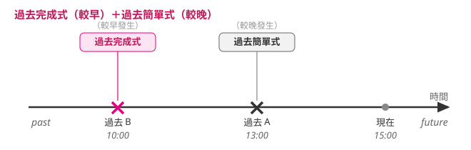

---
tags:
  - 文法/時式
  - 句型公式
  - 對比辨析
  - 圖表
page: 44
difficulty: ⭐⭐⭐
status: 已複習
related:
  - "[[05 過去簡單式]]"
  - "[[03 現在完成式]]"
---

# 過去完成式

> [!IMPORTANT]
> **一句話核心**
> 結構 **主詞＋had＋p.p.**，是「過去的過去」——兩個過去動作中，**較早發生**的用過去完成式，**較晚發生**的用過去簡單式。

## 🧭 心智圖

```markmap
# 過去完成式
## 動詞變化：主詞＋had＋p.p.
### 肯定 → had ＋ p.p.
- Before I bought the computer, I **had played** few video games.
### 否定 → had not／hadn't ＋ p.p.
### 疑問 → Had／Hadn't ＋ 主詞 ＋ p.p.
## 用法
### 7-1 搭過去簡單式，區分先後
- 較早發生 → 過去完成式；較晚發生 → 過去簡單式
- Dad **had finished** his dinner by the time I **got** home.
### 7-2 同現在完成式的整包用法（不只完成）
- 完成 already／just：The band **had already played** his favorite song before he got to the show.
- 經驗 never／ever：Before I bought the computer, I **had never played** any video games.
- 延續 for／since：到那一刻已持續多久
## 觀念釐清
### before／after 已標明先後 → 也可只用過去簡單式
- He **cleaned** his room before he **started** his homework.
### 一連串動作、上下文可看出先後 → 全用過去簡單式，最後一個動詞前加 and
```

## 📊 圖表解構：時間軸（7-1）

> 範例：Before I bought the computer, **I**（S.）**had played**（had ＋ p.p.）few video games.

較早發生的動作（過去 B）用過去完成式，較晚發生的（過去 A）用過去簡單式：



| 句型 | 結構 |
| --- | --- |
| 肯定句 | 主詞 ＋ had ＋ p.p. |
| 否定句 | 主詞 ＋ had not／hadn't ＋ p.p. |
| 疑問句 | Had ＋ 主詞 ＋ p.p.？<br>Hadn't ＋ 主詞 ＋ p.p.？ |

## 📐 用法規則（過去完成式用於下列情況）

### 7-1　通常會搭配過去簡單式一起使用，用以區分先後順序
> Ex.
> - Dad **had finished** his dinner by the time I **got** home. 爸爸在我到家前就吃完晚餐了。
> - The fire **started** because I **had forgotten** to turn off the oven. 起火的原因是因為我忘了關火爐。
> - He **told** me that he **had met** me somewhere two years before. 他告訴我他兩年前曾經在某個地方見過我。

### 7-2　和現在完成式用法相同，用於強調動作的完成
常和 ever、for、just、already、never 等字詞連用。

> Ex.
> - The band **had already played** his favorite song before he got to the show. 在他到達表演現場前，樂團就已經演奏了他最喜歡的一首歌。
> - Before I bought the computer, I **had never played** any video games. 在我買電腦以前，我從未玩過電玩。

> [!TIP]
> **💬 AI 補充｜「和現在完成式用法相同」＝四種用法整包搬過去，不只「完成」**
> 7-2 的標題只寫「強調動作的完成」，但書上自己的搭配詞和例句露了餡：just／already 是 [[03 現在完成式]] 3-2「剛完成」的招牌，ever／never 是 3-3「經驗」的招牌，for 是 3-1「延續」的招牌；第二個例句 had **never** played 更是不折不扣的經驗用法。所以「和現在完成式用法相同」要照字面認真讀——03 的四種用法**整包**都能搬進過去完成式，變的只有一件事：**參考點從「現在」搬到「過去某一刻」**（分法參考其他文法書的通行分類）：
>
> | [[03 現在完成式]]（基準＝現在） | 搬到過去完成式（基準＝過去某刻） | 例句 |
> | --- | --- | --- |
> | 3-1 延續（since／for） | 到那一刻為止已持續多久 | Before I moved to Taipei, I **had lived** in Tainan for ten years. 💬 |
> | 3-2 剛完成（already／just） | 那一刻之前已完成 | 7-2 例：The band **had already played** his favorite song before he got to the show. |
> | 3-3 經驗（never／ever／before） | 到那一刻為止的經驗 | 7-2 例：Before I bought the computer, I **had never played** any video games.（另見 7-1 例：he **had met** me two years before） |
> | 3-4 狀態已多久（has been ＋ 形容詞） | 到那一刻狀態已維持多久 | The old man **had been dead** for two years when they found him. 💬 |
>
> 這個「搬參考點」的機制，[[03 現在完成式]] 3-4 的 💬 補充已經出現過一次：The doctor **rushes** in, but the old man **has** already **died**.（基準＝現在）↔ The doctor **rushed** in, but the old man **had** already **died**.（基準＝過去）。[[08 過去完成進行式]] 則是 3-1 延續的加強版搬過去。
>
> 一句話記：**過去完成式沒有發明新用法——它就是「現在完成式，把基準點換成過去某一刻」**；7-1 的「區分先後」正是這個基準點機制本身，7-2 標題的「完成」只是四張臉的其中一張。

## 🔍 觀念釐清

### 1. before／after 已標明先後 → 也可只用過去簡單式
用連接詞區分兩件事情的先後（如 before、after），故除了用過去完成式之外，也可只用過去簡單式。

> Ex.
> - He **cleaned** his room before he **started** his homework. 他在開始做功課前就把房間整理乾淨了。
> - Donna **quit** the band after she **hurt** her hand. 唐娜手受傷後就離開了樂團。

### 2. 一連串動作、上下文看得出先後 → 全用過去簡單式
如果句子裡有一連串動作，而且由上下文可以看出其先後順序，那麼這一連串的動作可以都用過去簡單式表示，只需在最後一個動詞前加上 **and** 即可。

> Ex.
> - He **washed** the potatoes, **peeled** the carrots, **put** the roast in the oven, **and started** to prepare the dessert. 他把馬鈴薯洗乾淨、紅蘿蔔削皮、烤肉放入烤箱，然後開始準備甜點。

## ✏️ 例句

| 英文例句 | 中文翻譯 | 對應用法 |
| --- | --- | --- |
| Dad **had finished** his dinner by the time I **got** home. | 爸爸在我到家前就吃完晚餐了。 | 7-1 較早／較晚 |
| The fire **started** because I **had forgotten** to turn off the oven. | 起火是因為我忘了關火爐。 | 7-1 較早／較晚 |
| He **told** me that he **had met** me somewhere two years before. | 他告訴我他兩年前曾在某處見過我。 | 7-1 較早／較晚 |
| The band **had already played** his favorite song before he got to the show. | 他到現場前，樂團已演奏了他最愛的歌。 | 7-2 完成（already） |
| Before I bought the computer, I **had never played** any video games. | 買電腦以前我從未玩過電玩。 | 7-2 經驗（never） 💬 |

## ⚠️ 易錯點分析　💬 AI 補充
> [!WARNING]
> **常見錯誤**
> - ❌ When I got home, Dad ~~finished~~ his dinner.（若原意「我到家前爸爸已吃完」）　✅ Dad **had finished** his dinner by the time I **got** home.（較早的動作用過去完成式）
> - ❌ He told me that he ~~met~~ me two years before.　✅ He told me that he **had met** me two years before.（告訴之前就見過 → 較早用過去完成式）
> - ❌ Had he ~~went~~?　✅ Had he **gone**?（完成式一律用過去分詞 p.p.）
>
> **為什麼錯：** 過去完成式的存在意義就是「在兩個過去動作間標出誰更早」。若已有 before／after 把先後講明白，或一串動作照時序排好，就不必再用過去完成式、可全用過去簡單式（見觀念釐清）。

> [!WARNING]
> **💬 診斷卷錯題回填**（時式診斷卷（二）C5／C7／D1 挖出的錯點，2026-07-28）

**① 完成式一律接 p.p.（第三欄）——had 也一樣（C5，改錯未挖到；補測題產出端也倒）**
- ❌ Had he **went** to Japan before he moved to Korea?　✅ Had he **gone** …?
- ❌ The alarm had **rang** for twenty minutes.　✅ … had been **ringing**（ring 的 p.p. 是 **rung**）
- 為什麼：跨章舊錯（見 [[03 現在完成式]] 回填），這次連 had 也中。第二欄（過去式）永遠不能跟在 have／has／had 後面：go-went-**gone**、eat-ate-**eaten**、see-saw-**seen**；a→u 這組特別容易混：ring-rang-**rung**、sing-sang-**sung**、drink-drank-**drunk**、begin-began-**begun**、swim-swam-**swum**。⚠️ 卷一只是「改錯沒挖到」，本卷補測題是自己寫出 had rang——**辨識端和產出端都倒了**，比卷一嚴重。
- 一句話記：**寫完 have／has／had，回頭確認後面那個字是第三欄。**

**② 完成式不與過去時間副詞連用——把 have 換成 had 也不行（C7）**
- ❌ They **have finished** the project last Friday. → 改成 They **had finished** …（仍錯）
- ✅ They **finished** the project last Friday.
- 為什麼：問題不在 have 還是 had，在「**完成式**」這個結構本身。完成式要的是「與某個參考點的連結」（延續到現在／到過去某刻之前已完成），而 last Friday 是把事件**釘死在一個過去的點上**——一個要連結、一個要釘死，本質衝突。有明確過去時間點就用過去簡單式。要用 had finished，必須另有一個過去動作當參考點：They had finished the project **before the client called**.
- 一句話記：**看到 yesterday／last Friday／ago，完成式不論 have 或 had 一律出局。**

**③ 說得出 had ＋ p.p.「往前推一格」的語意差（D1，空白）**
- The movie **had started** when we arrived. ＝ 我們抵達**之前**電影就開演了（有落差，錯過開頭）
- The movie **started** when we arrived. ＝ 我們一到、電影**才**開演（接連發生，一秒沒錯過）
- 為什麼：had ＋ p.p. 的唯一任務就是把動作**往前推一格**（7-1）。本卷 A4、B4 都選對了時態，D1 卻寫不出差別——**直覺有了、規則還沒語言化**，這種洞平時看不出來，遇到變形題就會塌。
- 一句話記：**有 had ＝ 往前推一格；沒 had ＝ 接著發生。**

> [!WARNING]
> **💬 學習驗收錯題回填**（章末學習驗收（三）II-9 挖出的錯點，2026-07-30）

**④ 「敘事時間點之前的一整段期間」也是過去完成式（驗收（三）II-9）**
- ❌ Between 1986 and 2005, not one polar bear in that area **was dying** from drowning.
- ✅ Between 1986 and 2005, not one polar bear in that area **had died** from drowning. 1986 到 2005 年間，那個區域沒有一隻北極熊死於溺水。
- 為什麼：整篇文章的敘事時間點停在 **2005 年**（研究團隊出海調查、幾天後回去、看到四隻死熊）。`Between 1986 and 2005` 是**那個時間點之前**的一段期間——這就是 7-1 說的「較早」，只是這次的「較早」是一整段期間，不是單一動作。⚠️ 這一格是全文的收尾論證：正因為在那之前的十九年一隻都沒溺死過，這四隻才算得上「全球暖化最早的受害者」——時態選錯，整段論證就垮了。
- ⚠️ **選 was dying 還有第二層錯：die 是瞬間動詞。** 從活到死是一瞬間的切換，這件事本身沒有長度，所以 `was dying` 的意思是「**正在死去、瀕死中**」——`not one polar bear was dying` 就變成「沒有一隻北極熊處於瀕死狀態」，跟原意（沒有一隻溺死）完全是兩回事。同一個判準見 [[03 現在完成式]] 3-4 的 💬 補充：**看這件事本身有沒有長度**。另一個選項 had been dying 時區選對了，卻一樣栽在這裡——「沒有一隻一直在死」不成話。
- 一句話記：**敘事停在過去某一年，那一年「之前」的事——不管是一個動作還是一整段期間——都用 had ＋ p.p.**

> [!WARNING]
> **💬 學習驗收錯題回填**（章末學習驗收（四）1／7 挖出的錯點，2026-07-31）

**⑤ had ＋ p.p. ＝ 那一刻已經「做完」；要說「已經開始在做」得換寫法（驗收（四）1）**
- 題目：Kenny 的朋友在他終於抵達時**已經開始在吃飯了**。
- ❌ Kenny's friends **had eaten** dinner when he finally arrived.（＝他到的時候飯已經吃完了）
- ✅ Kenny's friends **had already started eating**（／**had been eating**）dinner when he finally arrived.
- 為什麼：**時態框架選對了**——過去完成式，把「吃飯」推到「他抵達」之前（7-1）。錯的是動作的**階段**：had ＋ p.p. 說的是「到那一刻已經完成」，中文要的卻是「動作已經展開、還在進行中」。同一條時間軸上的三個不同位置：
  - `had eaten` → 飯局結束了，他到的時候大家在收碗
  - `had (already) started eating` → 已經開動
  - `had been eating` → 已經吃了一陣子、還在吃（見 [[08 過去完成進行式]] 8-1）
- ⚠️ 這是舊錯「還在進行用進行式、完成式代表動作可能已停」搬到**過去**的版本（前幾次都發生在現在式：have watched → have been watching、has painted → has been painting）。**判準沒變：問「那一刻這件事還在做嗎？」還在做，就不能停在完成式。**
- 一句話記：**中文有「已經＋在／正在」→ 別停在 had ＋ p.p.，往 had been V-ing 或 had started V-ing 走。**

**⑥ 漏譯「躺下來前」，基準就留在現在——連帶把 gone 寫成 went（驗收（四）7）**
- 題目：這隻小狗**在躺下來前**繞來繞去繞了三次。
- ❌ The little dog **has went** all the way around three times.
- ✅ The little dog **had turned around**（／**had gone around in circles**）**three times before it lay down**.
- 為什麼：兩層錯，第一層是因、第二層是果。
  - **漏譯**：中文的「在躺下來前」整段沒翻出來。那句話正是**時間基準**——躺下是過去的事，繞圈比它更早 → 過去完成式（7-1）。基準被漏掉，句子就沒有過去的錨，於是預設用了現在完成式。
  - **形式**：`has went` 不成立，go 的三態是 go–went–**gone**，完成式一律取第三欄。
- ⚠️ **這一格推翻了先前的結論。** 這條 p.p. 舊錯回填過四五次，每次的判讀都是「**產出端會、挑錯端盲**，缺的是掃描動作不是知識」；這次是產出端自己寫出 has went，**那個判讀不成立了**——go 的第三欄本身還沒穩。
- 一句話記：**下筆前先把中文的時間詞圈起來，那是時態的錨；寫完回頭確認 have／has／had 後面是第三欄。**

## ✍️ 練習題（書中）

- [ ] 1. The train ______ when she arrived at the train station.　A. is leaving　B. has left　C. was left　D. had already left
- [ ] 2. The game ______ before we found our seats.　A. had started　B. starts　C. has been started　D. is starting

<details>
<summary>✅ 解答</summary>

1. **D**（had already left — 她抵達（arrived，較晚）前火車就開走了（較早），用過去完成式）
2. **A**（had started — 我們找到座位（較晚）前比賽就開始了（較早））

</details>

## 🔗 延伸與對比
- 與 [[05 過去簡單式]] 是固定搭檔：兩個過去動作，較早用過去完成式、較晚用過去簡單式。
- 與 [[03 現在完成式]] 對照：把「完成／經驗」的參考點從「現在」移到「過去某一刻」（has met ↔ had met）。
- 回 [[02 時式/00 本章總覽|本章總覽]] 看十二時式全貌。

## 相關
- [[01 圖表解構英文文法/02 時式/README|回本章目錄]]
