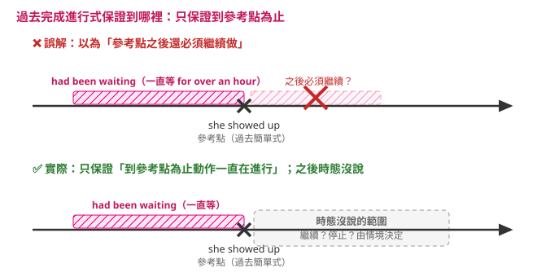

---
tags:
  - 文法/時式
  - 句型公式
  - 對比辨析
  - 圖表
page: 46
difficulty: ⭐⭐
status: 已複習
related:
  - "[[07 過去完成式]]"
  - "[[04 現在完成進行式]]"
---

# 過去完成進行式

> [!IMPORTANT]
> **一句話核心**
> 結構 **主詞＋had been＋V-ing**；用法跟過去完成式差不多（過去的過去），但**更強調較早那個動作的持續性**——「（在過去某刻之前）已經一直在做多久了」。

## 🧭 心智圖

```markmap
# 過去完成進行式
## 結構：had been ＋ V-ing
### 肯定 → had been ＋ V-ing
- Before I got home, my mom **had been preparing** dinner for half an hour.
### 否定 → had not／hadn't been ＋ V-ing
### 疑問 → Had／Hadn't ＋ 主詞 ＋ been ＋ V-ing
## 用法
### 8-1 同過去完成式，但更強調持續性
- 強調較早的 A 一直持續著
- Jim **had been working** for two hours already.
### 8-2 常配 before／by the time／for／how long
- Before he went to college, he **had been working** as a lifeguard.
## 對比
### 過去完成式（看完成／結果）↔ 過去完成進行式（強調持續）
### ⚠️ 「持續」只到參考點為止，之後繼不繼續由情境決定
- We **had been waiting** for over an hour when she **showed up**.（她一出現，等待當場終結）
```

## 📊 圖表解構

> 範例：Before I got home, **my mom**（S.）**had been preparing**（had been ＋ V-ing）dinner for half an hour.

| 句型 | 結構 |
| --- | --- |
| 肯定句 | 主詞 ＋ had been ＋ V-ing |
| 否定句 | 主詞 ＋ had not／hadn't ＋ been ＋ V-ing |
| 疑問句 | Had ＋ 主詞 ＋ been ＋ V-ing？<br>Hadn't ＋ 主詞 ＋ been ＋ V-ing？ |

## 📐 用法規則（過去完成進行式用於下列情況）

### 8-1　使用時機跟過去完成式差不多，差別在於更強調動作的持續性
假設發生在過去的兩件事 A、B，若欲強調較早發生的 **A 的持續性**，則用過去完成進行式。

> Ex.
> - By the time I **arrived** at the office, Jim **had been working** for two hours already. 在我回到辦公室的時候，吉姆已經工作了兩個小時。
> - We **had been waiting** for over an hour when she **showed up**. 她出現時，我們已經等了超過一個鐘頭了。
> - Before I **got** home, my mom **had been preparing** dinner for half an hour. 在我到家前，我媽媽已經準備晚餐半個鐘頭了。（而且還繼續在忙）

> [!TIP]
> **💬 AI 補充｜「強調持續性」怎麼讀才不會矛盾（waiting 句釐清）**
> 8-1 三個例句中，Jim 和媽媽那兩句「之後還會繼續做」，waiting 句她一出現等待就結束——看似矛盾，其實是把**從情境推出來的猜測**，誤當成**這個時態本身的意思**。
>
> **① 這個時態只保證一件事：到參考點（這三句分別是「我到辦公室時」「我到家前」「她出現時」）為止，動作一直在進行。至於參考點之後還做不做，這個時態沒有說，要看句子的情境。**
>
> 
>
> | 例句 | 到那一刻一直在做？ | 之後呢？ | 誰決定的 |
> | --- | --- | --- | --- |
> | Jim **had been working** for two hours（我到辦公室時） | ✅ | 大概繼續 | 情境：我到了，不會讓他停工 |
> | mom **had been preparing** dinner（我到家前） | ✅ | 繼續 | 情境：飯還沒好——書上括號「（而且還繼續在忙）」是**情境上的補充說明，不是這個時態的意思** |
> | We **had been waiting** for over an hour（她出現時） | ✅ | 當場終結 | 情境：等的人到了，等待自然結束 |
>
> 三句的文法意義完全相同。連**現在**完成進行式都有「剛停」的用法：Your eyes are red. **Have you been crying?**（哭已停、痕跡還新鮮）——「完成進行式＝之後還會繼續」從來不成立。中文對照：「她出現時，我們**已經等了一個多小時了**」——沒人會讀成她出現後還要繼續等。
>
> **② waiting 句為什麼「看不出」強調持續——因為 wait 本身就有長度。**
> `We had waited for over an hour` 也完全合法、意思幾乎一樣。wait／work／live 這類動詞上，兩種寫法差的只是**說話角度**：had waited ＝ 事後回頭算總數（總共等了一個多小時）；had been waiting ＝ 把畫面拉回那一刻（她現身那一秒，我們還站在那裡等），常帶不耐煩／累的情緒。要看到**事實差異**，得換有終點的動詞：
> - When she showed up, I **had read** her report. → **讀完了**（結果在手）
> - When she showed up, I **had been reading** her report. → **讀到一半**（被打斷）
>
> 檢查法一句話：**問「參考點那一刻，動作還在做嗎？」還在做 → had been V-ing；「之後還做不做」這個時態沒有規定。**

### 8-2　常與 before、by the time、for、how long 等搭配使用
> Ex.
> - Before he **went** to college, he **had been working** as a lifeguard. 他在上大學之前，一直都在當救生員。

## ✏️ 例句

| 英文例句 | 中文翻譯 | 對應用法 |
| --- | --- | --- |
| Before I got home, my mom **had been preparing** dinner for half an hour. | 在我到家前，我媽媽已經準備晚餐半個鐘頭了。 | 8-1 強調持續 |
| By the time I arrived at the office, Jim **had been working** for two hours already. | 我回到辦公室時，吉姆已經工作了兩個小時。 | 8-1 強調持續 |
| We **had been waiting** for over an hour when she showed up. | 她出現時，我們已經等了超過一個鐘頭了。 | 8-1 強調持續 |
| Before he went to college, he **had been working** as a lifeguard. | 他上大學之前，一直都在當救生員。 | 8-2 配 before／for |

## ⚠️ 易錯點分析　💬 AI 補充
> [!WARNING]
> **常見錯誤**
> - ❌ Jim ~~had working~~ for two hours.　✅ Jim **had been working** for two hours.（結構是 had ＋ **been** ＋ V-ing，缺一不可）
> - ❌ my mom had been ~~prepare~~ dinner.　✅ my mom **had been preparing** dinner.（been 後接 V-ing）
> - ❌ Before he went to college, he **had been being** a lifeguard.　✅ …he **had been working** as a lifeguard.／he **had been** a lifeguard.（be 動詞本身表狀態、不進行）
>
> **為什麼錯：** 過去完成進行式＝「had ＋ **been** ＋ V-ing」三段固定，只是把現在完成進行式（has/have been V-ing）的參考點從「現在」移到「過去某一刻」。想強調「一直持續到那一刻」用它；只講「那之前已完成」用過去完成式（見 [[07 過去完成式]]）。

> [!WARNING]
> **💬 診斷卷錯題回填**（時式診斷卷（二）B6／C6＋補測題挖出的錯點，2026-07-28）

**① 「到過去某刻為止已持續多久」只有 had been V-ing 做得到，過去進行式做不到（B6、C6、補測題，一卷中三次）**
- ❌ I **was living** in Tainan before we moved to Taipei.（且漏譯「十年」）
- ✅ Before I **moved** to Taipei, I **had lived**（／had been living）in Tainan **for ten years**.
- ❌ 補測題答 the alarm **had rang** for twenty minutes.　✅ … **had been ringing** for twenty minutes.
- ❌ C6 空白（Jim **had working** for two hours → had been working，改錯未挖到）
- 為什麼：過去進行式只能說「過去某一個時間點正在進行」，它**沒有能力表達「到那一刻為止已經持續多久」**；要標「較早 ＋ 持續 ＋ 時間長度」只有 had (been) V-ing。⚠️ 訊號很清楚：有中文提示「一直在等」時本卷 B5 寫對了 had been waiting，**沒提示就完全想不到**——缺的不是結構，是觸發條件。
- 一句話記：**before／by the time ＋ 一段時間長度 → had been V-ing。**

> [!WARNING]
> **💬 學習驗收錯題回填**（章末學習驗收（二）I-6／I-10 挖出的錯點，2026-07-30）

**② 同一段裡兩格都倒：一格退到過去簡單式、一格只走到完成式（I-6、I-10）**
- ❌ They **watched** the movie for about twenty minutes when Chris smelled smoke.
- ✅ They **had been watching** the movie for about twenty minutes when Chris smelled smoke. 他們看了電影大約二十分鐘，這時 Chris 聞到煙味。
- ❌ By the time the firemen arrived, the theater **had burned** for ten minutes.
- ✅ By the time the firemen arrived, the theater **had been burning** for ten minutes. 消防員抵達時，戲院已經燒了十分鐘。
- 為什麼：兩句的組合完全一樣——**過去某一刻**（Chris 聞到煙／消防員抵達）**＋ 在那之前已經持續了多久**，這就是 8-1。
  - I-6 用過去簡單式不成立：`watched … when` 會被讀成兩個一前一後發生的動作，但 when 那一刻是**插進來打斷**的事件，前面必須是一個已經跑了二十分鐘的持續狀態。
  - I-10 的 had burned 文法上不違規，但戲院在消防員抵達時**還在燒**，題目又給了 for ten minutes，要選強調持續的 had been burning。
- ⚠️ 這是卷二 B6／C6 那條「有時點＋有持續多久，卻想不到 had been V-ing」**第二次**現形；上次的結論是「有中文提示『一直在等』就寫得對，缺的是觸發條件」，這次題目沒有中文提示，兩格就一起倒。**觸發條件仍然沒有自動化。**
- 一句話記：**過去某一刻 ＋「已經做了多久」→ had been V-ing；只講「在那之前做完了」才用 had ＋ p.p.**

## ✍️ 練習題（書中）

- [ ] 1. The store's profits ______ steadily for the past year.　A. has been increasing　B. had increase　C. had been increasing　D. have increase

<details>
<summary>✅ 解答</summary>

1. **C**（had been increasing — profits 為複數，A 的 has 不合；B、D 非「been ＋ V-ing」結構不完整。以過去某時點為參考、強調持續增長）

</details>

## 🔗 延伸與對比
- 與 [[07 過去完成式]] 的差異：過去完成式看「較早動作已完成／結果」；過去完成進行式強調「較早動作一直在持續」。
- 與 [[04 現在完成進行式]] 對照：同為「持續」，參考點從現在移到過去（has been working ↔ had been working）。
- 回 [[02 時式/00 本章總覽|本章總覽]] 看十二時式全貌。

## 相關
- [[01 圖表解構英文文法/02 時式/README|回本章目錄]]
