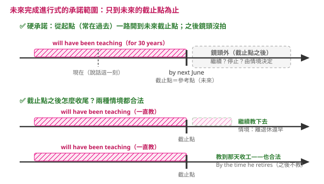

---
tags:
  - 文法/時式
  - 句型公式
  - 對比辨析
  - 圖表
page: 52
difficulty: ⭐⭐
status: 未讀
related:
  - "[[11 未來完成式]]"
  - "[[08 過去完成進行式]]"
---

# 未來完成進行式

> [!IMPORTANT]
> **一句話核心**
> 結構 **主詞＋will have been＋V-ing**；表示「到未來某個截止點為止，動作一直在持續」，**特別強調持續性**；截止點之後繼不繼續，由情境決定（承諾範圍見下方 💬）。

## 🧭 心智圖

```markmap
# 未來完成進行式
## 結構：will have been ＋ V-ing
### 肯定 → will have been ＋ V-ing
- By next June, I'll **have been teaching** English for 30 years.
### 否定 → will not／won't have been ＋ V-ing
### 疑問 → Will／Won't ＋ 主詞 ＋ have been ＋ V-ing
## 用法
### 12-1 未來某時點前完成，且強調仍將持續進行
- this power plant **will have been producing** power for six years.
### 12-2 常配 before／by／by the time
- By next June, I'll **have been teaching** for 30 years.
## 對比
### 未來完成式（看完成）↔ 未來完成進行式（強調仍持續）
```

## 📊 圖表解構

> 範例：By next June, **I**（S.）**'ll have been teaching**（will have been ＋ V-ing）English in this high school for 30 years.

| 句型 | 結構 |
| --- | --- |
| 肯定句 | 主詞 ＋ will have been ＋ V-ing |
| 否定句 | 主詞 ＋ will not have been ＋ V-ing<br>主詞 ＋ won't have been ＋ V-ing |
| 疑問句 | Will ＋ 主詞 ＋ have been ＋ V-ing？<br>Won't ＋ 主詞 ＋ have been ＋ V-ing？ |

## 📐 用法規則（未來完成進行式用於下列情況）

### 12-1　在未來某個時間點之前會完成的動作，特別強調該動作仍將持續進行
> Ex.
> - By the end of the month, this power plant **will have been producing** power for six years. 到月底前，這座發電廠將會持續發電六年了。（之後仍將持續發電）

### 12-2　常與 before、by、by the time 等合用
> Ex.
> - By next June, I'll **have been teaching** English in this high school for 30 years. 到明年六月之前，我將已經在這所高中教英文三十年了。（之後仍會繼續教下去）

> [!TIP]
> **💬 AI 補充｜承諾範圍家族第三站——參考點搬到未來的截止點**
> [[04 現在完成進行式]]（參考點＝現在）、[[08 過去完成進行式]]（參考點＝過去某刻）那條規則原封搬來：**時態只承諾「從起點到 by／by the time 的截止點為止一直開著」，截止點之後鏡頭沒拍**、繼不繼續由情境決定。
>
> 
>
> - 12-1、12-2 例句後的「（之後仍將持續發電）」「（之後仍會繼續教下去）」是**情境註記、不是定義**——發電廠和教書會繼續，是情境的合理推論，不是 will have been V-ing 給的承諾。
> - 鐵證就在本篇練習 1：If the prime minister **doesn't step down** next year, he **will have been serving** for ten years.——他會不會下台**還懸著**，句子照樣成立；若「之後必繼續」是時態承諾，這題根本出不成。
> - 反例一個就夠：By the time he **retires** next June, he **will have been teaching** for 30 years.（教到退休那天滿三十年，**之後就不教了**，完全合法。）
>
> 誤解模型的對照圖與完整推演（waiting 句、鏡頭差）見 [[08 過去完成進行式]] 8-1、現在版的兩種收尾見 [[04 現在完成進行式]] 4-1 的 💬 補充，此處不重複。

## ✏️ 例句

| 英文例句 | 中文翻譯 | 對應用法 |
| --- | --- | --- |
| By next June, I'll **have been teaching** English in this high school for 30 years. | 到明年六月之前，我將已經在這所高中教英文三十年了。 | 12-2 配 by／for |
| By the end of the month, this power plant **will have been producing** power for six years. | 到月底前，這座發電廠將會持續發電六年了。 | 12-1 強調仍持續 |

## ⚠️ 易錯點分析　💬 AI 補充
> [!WARNING]
> **常見錯誤**
> - ❌ …I'll ~~have teaching~~ for 30 years.　✅ …I'll **have been teaching** for 30 years.（結構是 will ＋ have ＋ **been** ＋ V-ing，四段缺一不可）
> - ❌ By the time we ~~will get~~ there, he will have been speaking…　✅ By the time we **get** there, he will have been speaking…（by the time 子句用現在簡單式）
> - ❌ he will have been ~~speak~~…　✅ he will have been **speaking**…（been 後接 V-ing）
>
> **為什麼錯：** 這是十二時式裡結構最長的一個：把「未來完成式 will have p.p.」的完成，換成「持續進行 been ＋ V-ing」，強調到那個未來截止點時「動作已進行了多久、且還沒停」。截止點常由 by／by the time／before 帶出，時間子句仍用現在簡單式。

## ✍️ 練習題（書中）

- [ ] 1. If the prime minister doesn't step down next year, he ______ for ten years.　A. will have been serving　B. have served　C. will serve　D. served
- [ ] 2. The president ______ for twenty minutes by the time we get there.　A. has spoke　B. speaking　C. will have been speaking　D. has been spoke

<details>
<summary>✅ 解答</summary>

1. **A**（will have been serving — 到明年若不下台，屆時他將已「持續」任職滿十年；if 子句用現在簡單 doesn't step down）
2. **C**（will have been speaking — by the time we get there 是未來截止點，強調屆時已持續演講二十分鐘）

</details>

## 🔗 延伸與對比
- 與 [[11 未來完成式]] 的差異：未來完成式看「到未來某刻已完成」；未來完成進行式強調「到那刻仍一直在持續」（will have left ↔ will have been teaching）。
- 與 [[08 過去完成進行式]]、[[04 現在完成進行式]] 對照：同一「持續」結構，參考點分別落在過去／現在／未來。
- 回 [[02 時式/00 本章總覽|本章總覽]] 看十二時式全貌與時間軸。

## 相關
- [[01 圖表解構英文文法/02 時式/README|回本章目錄]]
