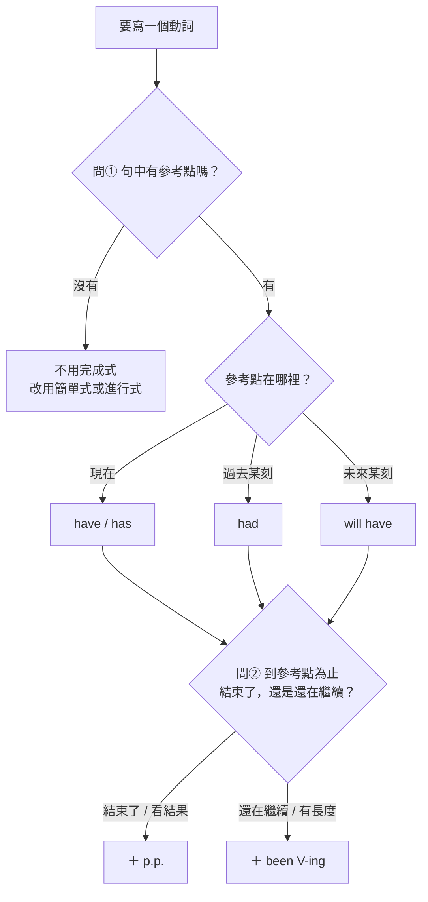

---
tags:
  - 文法/時式
  - 對比辨析
  - 易錯點
  - 圖表
source: 歸納自本章 00–13 各篇與全域易錯點總表的實錯紀錄（非書本內容）
difficulty: ⭐⭐
status: 未讀
related:
  - "[[02 時式/00 本章總覽|本章總覽]]"
  - "[[03 現在完成式]]"
  - "[[04 現在完成進行式]]"
  - "[[07 過去完成式]]"
  - "[[11 未來完成式]]"
---

# 💬 AI 補充　選時態的兩問掃描

> [!IMPORTANT]
> **整篇為 💬 AI 補充**（非書本內容）。取材自本章 [[02 時式/00 本章總覽|00 本章總覽]] 與 01–13 各篇，加上 [[易錯點總表]] 裡實際犯過的錯。
>
> **為什麼需要這一篇：** 本章 12 篇各自教「這一格是什麼」，[[02 時式/00 本章總覽|本章總覽]] 給的是 12 宮格的全貌——但**沒有任何一篇教「怎麼在 12 格之間選一格」**。實際寫句子時，沒有人會先告訴你「這句要用未來完成進行式」，選格子才是真正要做的動作。本篇就是那個判斷程序。
>
> 「**兩問掃描**」這個名字在 [[易錯點總表]] 已經被引用（「對應兩問掃描第①問」），但先前沒有任何一篇寫下它的內容——**本篇是它的定義處**。

> [!IMPORTANT]
> **一句話核心**
> 動筆寫動詞前，先跑一次「兩問掃描」：
>
> **① 參考點（拿來當基準的那一刻）在哪裡？**
> 　現在 → **have**／has｜過去某刻 → **had**｜未來某刻 → **will have**
> 　**找不到參考點 → 不用完成式**，改用簡單式或進行式
>
> **② 到參考點為止，這件事結束了，還是還在繼續？**
> 　結束了／看結果 → **p.p.**
> 　還在繼續／有長度 → **been V-ing**
>
> 兩個答案接起來就是時態：`will have` ＋ `been selling` → **will have been selling**

## 🧭 心智圖

```markmap
# 選時態的兩問掃描
## 問①　參考點在哪裡？
### 現在 → have／has
- I **have lived** in Tainan for ten years.
### 過去某刻 → had
- I **had lived** there for six years before I moved away.
### 未來某刻 → will have
- By next year, I **will have lived** here for eleven years.
### 找不到參考點 → 不用完成式
- I **lived** in Tainan for ten years.（那段時間已經結束）
## 問②　到參考點為止，結束了還是還在繼續？
### 結束了／看結果 → p.p.
- It **has rained** three times this week.
- When she arrived, I **had eaten**.
### 還在繼續／有長度 → been V-ing
- It **has been raining** since this morning.
- When she arrived, I **had been waiting** for an hour.
## 信號詞：誰給參考點、誰不給
### 給參考點 → by／by the time／before／when
- By December, they **will have built** the bridge.
### 不給參考點 → until／ago／yesterday／last night
- I **will wait** here until she comes back.
### since ＝ 線的起點，參考點仍在現在
- Since he retired, he **has traveled** to ten countries.
### for ＝ 長度，要另配一個時點才成立
- By eight, I **will have been waiting** for an hour.
## 組裝：把兩個答案接起來
### will have ＋ been selling
- By December, this company **will have been selling** coffee for twenty years.
### have ＋ been playing
- The kids are still outside. They **have been playing** there for three hours.
```

## 📊 兩問掃描流程



## 📐 問①　參考點在哪裡？

**參考點（拿來當基準的那一刻）＝ 你從哪一個時間點回頭看這件事。**

簡單式只需要標「事情發生在哪裡」，一個點就夠了；完成式需要**兩個點**——事情本身，加上一個你用來回頭看它的時刻。第二個點常常沒有明寫，要自己認出來。

下面三句的事件完全一樣（在台南住），差別只有參考點擺在哪裡。

### 參考點在現在 → have／has

```
2016 搬來 ━━━━━━━━━━━━━━━━━━━━━━━► 現在（參考點）
            ◄────── 回頭算：十年 ──────
```

> I **have lived** in Tainan for ten years.
> 我在台南住了十年了。（到現在為止十年，而且還住著）

### 參考點在過去某刻 → had

```
2016 ━━━━━━━━━━━━━► 2022 搬走（參考點） ─────► 現在
       ◄── 回頭算：六年 ──
```

> I **had lived** in Tainan for six years **before I moved away**.
> 我搬走前在台南住了六年。

⚠️ `before I moved away` 就是那個參考點。**把它拿掉，had 就沒有立足點了**——`had` 不是「比較久以前」的意思，是「參考點被搬到過去」。

### 參考點在未來某刻 → will have

```
2016 ━━━━━━━━━━━━━━━━━━━━━━━━━━━━━► 明年（參考點）
            ◄────── 回頭算：十一年 ──────
```

> **By next year**, I **will have lived** in Tainan for eleven years.
> 到明年，我就在台南住滿十一年了。

### 找不到參考點 → 不用完成式

這一格最重要——**完成式的錯有一半是「不該用卻用了」**。

```
2006 ━━━━━━━━━━━━━━━► 2016
     整段都在過去，沒有任何一刻被拿來當基準
```

> I **lived** in Tainan for ten years.
> 我在台南住過十年。（那段時間已經結束，跟現在沒有連著）

```
現在 ━━━━━━━━━━━━━━━━━━━━► 她回來（動作停在這）
     一路等過去，沒有人回頭看
```

> I **will wait** here **until** she comes back.
> 我會在這裡等到她回來。

```
● 去年
  時間點被釘死在過去
```

> I **visited** Japan last year. ✅
> ~~I have visited Japan last year.~~ ❌

**為什麼最後那句壞掉：** `last year` 把事件釘在去年那一點，而 `have` 要求參考點在現在——一個要釘死、一個要連到現在，兩個要求不能同時成立。

## 📐 問②　到參考點為止，結束了還是還在繼續？

參考點決定 `have／had／will have`；這一問決定後面接 **p.p.** 還是 **been V-ing**。

判準一句話：**看得到「結果」用 p.p.，看得到「長度」用 been V-ing。**

### 參考點在現在

```
本週  ●     ●     ●                現在（參考點）
     三場雨，每一場都下完了
```

> It **has rained** three times this week.
> 這禮拜下了三場雨。（三件完成的事，數得出來）

```
今早 ━━━━━━━━━━━━━━━━━━━━━━━━━► 現在（參考點）
     雨線還沒斷
```

> It **has been raining** since this morning.
> 從今天早上就一直在下雨。（一條線，而且線頭還在現在）

### 參考點在過去某刻

```
    吃完 ●                她到了（參考點）
```

> When she arrived, I **had eaten**.
> 她到的時候我已經吃過了。（我吃完了，桌子都收了）

```
    ━━━━━━━━━━━━━━━━━━━━► 她到了（參考點）
    等了一小時的線，一路連到她抵達那一刻
```

> When she arrived, I **had been waiting** for an hour.
> 她到的時候我已經等了一小時。

### 參考點在未來某刻

```
                  橋完工 ●      十二月（參考點）
```

> **By** December, they **will have built** the bridge.
> 到十二月，他們就會把橋蓋好。（看的是結果：橋好了）

```
    ━━━━━━━━━━━━━━━━━━━━► 十二月（參考點）
    蓋了兩年的線
```

> **By** December, they **will have been building** the bridge for two years.
> 到十二月，這座橋就蓋了兩年了。（看的是長度：兩年）

> [!TIP]
> **下筆前的一句話檢查**
> 寫下 `have ＋ p.p.` 之前先問：「**這件事現在停了沒？**」
> - I **have painted** the wall. → 牆刷好了，我在洗刷子
> - I **have been painting** the wall. → 我滿手油漆，還在刷
>
> 還在做 → 換成 `have been V-ing`。

## 🔍 信號詞：誰給參考點、誰不給

問①的成敗全在這裡。信號詞分兩類：

| 給參考點（可以用完成式） | 不給參考點（不能用完成式） |
| --- | --- |
| **by**（by December） | **until**（給的是動作停止的那一端） |
| **by the time**（＋完整子句） | **ago**（two hours ago） |
| **before**（before he retired） | **yesterday／last night／last week** |
| **when**（＋過去事件） | 單獨出現的 **next month** |
| 說話當下（現在，預設） | |

兩個特例要單獨記：

- **since ＝ 線的起點，不是參考點。** since 標的是動作從哪裡開始；參考點沒被指定，預設就是現在 → 配 `have／has ＋ p.p.` 或 `has been V-ing`。
- **for ＝ 長度，本身不成立。** `for twenty years` 只給你線有多長，要另外有一個時點才能回頭結算。

### 同一個時刻的三種角色

事件固定：等我妹妹。看「七點」「八點」這兩個時刻怎麼扮演三種不同角色——**決定時態的從來不是那個時間，是它在句子裡做什麼**。

```
① since ＝ 線的左端（參考點仍在現在）
   七點 ━━━━━━━━━━━━━━━━━━━━━► 現在（參考點）
```

> I **have been waiting since** seven.
> 我從七點就一直在等。

```
② until ＝ 線的右端（沒有人回頭看）
   七點 ━━━━━━━━━━━━━━━━━━━━━● 八點
        動作一路做到八點才停
```

> I **waited** for her from seven **until** eight.
> 我從七點等她等到八點。

```
③ by the time ＝ 參考點
   七點 ━━━━━━━━━━━━━━━━━━━━━► 八點（參考點）
        ◄────── 回頭算：一小時 ──────
```

> **By the time** she showed up at eight, I **had been waiting** for an hour.
> 她八點出現時，我已經等了一小時。

> [!WARNING]
> **until 和 by the time 指的是同一個時刻，卻配不同的時態。**
> 差別不在時間，在**你拿它來做什麼**：until 標的是動作停止的那一端（一路做到那裡），by the time 標的是你回頭結算的那一刻。
> 所以 `will have been waiting **until** she comes back` 不成立——它同時要求「往前做到那裡」和「站著回頭算」，兩件事互相衝突。

## ✏️ 組裝順序

長動詞組不是一次想出來的，是**兩個答案接起來的**。照順序寫，第二段自己會出來。

### 例一

> By December, this company \_\_\_\_\_\_ (sell) coffee in Taiwan for twenty years.

```
① 參考點在哪裡？  By December → 未來的十二月  →  will have
                                                    ＋
② 結束了還是還在繼續？  for twenty years → 有長度  →  been selling
                                                    ＝
                                        will have been selling
```

> By December, this company **will have been selling** coffee in Taiwan for twenty years.
> 到十二月，這家公司在台灣賣咖啡就滿二十年了。

### 例二

> Look — the kids are still in the yard. They \_\_\_\_\_\_ (play) there for three hours.

```
① 參考點在哪裡？  still 表示講的是現在  →  have
                                             ＋
② 結束了還是還在繼續？  還在院子裡、三小時  →  been playing
                                             ＝
                                    have been playing
```

> They **have been playing** there for three hours.
> 他們已經在那裡玩了三個小時。

⚠️ 寫成 `have played` 的意思是「玩過三小時、現在可能不玩了」，跟前一句 `still in the yard` 直接打架。

## 📎 延伸：加問③，補滿 12 格

兩問掃描處理的是完成式家族那 6 格。再加一個問題就能涵蓋全部 12 格：

> **③ 在那個時間點，動作正在進行嗎？** 正在進行 → 加 `be ＋ V-ing`

**問①答「沒有參考點」時**，跳過問②、改問問③ → 得到剩下那 6 格：

| 時間 | 問③ 否（不強調正在進行） | 問③ 是（正在進行） |
| --- | --- | --- |
| 現在 | He **writes**. | He **is writing**. |
| 過去 | He **wrote**. | He **was writing**. |
| 未來 | He **will write**. | He **will be writing**. |

**問①答「有參考點」時**，照原本的問② → 完成式家族 6 格：

| 參考點位置 | 結束了（p.p.） | 還在繼續（been V-ing） |
| --- | --- | --- |
| 現在 | He **has written**. | He **has been writing**. |
| 過去某刻 | He **had written**. | He **had been writing**. |
| 未來某刻 | He **will have written**. | He **will have been writing**. |

十二格的全貌與各格的結構公式見 [[02 時式/00 本章總覽|本章總覽]]。

## ⚠️ 易錯點分析

以下每一條都是實際犯過的錯（2026-08-01 檢核），不是假想的。

> [!WARNING]
> **① until 配完成進行式（同一個坑第四次）**
> - ❌ I **will have been waiting** here **until** my sister comes back.
> - ✅ I **will wait** here until my sister comes back.／I **will be waiting** here until…
> - 為什麼：問①失敗。until 給的是動作停止的那一端，不是可以回頭結算的時刻。要用 will have been waiting，得換成給參考點的信號詞：**By the time** she comes back, I will have been waiting **for two hours**.
> - ⚠️ 這次不是寫錯，是**主張原句沒錯**，理由「有一直、又是未來往回看」——「有長度」是問②的事，不能拿來當問①的答案。

> [!WARNING]
> **② since 的主要子句推成過去完成式**
> - ❌ Since my grandfather retired in 2020, he **had traveled** to more than ten countries.
> - ✅ Since my grandfather retired in 2020, he **has traveled** to more than ten countries.
> - 為什麼：問①推過頭。since 給的是線的**起點**，不是參考點；參考點沒被指定就是現在 → has。要用 had traveled，句中必須另有一個過去時點：By the time he moved to Japan **in 2023**, he had traveled…
> - ⚠️ 這次是「發現要改、也動手了，卻往錯的方向推」——比沒發現更需要問①。

> [!WARNING]
> **③ 還在進行卻用完成式（原樣第四次）**
> - ❌ The kids are **still** in the yard. They **have played** there for three hours.
> - ✅ … They **have been playing** there for three hours.
> - 為什麼：問②失敗。have played ＝ 玩過三小時、現在可能不玩了，與 still 矛盾。
> - ⚠️ 這次 `still` 就印在前一句，信號是明碼——所以洞不在「看不看得到信號」，在**寫下 have ＋ p.p. 前沒有問「這件事現在停了沒」**。

> [!WARNING]
> **④ 動詞組寫到助動詞就停**
> - ❌ By the time the guests arrive, we will have **finish** cooking dinner.
> - ✅ … we will have **finished** cooking dinner.
> - ❌ By December, this company ______ (sell) coffee for twenty years. → **整格空白**
> - ✅ … **will have been selling** coffee for twenty years.
> - 為什麼：不是規則不懂，是**把時態當成一個名字在想**，想不出四個字的名字就卡住。改成先寫問①的答案（will have），再寫問②的答案（been selling），接起來就好。
> - 一句話記：**先寫①，再寫②，最後接起來——不要一次想整個時態。**

## 🧠 自我測驗　💬 AI 補充

> **讀完當天**作答一次即可。每題只問一件事：**這個時間詞是參考點，還是線的端點？**
> ⚠️ 不要每輪複習重做（題目寫死了，重做只會把答案背起來）。後續複習用現場生成的新題，見 [[複習方法]]。

- [ ] Q1：`by next Friday` 是？
- [ ] Q2：`until next Friday` 是？
- [ ] Q3：`since last Friday` 是？
- [ ] Q4：`By December, the team ______ (work) on this project for a year.` 先寫出問①②的答案，再寫時態。

<details>
<summary>✅ 解答</summary>

A1：**參考點**。可以回頭結算 → By next Friday, I **will have finished** the report.

A2：**線的右端**（動作停止的那一刻），不給參考點 → I **will keep working** until next Friday.

A3：**線的左端**（動作的起點），參考點仍在現在 → Since last Friday, I **have finished** three chapters.

A4：① By December → 未來某刻 → `will have`；② for a year 有長度、到那時仍在做 → `been working`。
　　→ By December, the team **will have been working** on this project for a year.

</details>

## 🔗 延伸與對比

本篇教的是「怎麼選格子」；每一格本身的結構公式、用法細節與例句在各篇：

| 參考點 | 結束了（p.p.） | 還在繼續（been V-ing） |
| --- | --- | --- |
| 現在 | [[03 現在完成式]] | [[04 現在完成進行式]] |
| 過去某刻 | [[07 過去完成式]] | [[08 過去完成進行式]] |
| 未來某刻 | [[11 未來完成式]] | [[12 未來完成進行式]] |

- 問①答「沒有參考點」時會用到的格子：[[01 現在簡單式]]、[[05 過去簡單式]]、[[09 未來簡單式]]、[[02 現在進行式]]、[[06 過去進行式]]、[[10 未來進行式]]
- 十二時式全貌與各格結構公式：[[02 時式/00 本章總覽|本章總覽]]
- 「只保證到參考點為止、之後由情境決定」的三張承諾範圍圖：[[04 現在完成進行式]]、[[08 過去完成進行式]]、[[12 未來完成進行式]]
- 排程中的時態錯點：[[易錯點總表]]

## 相關
- [[01 圖表解構英文文法/02 時式/README|回本章目錄]]
