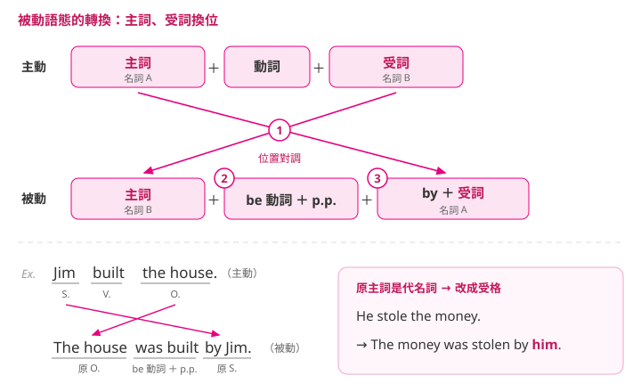

---
tags:
  - 文法/語態
  - 句型公式
  - 圖表
page: 61
difficulty: ⭐
status: 學習中
related: []
---

# 本章總覽　動詞被動語態

> [!IMPORTANT]
> **一句話核心**
> 被動語態＝**be 動詞 ＋ 過去分詞（p.p.）**；把主動句的受詞搬到句首當主詞，句子的重點就從「誰做的」換成「動作的承受者或動作本身」。

## 📊 被動語態的公式

**被動語態 ＝ be 動詞 ＋ 過去分詞（p.p.）**

### 主動語態與被動語態的比較

| 語態 | 例句 | 說明 |
| --- | --- | --- |
| 主動 | Jerry **ate** three apples. | 強調動作的**實施者**。 |
| 被動 | Three apples **were eaten** by Jerry. | 強調動作的**承受者**或是動作本身。 |

## 🔄 被動語態的轉換

> 動詞為及物動詞，也就是之後有受詞的情況下，即可將句子改為被動語態。

| 語態 | 結構公式 |
| --- | --- |
| 主動 | **主詞**（名詞 A）＋ 動詞 ＋ **受詞**（名詞 B） |
| 被動 | **主詞**（名詞 B）＋ be 動詞 ＋ p.p. ＋ by ＋ **受詞**（名詞 A） |

**三個步驟**

1. **Step 1**：主詞、受詞位置對調，即主動句中的受詞變成被動句中的主詞。
2. **Step 2**：找出新主詞的 be 動詞，並配合時式加以變化，再把原來的動詞變成過去分詞，放在 be 動詞後面。
3. **Step 3**：原主詞前需加上介系詞 by；如果原主詞是代名詞，則要改成受格。

### ✏️ 例句

| 語態 | 例句 | 結構 |
| --- | --- | --- |
| 主動 | Jim **built** the house. | S. ＋ V. ＋ O. |
| 被動 | The house **was built** by Jim. | 原 O. ＋ be 動詞 ＋ p.p. ＋ 原 S. |
| 主動 | He **stole** the money. | S. ＋ V. ＋ O. |
| 被動 | The money **was stolen** by him. | 原 O. ＋ be 動詞 ＋ p.p. ＋ 原 S. 改受格 |

## 🔤 「by ＋ 受詞」的使用情形

### ❶ by ＋ 某人

> 平常會省略，除非需要表明、或特別強調到底是誰做了這個動作時才會加上。

- The music was composed **by Beethoven**.
  這個音樂是由貝多芬譜曲的。

### ❷ （by ＋ 對象）可省略

> by 後面所接的對象身分不明確或不重要時，則可省略。

- Someone stole my money.
  → My money was stolen **(by someone)**.
  - someone 的身分並不明確，重點是「錢被偷了」
- People in Brazil speak Portuguese.
  → Portuguese is spoken in Brazil **(by people)**.
  - people 泛指一般大眾，並不是明確的某個人、也不重要

### ❸ 介系詞 ＋ 受詞

> 有時不用 by，而視前面的過去分詞來決定用哪個介系詞。

- The boys were coated **in** mud.
  這些男孩一身是泥。
- The windows were covered **with** old newspapers.
  這些窗戶覆蓋著舊報紙。

## 相關
- [[01 圖表解構英文文法/03 動詞被動語態/README|回本章目錄]]
