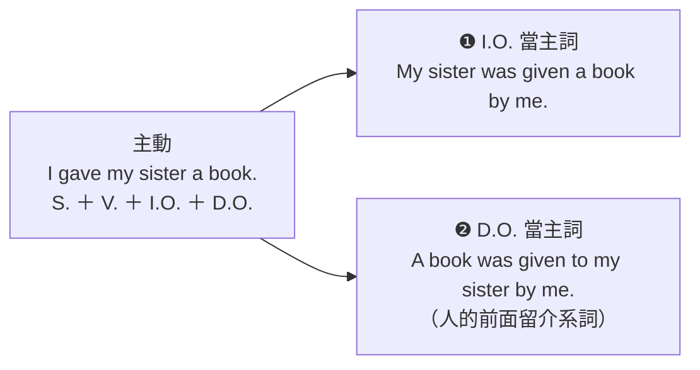

---
tags:
  - 文法/語態
  - 句型公式
  - 圖表
page: 66
difficulty: ⭐⭐
status: 未讀
related:
  - "[[03 動詞被動語態/00 本章總覽|本章總覽]]"
  - "[[01 五大句型/04 主詞＋及物動詞＋間接受詞＋直接受詞|句型 4]]"
---

# 授與動詞的被動語態

> [!IMPORTANT]
> **一句話核心**
> 授與動詞帶兩個受詞（間接受詞 I.O.＝人、直接受詞 D.O.＝物），所以同一句主動可以改成**兩種被動**——I.O. 當主詞、D.O. 當主詞；D.O. 當主詞時，人的前面要留下介系詞（give 類留 **to**、buy 類留 **for**）。

## 🧭 心智圖

```markmap
# 授與動詞的被動語態
## 主動有兩種語序
### S. ＋ 授與動詞 ＋ I.O.（人）＋ D.O.（物）
- I **gave** my sister a book.
- Aaron **bought** Samantha a beautiful necklace.
### ＝ S. ＋ 授與動詞 ＋ D.O.（物）＋ 介系詞 ＋ I.O.（人）
- I **gave** a book **to** my sister.
- Aaron **bought** a beautiful necklace **for** Samantha.
## 被動有兩種：看誰去當主詞
### ❶ I.O.（人）當主詞
- My sister **was given** a book by me.
- Samantha **was bought** a beautiful necklace by Aaron.
  - ⚠️ 人搬到句首當主詞，前面不加介系詞
  - ⚠️ 動詞後面還留著一個受詞（a book）是正常的，不是多寫
### ❷ D.O.（物）當主詞：人的前面要留介系詞
- A book **was given to** my sister by me.
- A beautiful necklace **was bought** by Aaron **for** Samantha.
  - ⚠️ 介系詞掉了就錯：was given ~~my sister~~
## 介系詞跟著動詞走
### give／send／show／teach／tell → to
- Five new words **were taught to** the students by the teacher every day.
### buy／make／cook／get／find → for
- A beautiful necklace was bought by Aaron **for** Samantha.
```

## 📊 圖表解構：一句主動 → 兩句被動

| 語態 | 結構公式 |
| --- | --- |
| 主動語態 | S. ＋ 授與動詞 ＋ **間接受詞**（I.O.）＋ **直接受詞**（D.O.）<br>＝ S. ＋ 授與動詞 ＋ **直接受詞**（D.O.）＋ 介系詞 ＋ **間接受詞**（I.O.） |
| 被動語態 | 可改成兩種被動語態（有兩種情況）：**I.O. 當主詞**／**D.O. 當主詞** |



## 📐 用法規則

### ❶　I gave my sister a book.（give → to）

> 主動語態
> - I **gave** my sister（I.O.）a book（D.O.）.
> - ＝ I **gave** a book（D.O.）**to** my sister（I.O.）. 我送妹妹一本書。

> 被動語態
> - **I.O. 當主詞** → **My sister** was given a book by me.
> - **D.O. 當主詞** → **A book** was given to my sister by me.

### ❷　Aaron bought Samantha a beautiful necklace.（buy → for）

> 主動語態
> - Aaron **bought** Samantha（I.O.）a beautiful necklace（D.O.）.
> - ＝ Aaron **bought** a beautiful necklace（D.O.）**for** Samantha（I.O.）. 艾倫買了一條漂亮的項鍊給珊蔓莎。

> 被動語態
> - **I.O. 當主詞** → **Samantha** was bought a beautiful necklace by Aaron.
> - **D.O. 當主詞** → **A beautiful necklace** was bought by Aaron for Samantha.

> [!NOTE]
> **💬 AI 補充｜介系詞跟著動詞走，不是跟著句子走**
> D.O. 當主詞時，人的前面一定要留介系詞，留哪一個由**動詞**決定：
> - **＋ to**：give 給、send 寄、show 展示、teach 教、tell 告訴、hand 交予、mail 郵寄
> - **＋ for**：buy 買、make 製作、cook 煮、get 取得、find 找
>
> 所以是 `A book was given **to** my sister.`、`A necklace was bought **for** Samantha.`——換成 `was given for` 或 `was bought to` 都不對。（同一組搭配在主動句改寫時就用得到，見 [[01 五大句型/04 主詞＋及物動詞＋間接受詞＋直接受詞|句型 4]]。）

> [!NOTE]
> **💬 AI 補充｜by 片語和介系詞片語誰先誰後**
> 書中兩句 D.O. 被動的排法不一樣：`was given **to my sister by me**`（介系詞片語在前）、`was bought **by Aaron for Samantha**`（by 片語在前）。兩種順序都通、不是規則差異；一般把較短的片語放前面唸起來比較順。

> [!WARNING]
> **💬 AI 補充｜for 類動詞的「人當主詞」實際上少見**
> 書中兩個例句都列了兩種被動，但 `Samantha was bought a beautiful necklace by Aaron.` 這種 **for 類動詞（buy、make、cook、find…）把人拉去當主詞**的說法，在實際使用中相當少見，母語人士多半直接講 D.O. 版的 `A beautiful necklace was bought for Samantha.`。to 類動詞（give、send、teach…）則兩種都很自然。
> 按書上的規則答題沒問題，但自己寫句子時，for 類優先選「物當主詞」那一種比較保險。

## ✏️ 例句

| 英文例句 | 中文翻譯 | 重點 |
| --- | --- | --- |
| I **gave** my sister a book. | 我送妹妹一本書。 | 主動❶：V ＋ I.O. ＋ D.O. |
| I **gave** a book **to** my sister. | 我送妹妹一本書。 | 主動❶：V ＋ D.O. ＋ to ＋ I.O. |
| **My sister** was given a book by me. | 我送妹妹一本書。 | 被動❶：I.O. 當主詞 |
| **A book** was given **to** my sister by me. | 我送妹妹一本書。 | 被動❶：D.O. 當主詞，留 to |
| Aaron **bought** Samantha a beautiful necklace. | 艾倫買了一條漂亮的項鍊給珊蔓莎。 | 主動❷：V ＋ I.O. ＋ D.O. |
| Aaron **bought** a beautiful necklace **for** Samantha. | 艾倫買了一條漂亮的項鍊給珊蔓莎。 | 主動❷：V ＋ D.O. ＋ for ＋ I.O. |
| **Samantha** was bought a beautiful necklace by Aaron. | 艾倫買了一條漂亮的項鍊給珊蔓莎。 | 被動❷：I.O. 當主詞 |
| **A beautiful necklace** was bought by Aaron **for** Samantha. | 艾倫買了一條漂亮的項鍊給珊蔓莎。 | 被動❷：D.O. 當主詞，留 for |

## ✍️ 練習題（書中）

**主動語態：**

The teacher taught the students five new words every day.

- [ ] ＝ The teacher taught five new words ＿＿＿＿ the students every day.（老師每天教學生五個生字。）

**被動語態：**

- [ ] → The students ＿＿＿＿＿＿＿＿＿＿＿＿＿＿＿.
- [ ] → Five new words ＿＿＿＿＿＿＿＿＿＿＿＿＿＿＿.

<details>
<summary>✅ 解答</summary>

主動語態：**to**（teach 屬 to 類）

被動語態：
- → The students **were taught five new words every day by the teacher**.（I.O. 當主詞）
- → Five new words **were taught to the students by the teacher every day**.（D.O. 當主詞，人的前面留 to）

</details>

## ⚠️ 易錯點分析　💬 AI 補充

> [!WARNING]
> **常見錯誤**
> - ❌ A book was given ~~my sister~~ by me.　✅ A book was given **to** my sister by me.（D.O. 當主詞時，被留在原地的人前面一定要補介系詞——這是最常掉的一個字）
> - ❌ A beautiful necklace was bought ~~to~~ Samantha.　✅ A beautiful necklace was bought **for** Samantha.（介系詞由動詞決定：give 類 to、buy 類 for，不是一律 to）
> - ❌ ~~To my sister~~ was given a book.　✅ **My sister** was given a book.（I.O. 當主詞時反過來，人前面不加介系詞——介系詞只在人「留在後面」時才出現）
> - ❌ My sister was ~~gave~~ a book by me.　✅ My sister **was given** a book by me.（被動用 p.p.：give–gave–**given**、buy–bought–**bought**、teach–taught–**taught**）
> - ❌ 覺得 `My sister was given a book.` 多寫了 a book，硬把它刪掉　✅ 這個受詞本來就要留著（兩個受詞只搬走一個，另一個留在動詞後面）
> - ❌ Five new words ~~was~~ taught to the students.　✅ Five new words **were** taught to the students.（be 動詞跟著**新主詞**的單複數走：five new words 是複數）
>
> **為什麼錯：** 授與動詞有兩個受詞，改被動時**只搬走一個、另一個留在原地**——所以被動句的動詞後面還掛著一個名詞是正常現象。真正要決定的只有兩件事：**搬走誰**（人＝❶、物＝❷），以及**留下來的人要不要介系詞**（人被留在後面就要，而且 give 類用 to、buy 類用 for）。最後照一般被動的通則檢查：be 動詞跟新主詞一致、動詞用 p.p. 不用過去式。

## 🧠 自我測驗　💬 AI 補充

> **讀完當天**作答一次，答完再看下方答案——檢查有沒有真的讀懂。
> ⚠️ **不要每輪複習重做**：題目是寫死的，重做只會把這幾題背起來。後續複習改用現場生成的新題。

- [ ] Q1：把 `My uncle sent me a postcard.` 改成兩種被動語態。
- [ ] Q2：把 `Mom made us pancakes.` 改成「物當主詞」的被動語態。
- [ ] Q3：下面這句錯在哪？`A new bike was given my brother by Dad.`
- [ ] Q4：為什麼 `The students were taught five new words.` 不用介系詞，`Five new words were taught to the students.` 卻要有 to？

<details>
<summary>✅ 解答</summary>

A1：I.O. 當主詞 → **I was sent a postcard by my uncle.**；D.O. 當主詞 → **A postcard was sent to me by my uncle.**（send 屬 to 類；me 當主詞要改主格 I）
A2：**Pancakes were made for us by Mom.**（make 屬 for 類，人的前面留 for；主詞 pancakes 是複數，be 動詞用 were）
A3：漏了介系詞——物當主詞時，留在後面的人要有 to → **A new bike was given to my brother by Dad.**
A4：介系詞只在人「留在原地」時才需要。人被搬到句首當主詞（The students），前面什麼都不加；人留在動詞後面（… to the students），就得靠 to 把它接住——teach 屬 to 類，所以是 to 不是 for。

</details>

## 🔗 延伸與對比
- 授與動詞本身的兩種語序、to／for／of／from 的完整搭配表，見 [[01 五大句型/04 主詞＋及物動詞＋間接受詞＋直接受詞|句型 4]]。
- 一般被動的轉換三步驟（主詞受詞對調、be ＋ p.p.、原主詞前加 by）見 [[03 動詞被動語態/00 本章總覽|本章總覽]]；換時式看 [[01 各種時式的被動語態]]，配情態助動詞看 [[02 情態助動詞的被動語態]]。

## 相關
- [[01 圖表解構英文文法/03 動詞被動語態/README|回本章目錄]]
