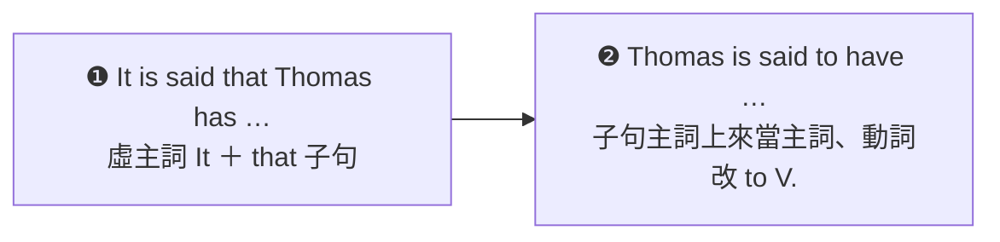

---
tags:
  - 文法/語態
  - 句型公式
  - 圖表
page: 74
difficulty: ⭐⭐
status: 未讀
related:
  - "[[03 動詞被動語態/00 本章總覽|本章總覽]]"
  - "[[01 各種時式的被動語態]]"
---

# 表達客觀立場時，會用被動語態

> [!IMPORTANT]
> **一句話核心**
> 要講「據說、一般認為」而不點名是誰說的，用被動的兩種寫法：**It ＋ be ＋ p.p. ＋ that 子句**，或把 that 子句的主詞拉到句首、動詞改成不定詞——**S. ＋ be ＋ p.p. ＋ to ＋ V.**。兩句意思完全相同。

## 🧭 心智圖

```markmap
# 表達客觀立場時，會用被動語態
## 寫法❶ It ＋ be 動詞 ＋ p.p. ＋ that ＋ S. ＋ V.
### 用虛主詞 It 開頭，後面接完整子句
- **It is said** that Thomas has the best chance of winning.
- So far, **it has been assumed** that they are a perfect match.
## 寫法❷ S. ＋ be 動詞 ＋ p.p. ＋ to ＋ V.
### 把 that 子句的主詞拉到句首，動詞改成 to V.
- Thomas **is said to have** the best chance of winning.
- So far, they **have been assumed to be** a perfect match.
  - ⚠️ 主詞換人，be 動詞要跟著換（it has been → they have been）
  - ⚠️ 子句動詞要變不定詞：has → to have、are → to be
## 兩種寫法怎麼換
### 三個動作
- ① that 子句的主詞搬到句首當主詞
- ② 原本的 It 不要了
- ③ 子句動詞改成 to ＋ 原形
```

## 📊 圖表解構：同一句話的兩種寫法

| # | 結構公式 | 例句 |
| --- | --- | --- |
| ❶ | **It ＋ be 動詞 ＋ p.p. ＋ that ＋ S. ＋ V.** | It is said **that Thomas has** the best chance of winning. |
| ❷ | **S. ＋ be 動詞 ＋ p.p. ＋ to ＋ V.** | **Thomas** is said **to have** the best chance of winning. |



## 📐 用法規則

**It ＋ be 動詞 ＋ p.p. ＋ that ＋ S. ＋ V.　＝　S. ＋ be 動詞 ＋ p.p. ＋ to ＋ V.**

> Ex.
> - It **is said** that Thomas has the best chance of winning.
>   → Thomas **is said to have** the best chance of winning. 據說湯瑪斯贏得勝利的機會最大。
> - So far, it **has been assumed** that they are a perfect match.
>   → So far, they **have been assumed to be** a perfect match. 到目前為止，他們一直被認為是天造之合。

> [!NOTE]
> **💬 AI 補充｜❶ 換成 ❷ 的三個動作**
> 1. **that 子句的主詞搬到句首**當新主詞（that **Thomas** has… → **Thomas** is said…）。
> 2. **It 不要了**——它本來只是佔著主詞位子的虛主詞，真正的主詞上來以後就沒它的事。
> 3. **子句動詞改成 to ＋ 原形**（has → to have、are → to be）。
>
> 主詞換人以後，前面那個 be／have 也要跟著新主詞走：`it **has** been assumed` → `they **have** been assumed`。

> [!NOTE]
> **💬 AI 補充｜這個句型常配哪些動詞**
> 這類「不點名是誰說的」句型，p.p. 的位置常見這些字：**say（據說）、believe（一般相信）、think（大家認為）、know（眾所周知）、report（據報導）、assume（一般認為）、consider（被認為）、expect（預期）、suppose（照理說）**。
> 用途是**把消息來源藏起來**——不是我說的、也不是某個人說的，而是「大家都這麼說」，所以新聞、論文、公告特別愛用。

> [!NOTE]
> **💬 AI 補充｜子句的事情比較早，用 to have ＋ p.p.**
> 書中兩個例句裡，子句的事情和主要動詞是**同一個時間**（現在說、現在有機會），所以用 `to ＋ 原形`。若子句講的是**更早**發生的事，不定詞要改成完成式：
> - It is said that he **was** a famous singer.（據說他以前是名歌手）
>   → He is said **to have been** a famous singer.
> 對照書中的 `Thomas is said **to have** the best chance`——那個 have 是「擁有」，不是完成式的 have，兩者長得像但不同東西。

## ✏️ 例句

| 英文例句 | 中文翻譯 | 重點 |
| --- | --- | --- |
| It **is said** that Thomas has the best chance of winning. | 據說湯瑪斯贏得勝利的機會最大。 | ❶ It ＋ be ＋ p.p. ＋ that 子句 |
| Thomas **is said to have** the best chance of winning. | 據說湯瑪斯贏得勝利的機會最大。 | ❷ S. ＋ be ＋ p.p. ＋ to V. |
| So far, it **has been assumed** that they are a perfect match. | 到目前為止，他們一直被認為是天造之合。 | ❶ 現在完成式的被動 ＋ that 子句 |
| So far, they **have been assumed to be** a perfect match. | 到目前為止，他們一直被認為是天造之合。 | ❷ 主詞換人，has been → have been |

## ⚠️ 易錯點分析　💬 AI 補充

> [!WARNING]
> **常見錯誤**
> - ❌ Thomas is said ~~that he has~~ the best chance of winning.　✅ 二選一：**It is said that** Thomas has…／**Thomas is said to have**…（兩種寫法不能混用——用了人當主詞就走不定詞，用了 that 子句就要 It 開頭）
> - ❌ Thomas is said ~~has~~ the best chance.　✅ Thomas is said **to have** the best chance.（拉上來以後，子句動詞一定要變成不定詞）
> - ❌ They have been assumed ~~are~~ a perfect match.　✅ They have been assumed **to be** a perfect match.（be 動詞也一樣要變 to be）
> - ❌ So far, they ~~has been~~ assumed to be a perfect match.　✅ So far, they **have been** assumed…（主詞從 it 換成 they，前面的助動詞要跟著換）
> - ❌ ~~He is said that~~ he is rich.／❌ ~~That~~ is said that…　✅ **It** is said that he is rich.（❶ 的句首只能是虛主詞 It）
> - ❌ It is said that he was a famous singer. → ❌ He is said ~~to be~~ a famous singer.　✅ He is said **to have been** a famous singer.（子句講的是更早的事，不定詞要用完成式）
>
> **為什麼錯：** 兩種寫法各有一套零件，選一套就要配到底。❶ 用 **It** 佔主詞位子，後面接一個**完整的句子**（that ＋ 主詞 ＋ 動詞）；❷ 把子句主詞請上來當主詞，句子只剩一個動詞，原本的子句動詞就得降級成**不定詞**（to V.）。換過去以後記得檢查兩件事：前面的 be／have 有沒有跟新主詞一致、子句的事情是不是更早（更早就用 to have ＋ p.p.）。

## 🔗 延伸與對比
- 這個句型的骨架仍是一般被動（`be ＋ p.p.`），換時式的方式見 [[01 各種時式的被動語態]]（例句裡的 `has been assumed` 就是現在完成式的被動）。
- 為什麼要用被動、by 片語什麼時候省略，見 [[03 動詞被動語態/00 本章總覽|本章總覽]]——本節正是「動作者不重要、也不想點名」的典型場合。

## 相關
- [[01 圖表解構英文文法/03 動詞被動語態/README|回本章目錄]]
