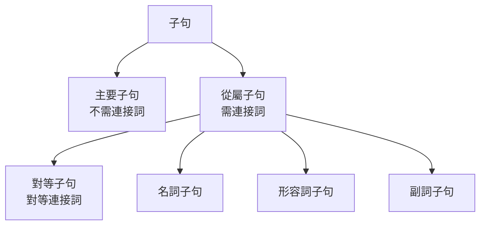

---
tags:
  - 文法/句型
  - 句型公式
  - 對比辨析
  - 圖表
  - 易錯點
source: https://app.notion.com/p/59146c16281447f79f61da5721e766ba
difficulty: ⭐⭐
status: 未讀
related: []
---

# 句子的要素及種類

> [!IMPORTANT]
> **一句話核心**
> 句子 = **主部（主詞）+ 述部（述語動詞＋受詞／補語）**。主詞、受詞須是**名詞或名詞相等語**；動詞依「**有無受詞**」分及物／不及物、依「**有無補語**」分完全／不完全。句子**按內容**分直述／疑問／祈使／感嘆，**按結構**分單句／合句／複句／複合句。**片語**＝無主詞動詞、**子句**＝有主詞動詞。

## 📊 句子的組成：主部 + 述部

| 主部（＝主詞） | 述部（動詞＋…） |
| --- | --- |
| We | laughed. |
| The tall **boy** | looks tired. |
| All the **students** in the school | must wear uniforms. |

> 主部裡真正的主詞是核心名詞（the tall **boy** → boy；All the **students**… → students），其餘為修飾語。

---

## 🔤 十大詞類
> 傳統 8 大詞類，老師細分成 10 類（助動詞歸動詞、感嘆詞另計）。

| 詞類 | 功能 | 例 |
| --- | --- | --- |
| 名詞 Noun | 人事地物名稱 | teacher、computer |
| 冠詞 Article | 特定／不特定，放名詞前 | a、an、the |
| 代名詞 Pronoun | 代替名詞 | I、him、some |
| 形容詞 Adjective | 表名詞的性質、狀態、數量 | happy、many |
| 副詞 Adverb | 修飾動詞／形容詞／副詞 | tomorrow、here、very |
| 動詞 Verb | 表狀態或動作 | be、love、run |
| 助動詞 Aux. verb | 表時態、語態、否定、疑問 | have、do、can |
| 連接詞 Conjunction | 連接單字／片語／子句 | and、but、when |
| 介系詞 Preposition | 放名詞前表時地；或與動詞結合成片語 | in、on、at |
| 感嘆詞 Interjection | 表喜怒哀樂，句尾常加驚嘆號 | oh、well、ouch |

---

## 🧱 句子的要素

### 主詞 ⇒ 名詞或名詞相等語
> 「名詞相等語」＝跟名詞差不多、能當主詞的：代名詞、不定詞、動名詞、名詞片語、名詞子句…。

| 主詞形式 | 例 |
| --- | --- |
| 名詞 | **The telephone** rang early in the morning. |
| 代名詞 | **He** is a famous musician. |
| 不定詞 | **To read novels** is pleasant.（一件事 → 單數動詞） |
| 動名詞 | **Learning a foreign language** is important. |
| 名詞片語 | **Who to bell the cat** is a big problem. |
| 名詞子句 | **That he is honest** is true. |

> [!TIP]
> **the + 形容詞／the + 分詞 ⇒ 等同名詞，可當主詞（指一群人，複數）**
> - **The rich** are not always happy.（有錢人）／**The wounded** numbered ten.（傷者；wounded 過去分詞表被動）

### 動詞
- **由結構分**：一個字的動詞（saw）／複合動詞（have given up）。
- **由用法分**：
  - **受詞有無** → **及物**（提及他物，有受詞：I **love** chocolate.）／**不及物**（無受詞）。
  - **補語有無** → **不完全**（需補語：I am a girl.）／**完全**（不需補語）。

| 動詞類型 | 特徵 | 例 |
| --- | --- | --- |
| 完全不及物 | 無受詞、無補語 | The car **won't start.** |
| 不完全不及物 | 無受詞、有補語 | The sky **is** blue.（blue 為補語） |
| （完全）及物 | 有受詞 | I **love** chocolate.（chocolate 為受詞） |

> ⚠️ 助動詞一定跟動詞在一起（won't start）。

### 受詞 ⇒ 名詞或名詞相等語
- 名詞：She cooks **dinner**.／代名詞：I have met **him**.
- 不定詞／動名詞：He began **to sing**.／He enjoyed **playing tennis**.
- 名詞片語：He knew **who to ask**.／名詞子句：I believed **what he said**.（what = the thing(s) which）
- the + 分詞：The ambulances sent **the injured** to the hospital.

### 補語 ⇒ 名詞、形容詞、副詞及其相等語
- 主詞補語：His latest novel is **interesting**.／受詞補語：I found his latest novel **interesting**.
- 所有代名詞：The blue sweater is **mine**.／動名詞：One of my hobbies is **making artificial flowers**.
- 地方副詞當補語：The cat is **under the table**.

### 修飾語（形容詞／副詞，可有可無，但增強表達）
- **修飾名詞**（形容詞、冠詞、代名詞、分詞、不定詞、片語、子句）：a picture **on the wall**、books **which I have already read**、something **interesting to read**。
- **修飾動詞／形容詞／副詞**（副詞、片語、不定詞、副詞子句）：
  - He usually jogs **in the park for an hour before breakfast**.（**地點在前、時間在後；皆小單位→大單位**）
  - **Very** strange men walked **quite fast** down the stairs.（very 修飾 strange、quite 修飾 fast、fast 修飾 walk）

---

## 🧩 片語與子句
> [!WARNING]
> **片語 = 兩字以上、有獨立意思、但「沒有主詞沒有動詞」；子句 = 句子的一部分、「本身含主詞 + 動詞」。差別就在有沒有主詞動詞。**

- **片語**（依詞性分名詞／形容詞／副詞片語）：
  - 副詞片語：I often stop **at a convenience store** **on my way home**.
  - 形容詞片語（後位修飾）：The book **on the desk** is mine.
  - 名詞片語：I don't know **what to do**.（能代換的須詞性相同）
- **子句**：只要有主詞＋動詞就是「句」；多一個主詞或動詞就要用**連接詞**。
  - **主要子句**（不需連接詞引導，老大）vs **從屬子句**（需連接詞引導，跟班）。

- 對等子句（對等連接詞，可單獨存在）：Jane went out, **but** Mike stayed home.
- 名詞子句：I know **(that) you are doing your best**.
- 形容詞子句：These are pictures **which I took in Kenting**.
- 副詞子句：Judy put her coat on a hanger **before she sat down**.

---

## 🗂️ 句子的種類（由內容分）

### 直述句（含肯定、否定）
- My sister **is** a TV director.／My sister **is not** a TV director.

### 疑問句
| 類型 | 說明 | 例 |
| --- | --- | --- |
| Yes／No 問句 | be／助動詞為首，可答 yes／no | **Do** you know her address? — Yes, I do. |
| WH 問句 | 疑問詞為首，**不可**答 yes／no | **Where** are you from? — I'm from Sydney. |
| 選擇問句 | 含 or，直接答選項 | Coffee **or** tea? — Coffee, please. |
| 附加問句 | 附在直述句後 | It's very hot today, **isn't it?** |
| 修辭問句 | 反問語氣、不一定要答 | **Who knows?**（= No one knows.） |
| 間接問句 | 疑問詞移入句中，其後為 S + V | Do you know **what time it is**? |

> [!WARNING]
> **幾個易錯點**
> - **否定疑問句的答法看事實**：Doesn't he speak English? — 會說就 **Yes, he does**；不會就 No（與中文相反）。
> - **疑問詞當主詞**（疑問代名詞）→ 其後直接接動詞，**狀況不明視為單數**：**Who runs** faster, Tom or John?
> - **附加問句三原則**：肯定句→否定附加、否定句→肯定附加；be／助動詞依前句判斷、否定要縮寫；主詞用**人稱代名詞**。
> - **間接問句語序**：疑問詞入句中後改「S + V」肯定語序（what time **it is**，非 what time **is it**）。

### 祈使句（請求／命令／建議）
- 一般：`原形 + …`（Wait a minute, please.）／否定：`Don't（Never）+ 原形`（Never 語氣更強）／邀請：`Let's + 原形`。
- **省略主詞 you、用現在式動詞**。

### 感嘆句
- `What + a/an + 形容詞 + 名詞 (+ 主詞 + 動詞)!`：**What a beautiful girl she is!**
- `How + 形容詞／副詞 (+ 主詞 + 動詞)!`：**How beautiful (a girl she is)!**／**How (hard) it rains!**（副詞感嘆只能用 How）
- 形容詞常省略（What a day! 靠語氣判斷褒貶）。

---

## 🏗️ 句子的種類（由結構分）

| 種類 | 定義 | 例 |
| --- | --- | --- |
| **單句** | 只有一組〈主部＋述部〉 | Jason and Jack **rushed** into the classroom.（兩主詞一動詞仍是單句） |
| **合句** | 對等連接詞連接的兩個對等子句 | I missed the last train, **so** I took a taxi home. |
| **複句** | 從屬連接詞連接主要子句＋從屬子句 | I want to finish the work **before it gets dark.** |
| **複合句** | 一個以上從屬子句＋獨立子句（口語最常用） | She knew **what she wanted**, **but** she never told anyone. |

> ⚠️ **單句判準**：一主詞＋兩動詞（用 and）、或兩主詞＋一動詞，仍是單句；**同時出現兩主詞兩動詞**才不是單句。

---

## ⚠️ 易錯點分析

> [!WARNING]
> **常見錯誤（皆為來源整理的重點）**
> - 主詞、受詞必為**名詞或名詞相等語**；動詞不能直接當主詞 → 改不定詞或動名詞。
> - **the + 形容詞／分詞**＝一群人（複數動詞）：The rich **are**…。
> - 動詞四分：完全／不完全 × 及物／不及物，看**受詞、補語的有無**。
> - **片語無主詞動詞、子句有主詞動詞**；多一主詞或動詞就要連接詞。
> - **否定疑問句答法看事實**（Yes = 肯定事實，與中文相反）。
> - **疑問詞當主詞視為單數**（Who runs…）。
> - **間接問句**用「S + V」肯定語序、非疑問語序。
> - **單句**可有兩主詞（and）或兩動詞（and）；兩主詞＋兩動詞才需連接詞、才非單句。

---

## 🔗 延伸與對比
- 相關主題：[[06 五大句型]]（本篇的「動詞四分」延伸為五大句型）、[[08 疑問]]（各類疑問句細節）、[[20 連接詞]]（對等／從屬連接詞與子句）、[[01 不定詞]]・[[02 動名詞]]（名詞相等語當主詞／受詞／補語）、[[11 關係詞]]（形容詞子句、子句 vs 片語）
- **補充內容**（Notion「✏️ 補充內容」內連結的第三方文章，僅列為線索）：〈that 名詞子句用法大全〉、〈片語與子句補充〉、〈句子種類補充〉。

---

## 🧠 自我測驗　💬 AI 補充
> 複習時作答，答完再看下方答案。（此區為 AI 出題，非來源內容）

- [ ] Q1：指出主詞與動詞類型：The sky is blue.
- [ ] Q2：把動詞當主詞改成合法主詞：Read novels is pleasant.
- [ ] Q3：回答（他確實會說）：Doesn't he speak English? — ___
- [ ] Q4：改成間接問句：What time is it? → Do you know ___ ?
- [ ] Q5：判斷句型（單／合／複／複合）：I missed the train, so I took a taxi.
- [ ] Q6：改感嘆句（用 What）：She is a very beautiful girl.

✅ 解答

A1：主詞 The sky；is 為**不完全不及物**動詞（blue 是主詞補語）。
A2：動詞不能當主詞 → **To read** novels is pleasant.（或 Reading novels…）。
A3：事實會說 → **Yes, he does.**
A4：疑問詞入句中用 S+V → Do you know **what time it is**?
A5：對等連接詞 so 連兩子句 → **合句**。
A6：**What a beautiful girl she is!**

