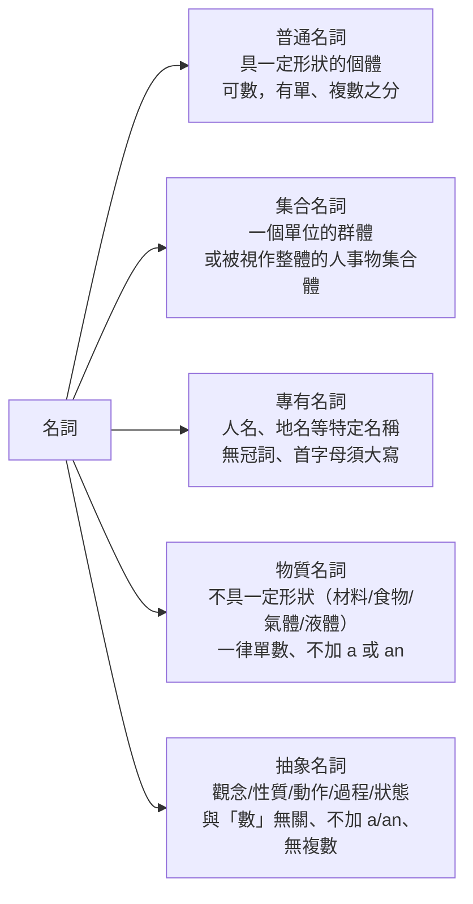

---
tags:
  - 文法/詞類
  - 圖表
  - 對比辨析
  - 易錯點
source: https://app.notion.com/p/af59444a56ad41fca1d433f118afb199
difficulty: ⭐
status: 學習中
review: []
related: []
---

# 名詞、冠詞

> [!IMPORTANT]
> **一句話核心**
> 名詞是人、事、地、物的名稱，可當**主詞／受詞／補語**，分五類、有單複數與所有格變化；冠詞放名詞前修飾名詞——**a / an** 表「不特定的一個」（只接單數可數），**the** 表「特定」（可數不可數、單複數皆可）。

---

## 🧩 名詞介紹

> [!NOTE]
> **名詞（noun）**：用來表示人或事物、動物，能做為**主詞、補語、受詞**。
> - 可計數的稱為**可數名詞**。
> - 不可計數的稱為**不可數名詞**。

- 人、事、地、物的名稱或名字，就叫做名詞 ⇒ 能做主詞、補語、受詞。
- 不管是一個字的名詞或是一長串的名詞，只要是名詞，功能就是當主詞、補語、受詞使用。
- 不定詞、動名詞具有名詞的功用，所以也可以當名詞使用。
- **主詞**：句子的第一要素，是整個句子的主角。
- **受詞**：接受動詞動作的人或物。
- **補語**：用來補充說明的就叫做補語。

---

## 📊 名詞的種類

### 普通名詞
表示具有一定形狀的個體，為**可數名詞**，有單數、複數之分。例如：book(書)、pencil(鉛筆)、dog(狗)、spaceship(太空船)等。

> [!WARNING]
> **當一個名詞分為單數和複數時，要在句子中表現出單數或是複數。**
> - ✅ I like dogs.
> - ❌ I like dog.
> - 因為我喜歡的是狗這樣的動物，並不是說我喜歡這一隻狗。

### 集合名詞
表示一個單位的群體，或者表示被視作整體的人、事、物的集合體。例如 class(班級、班上的同學)、family(家庭、家)、audience(聽眾)等。

可以指群體，也可以指群體裡面的一個東西：

| 字 | 群體 | 群體裡的一個 |
| --- | --- | --- |
| class | 班級 | 班上的同學 |
| family | 家庭 | 家人 |
| audience | 一群聽眾 | 一個聽眾 |

> [!TIP]
> **從前後文就可以判斷出單、複數的名詞**
> - My **family** is large.（我家是大家庭。）
> - My **family** are all early risers.（我的家人都起得早。）

### 專有名詞
如人名、地名等，用來表示其一特定的名稱。無冠詞，第一個字母須大寫。例如 Bob(鮑伯)、Smith(史密斯)、April(四月)、London(倫敦)等。

> [!WARNING]
> **注意點：**
> - 第一個字母需要大寫。
> - 不加 a、an。
> - 不能有複數的表現。

- 下列專有名詞需要加上定冠詞 **the**。（例）the United States(美國)、the United Nations(聯合國)。
  - 提到國家名稱要加上 the。
  - 提到特殊組織要加上 the。

### 物質名詞
表示不具有一定形狀的物質名詞，如材料、食物、氣體、液體等。一律用單數，但前面不加 a 或 an。例如 glass(玻璃)、wood(木頭)、paper(紙)、butter(奶油)、fruit(水果)、meat(肉)、sugar(糖)、air(空氣)、gas(瓦斯)、water(水)等。

> [!NOTE]
> **物質名詞計算數量**：用容器或度量衡的單位來表示，即 ⇒ **數字 + 容器(度量衡) + of + 物質名詞**。
> - a loaf of bread（一條麵包）、loaves of bread（很多條麵包）
> - a cup of coffee（一杯咖啡）、two cups of coffee（兩杯咖啡）
> - a sheet of paper（一張紙）
> - a spoonful of sugar（一匙糖）

> [!NOTE]
> 也可以把一個可測量的東西加上 **-ful** 當成單位：
> - hand → handful → a handful of（一把）→ 一把沙子
> - arm → armful → an armful of（一把）→ 一把木材（指抱起來的動作，如一把木材）

### 抽象名詞
表示觀念、性質、動作、過程、狀態等。例如 beauty(美麗)、honesty(誠實)、love(愛)、patience(耐心)、happiness(幸福)、music(音樂)等。

> [!WARNING]
> **注意點：**
> - 原則上與「數」無關。
> - 一律使用單數，但前面不加 a 或 an。

---

## 🔢 名詞的數（單複數變化）

> 表示人或事物的名詞中，有一些是可以計數的。個數只有一個的情形，稱之為**單數**；個數超過一個時，稱之為**複數**。

### 規則變化的複數名詞

| 情況 | 變化 | 例 |
| --- | --- | --- |
| 大部分名詞 | 字尾加 **s** | dog→dogs、book→books、girl→girls |
| 字尾為 s、z、x、sh、ch | 加 **es**（發 [ɪz]） | class→classes、bus→buses、dish→dishes、bench→benches、box→boxes |
| 子音 + y | 去 y + **ies** | baby→babies、story→stories、city→cities、lady→ladies |
| 字尾為 f 或 fe | 去 f/fe + **ves** | leaf→leaves、wife→wives、knife→knives |
| 母音 + o | 加 **s** | zoo→zoos、radio→radios、studio→studios |
| 子音 + o | 加 **es**（發 [z]） | hero→heroes、tomato→tomatoes、potato→potatoes |
| 字尾 o（兩可） | 加 **s** 或 **es** 皆可 | mosquito(e)s、volcano(e)s、tornado(e)s |

> [!NOTE]
> **發音與例外**
> - 加 s：字尾有聲，s 發 [z]；字尾無聲，s 發 [s]。
> - 子音+y 去 y+ies：因為 y 跟 i 都發 [ɪ]，es 發 [z]。
> - f/fe→ves：f 與 v 發音相似、嘴型相近，故 ves 的 v 發 [v]。
> - **f/fe 的例外（直接加 s）**：chiefs（首領）、handkerchiefs（手帕）、roofs（屋頂）。
> - 子音+o 加 es 有例外：photos（照片）、pianos（鋼琴）直接加 s。

### 不規則變化的複數名詞

| 類型 | 例 |
| --- | --- |
| 字尾加 en、ren | ox→oxen、child→children |
| 改變母音 | man→men、woman→women、goose→geese、tooth→teeth、mouse→mice |
| 單複數同形 | deer、sheep、Chinese、Japanese |

> [!NOTE]
> **fish 的特例**
> - 表示**數量** → one fish、two fish（同形）。
> - 表示**種類** → 要加 es：a kind of fish、two kinds of fishes。

### 更多規則與例外　💬 AI 補充
> 改寫自外部文章 english.cool[〈英文複數規則〉](https://english.cool/nouns-plural/)，補謝孟媛講義未提到的部分（非講義原文）。

- **母音 + y → 直接加 s**（對照前面「子音+y→ies」）：boy→boys、day→days、key→keys。
- **字尾 ch 但發 [k] 音 → 直接加 s**：stomach→stomachs、monarch→monarchs。
- **f/fe 直接加 s 的更多例外**：roof→roofs、proof→proofs、belief→beliefs、cliff→cliffs、safe→safes。
- **外來語複數**（源自拉丁／希臘文，需個別記）：
  - datum→data、medium→media、bacterium→bacteria、curriculum→curricula、criterion→criteria、phenomenon→phenomena
  - basis→bases、crisis→crises、oasis→oases、thesis→theses、analysis→analyses、diagnosis→diagnoses
- **更多單複數同形**：species（物種）、aircraft（航空器）、means（方法）、offspring（後代）、headquarters（總部）；字尾 -ss／-ese 的國籍如 Swiss、Chinese。

---

## 🏷️ 名詞的所有格

> [!TIP]
> **什麼東西歸某人所有，就叫做所有格。**

### 所有格形式

| 名詞類型 | 形式 | 例 |
| --- | --- | --- |
| 單數名詞 | 名詞 **'s** | the boy's schoolbag、Joan's dress |
| 複數名詞（字尾 s） | 名詞s **'** | a girls' school、these students' teacher |
| 字尾非 s 的複數名詞 | 名詞 **'s** | children's playground、women's activities |

### 特別注意的所有格用法
- **共同所有格**（→ 名詞 + 名詞 + … + 名詞's）：Harry and Bill**'s** father is a scientist.（Harry 和 Bill 的父親是一位科學家＝同一人。）
- **個別所有格**（→ 名詞's + 名詞's + … + 名詞's）：Harry**'s** and Bill**'s** fathers are scientists.（Harry 和 Bill 的父親都是科學家＝各自的父親。）
- **（無）生物所有格　A 的 B → B of A**：
  - 桌子的腳：the legs of the table
  - 車門：the door of the car
  - 女孩的名字：the girl's name、the name of the girl
- **所有格後的名詞在句中很好理解時，可以省略**：
  - She's going to the dentist**'s**.（她要去看牙。）
  - I met him at the barber**'s**.（我在理髮院遇到他。）
  - We like to eat lunch at McDonald**'s**.（我們喜歡去麥當勞吃午餐。）

---

## 📰 冠詞 a / an / the

> 冠詞可分為**不定冠詞 a(an)** 及**定冠詞 the**，通常放在名詞之前，用來修飾名詞。

### a、an 的用法

> [!TIP]
> **純粹表示數量為 1，沒有限定的意思。**

- **a + 子音開頭的單數名詞**：a book（一本書）、a girl（一個女孩）、a young man（一位年輕人）。
- **an + 母音開頭的單數名詞**：an apple（一個蘋果）、an umbrella（一把雨傘）、an old woman（一個老女人）。

> [!WARNING]
> **注意點：**
> - 只能使用在**單數名詞**；究竟用 a 或 an，取決於**緊跟著的單字**。
> - 名詞前有形容詞時，是看**形容詞**是否為母音開頭來決定用 a 或 an。

- **a(an) 的發音**：一般 a[ə]、an[ən]；但強調「一個」、特別加重語氣時，可讀成 a[e]、an[æn]。
  - I read a novel.　[ə]
  - I read **a** novel, not two.　[e]

### the 的用法
- 定冠詞 the 可限定**可數與不可數名詞**，可表示**單數及複數**，也可用來限定形容詞。母音前讀 [ðɪ]、子音前讀 [ðə]。
  - 可翻成 ⇒ 這一個、那一個、這些、那些。
  - Please shut the door.（請關門。）
  - The rich aren't always happy.（有錢人並非總是快樂。）→ **the + 形容詞**泛指「～的人」，代表複數。

### 比較

| 不定冠詞 a、an | 定冠詞 the |
| --- | --- |
| 表示不特定的事物 | 表示特定的事物 |
| 只能接可數名詞 | 可接可數名詞和不可數名詞 |
| 只能用於單數 | 可用於單數和複數 |

### 何時在專有名詞前加 the　💬 AI 補充
> 延伸自上方「名詞的種類 → 專有名詞」的補充整理（來源為 Notion 補充頁，非謝孟媛講義）。專有名詞原則上不加冠詞，但下列情況要加 the。

**要加 the：**
- **河流、海洋、海灣、山脈**：the Nile、the Atlantic Ocean、the Gulf of Mexico、the Alps
- **群島、群山、沙漠**：the Philippines、the Andes、the Sahara
- **含 republic／kingdom／states 或由多個詞組成的國名**：the United States、the United Kingdom、the Netherlands、the Republic of Korea
- **著名建築、酒店、博物館（名稱含普通名詞）**：the Empire State Building、the Louvre、the Ritz
- **機構、組織**：the United Nations、the Red Cross
- **報紙、期刊**：the New York Times、the Guardian

**不加 the：**
- **人名、多數地名**：John Smith、Paris、Japan
- **單一山峰、湖泊**：Mount Everest、Lake Superior
- **單一詞組成的國名**：France、China、Brazil

---

## ⚠️ 易錯點分析

> [!WARNING]
> **常見錯誤（皆為來源整理的重點）**
> - ❌ I like dog.　✅ I like dogs.　→ 泛指某類動物，可數名詞要用**複數**。
> - 專有名詞：**首字母大寫、不加 a/an、不用複數**；但**國家名／特殊組織**要加 the（the United States、the United Nations）。
> - 物質名詞、抽象名詞：**一律單數、不加 a/an**；物質名詞計量用「數字＋容器＋of＋名詞」。
> - a／an 的選擇看**緊跟的單字發音**（有形容詞看形容詞），不是看名詞本身。

---

## 🔗 延伸與對比
- **外部延伸閱讀**（english.cool，第三方文章，非謝孟媛講義）：
  - [主詞、動詞、受詞、補語是什麼？](https://english.cool/subject-verb-object-complement/) — 句型觀念（本篇未展開，屬「句型」主題，待建 [[13 動詞]] 時再對接）
  - [【英文複數】加 s？加 es？名詞複數規則](https://english.cool/nouns-plural/) — 複數變化完整版（重點已折入上方「名詞的數 → 更多規則與例外 💬」）
- 「專有名詞何時加 the」的補充頁內容已折入上方「冠詞 💬」段，不另列連結。
- 相關主題：[[04 代名詞]]、[[11 形容詞]]（待建）

---

## 🧠 自我測驗　💬 AI 補充
> 複習時作答，答完再看下方答案。（此區為 AI 出題，非來源內容）

- [ ] Q1：a／an 怎麼選？請說明並各舉一例（含名詞前有形容詞的情況）。
- [ ] Q2：寫出下列複數：leaf、tomato、child、sheep。
- [ ] Q3：「Harry 和 Bill 的父親是同一人」與「各自的父親」所有格寫法有何不同？
- [ ] Q4：專有名詞原則上不加冠詞，但哪兩類要加 the？各舉一例。

✅ 解答

A1：看**緊跟著的單字發音**——子音開頭用 a、母音開頭用 an；有形容詞時看形容詞。例：a book／an apple；a young man／an old woman。
A2：leaves、tomatoes、children、sheep（單複同形）。
A3：同一人用**共同所有格**（Harry and Bill**'s** father is a scientist.）；各自的父親用**個別所有格**（Harry**'s** and Bill**'s** fathers are scientists.）。
A4：**國家名**（the United States）與**特殊組織**（the United Nations）。

