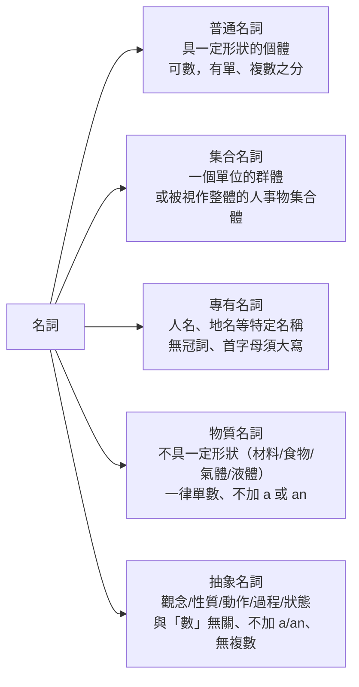

---
tags:
  - 文法/詞類
  - 圖表
  - 對比辨析
  - 易錯點
source: https://app.notion.com/p/af59444a56ad41fca1d433f118afb199
difficulty: ⭐
status: 未讀
style: 教學型重構
review: []
related: []
---

# 名詞、冠詞

<!-- 教學型重構：❌ 反例由來源例句變形而來（規則見使用說明 3-1）；中譯已於 2026-07-15 回源補齊並查證 -->

> [!IMPORTANT]
> **一句話核心**
> 名詞是人、事、地、物的名稱，在句中當**主詞／受詞／補語**。名詞分五類，分類的用途是回答兩個問題：**能不能數**、**前面能不能加 a/an**——而這正是冠詞的前提：**a/an** 表「不特定的一個」（只接單數可數），**the** 表「特定」（可數不可數、單複數皆可）。

## 🧭 心智圖

```markmap
# 名詞、冠詞

## 🧭 名詞是什麼

- 人、事、地、物的名稱；在句中當**主詞・受詞・補語**
  - 長度不影響身分；不定詞、動名詞也具名詞功用

## 📊 五類名詞（能不能數？能不能加 a/an？）

- 普通名詞：有一定形狀 → **可數**，單複數須表現
  - ❌ I like dog → ✅ I like **dogs**（泛指狗這種動物）
- 集合名詞：一字兩視角，**看動詞判斷**
  - My family **is** large.（當一個整體）
  - My family **are** all early risers.（指家裡每個人）
- 專有名詞：**首字大寫・不加 a/an・無複數**
  - Bob、April、London
  - 例外加 the：國家名／特殊組織（the United States、the United Nations）
- 物質名詞：無形狀 → **一律單數、不加 a/an**
  - 計量：**數字＋容器＋of＋物質**：a loaf of bread、two **cups** of coffee
    - ⚠️ 變複數的是**容器**（cup→cups），物質始終不動
  - -ful 當單位：a **handful** of（一把）
- 抽象名詞：觀念・性質・狀態，與「數」無關、不加 a/an
  - beauty、honesty、love、patience

## 🔢 名詞的數（複數變化）

- 規則變化（多由**發音**逼出來）
  - 大部分＋s：dog→dogs
  - s・z・x・sh・ch ＋es（發 [ɪz]）：class→classes、box→boxes
  - 子音＋y → 去 y＋ies：baby→babies、city→cities
  - f／fe → ves：leaf→leaves、wife→wives
    - 例外直接＋s：chiefs、roofs、handkerchiefs
  - 母音＋o ＋s（radios）；子音＋o ＋es：hero→heroes、tomato→tomatoes
    - 例外：photos、pianos
- 不規則變化
  - ＋en／ren：ox→oxen、child→children
  - 改母音：man→men、tooth→teeth、mouse→mice
  - 單複數同形：fish、deer、sheep、Chinese
    - fish 特例：數量同形（two fish）；**種類**加 es（two kinds of fishes）
- 💬 補充：外來語複數要個別記
  - datum→data、crisis→crises、basis→bases、phenomenon→phenomena

## 🏷️ 名詞的所有格

- 原則加 **'s**；字尾已有 s（複數）只補 **'**
  - the **boy's** schoolbag／a **girls'** school／**children's** playground（複數但無 s → 照原則 's）
- 共同 vs 個別所有
  - Harry and **Bill's** father is a scientist.（只加最後一個＝同一人）
  - **Harry's** and **Bill's** fathers are scientists.（每個都加＝各自的父親）
- 無生物用 **B of A**：the legs **of** the table、the door of the car
- 名詞可省略（大家都懂時）：the **dentist's**（診所）、at **McDonald's**

## 📰 冠詞 a／an／the

- **a／an**：不特定的「一個」，只接單數可數
  - 看**緊跟單字的發音**（有形容詞看形容詞）：a **young** man／an **old** woman
  - 強調「一個」可讀 [e]：I read **a** novel, not two.
- **the**：特定；可數不可數、單複數皆可
  - Please shut **the** door.（在場都知道哪扇門）
  - **The rich** aren't always happy.（the＋形容詞＝～的人，複數）
- 💬 專有名詞何時加 the：問「主體是**名字**還是**普通名詞**？」
  - 主體是普通名詞（描述型）→ 加：the United **States**、the Empire State **Building**
  - 複數一組 → 加：the Philippine**s**、the Alp**s**（同 the dogs 的 the）
  - 普通名詞被省略 → 加：the Nile（River）、the Sahara（Desert）
  - 頭銜＋名字 → 不加：**Mount** Everest、**Lake** Superior（整體仍是純名字）
```

---

## 🧭 名詞是什麼？——從句子的三個位置說起

一個句子總在講「誰、做什麼、對誰」。這幾個「誰」的位置，填進去的就是名詞：

- **主詞**：句子的第一要素，是整個句子的主角。
- **受詞**：接受動詞動作的人或物。
- **補語**：用來補充說明的就叫做補語。

所以名詞的定義可以反過來記——**人、事、地、物的名稱或名字，就叫做名詞**，而它的功用就是填進上面這三個位置。

> [!NOTE]
> **名詞（noun）**：用來表示人或事物、動物，能做為**主詞、補語、受詞**。
> - 可計數的稱為**可數名詞**。
> - 不可計數的稱為**不可數名詞**。

兩個容易忽略的延伸：

- **長度不影響身分**：不管是一個字的名詞，或是一長串的名詞，只要是名詞，功能就是當主詞、補語、受詞使用。
- **別的詞類也能兼差**：不定詞、動名詞具有名詞的功用，所以也可以當名詞使用。

---

## 📊 為什麼名詞要分五類？

分類不是為了背名字，而是為了回答兩個實用問題：**這個字能不能數（有沒有複數）**、**前面能不能加 a/an**。五類名詞的差別，幾乎都落在這兩點上——這也是為什麼這一章把名詞和冠詞放在一起講。



### 普通名詞——有形狀，所以數得出來

表示具有一定形狀的個體，為**可數名詞**，有單數、複數之分。例如：book(書)、pencil(鉛筆)、dog(狗)、spaceship(太空船)等。

「有一定形狀」是關鍵：形狀確定，個體之間的界線就清楚，自然數得出一個、兩個。

既然數得出來，**單複數就必須在句子中表現出來**，不能含糊：

- ✅ I like dogs.
- ❌ I like dog.
- 因為我喜歡的是狗這樣的動物，並不是說我喜歡這一隻狗。

這個 ❌ 之所以錯，不是文法零件壞了，而是它其實在說「我喜歡某一隻特定的狗」——與你想表達的「泛指狗這種動物」不合。

### 集合名詞——一個字，兩種視角

表示一個單位的群體，或者表示被視作整體的人、事、物的集合體。例如 class(班級、班上的同學)、family(家庭、家)、audience(聽眾)等。

集合名詞的特別之處在於**同一個字可以指群體，也可以指群體裡面的一個東西**：

| 字 | 群體 | 群體裡的一個 |
| --- | --- | --- |
| class | 班級 | 班上的同學 |
| family | 家庭 | 家人 |
| audience | 一群聽眾 | 一個聽眾 |

那句子裡到底是哪一種？**從前後文就可以判斷出單、複數**——看動詞：

- My **family** is large.（我家是大家庭。）→ 把家當一個整體 → 單數 is
- My **family** are all early risers.（我的家人都起得早。）→ 講的是家裡每個人 → 複數 are

### 專有名詞——獨一無二，所以不必數也不必限定

如人名、地名等，用來表示其一特定的名稱。無冠詞，第一個字母須大寫。例如 Bob(鮑伯)、Smith(史密斯)、April(四月)、London(倫敦)等。

三個注意點其實同一個道理——名字本身已經指定了唯一的那一個，不需要冠詞去限定、也沒有第二個可數：

> [!WARNING]
> **注意點：**
> - 第一個字母需要大寫。
> - 不加 a、an。
> - 不能有複數的表現。

但有例外要加定冠詞 **the**。（例）the United States(美國)、the United Nations(聯合國)：

- 提到國家名稱要加上 the。
- 提到特殊組織要加上 the。

（為什麼獨一無二的名字反而要加 the？判斷原則與完整整理見下方冠詞段的「何時在專有名詞前加 the 💬」。）

### 物質名詞——沒有固定形狀，就沒有「一個」可言

表示不具有一定形狀的物質名詞，如材料、食物、氣體、液體等。一律用單數，但前面不加 a 或 an。例如 glass(玻璃)、wood(木頭)、paper(紙)、butter(奶油)、fruit(水果)、meat(肉)、sugar(糖)、air(空氣)、gas(瓦斯)、water(水)等。

跟普通名詞正好相反：水沒有形狀，你切不出「一個水」——所以 a/an 用不上，也沒有複數。

但生活中還是要買一杯咖啡、一條麵包。既然物質本身數不了，就**改數裝它的容器**：

> [!NOTE]
> **物質名詞計算數量**：用容器或度量衡的單位來表示，即 ⇒ **數字 + 容器(度量衡) + of + 物質名詞**。
> - a loaf of bread（一條麵包）、loaves of bread（很多條麵包）
> - a cup of coffee（一杯咖啡）、two cups of coffee（兩杯咖啡）
> - a sheet of paper（一張紙）
> - a spoonful of sugar（一匙糖）

注意變複數的是**容器**（cup → cups），不是物質（coffee 始終不動）——因為被數的一直都是容器。

> [!NOTE]
> 也可以把一個可測量的東西加上 **-ful** 當成單位：
> - hand → handful → a handful of（一把）→ 一把沙子
> - arm → armful → an armful of（一把）→ 一把木材（指抱起來的動作，如一把木材）

### 抽象名詞——連形體都沒有

表示觀念、性質、動作、過程、狀態等。例如 beauty(美麗)、honesty(誠實)、love(愛)、patience(耐心)、happiness(幸福)、music(音樂)等。

物質名詞至少摸得到，抽象名詞連形體都沒有，「數」這件事更是無從談起：

> [!WARNING]
> **注意點：**
> - 原則上與「數」無關。
> - 一律使用單數，但前面不加 a 或 an。

---

## 🔢 名詞的數——可數名詞怎麼變複數

> 表示人或事物的名詞中，有一些是可以計數的。個數只有一個的情形，稱之為**單數**；個數超過一個時，稱之為**複數**。

上一節確定了「哪些字能數」，這一節處理「能數的字怎麼變」。規則看似零碎，但**絕大多數是發音逼出來的**——先記這點，表格就好記得多。

### 規則變化的複數名詞

| 情況 | 變化 | 例 |
| --- | --- | --- |
| 大部分名詞 | 字尾加 **s** | dog→dogs(狗)、book→books(書)、girl→girls(女孩) |
| 字尾為 s、z、x、sh、ch | 加 **es**（發 [ɪz]） | class→classes(班級)、bus→buses(公車)、dish→dishes(盤子)、bench→benches(長凳)、box→boxes(盒子) |
| 子音 + y | 去 y + **ies** | baby→babies(嬰兒)、story→stories(故事)、city→cities(城市)、lady→ladies(女士) |
| 字尾為 f 或 fe | 去 f/fe + **ves** | leaf→leaves(葉子)、wife→wives(老婆)、knife→knives(刀子) |
| 母音 + o | 加 **s** | zoo→zoos、radio→radios(收音機)、studio→studios(工作室) |
| 子音 + o | 加 **es**（發 [z]） | hero→heroes、tomato→tomatoes、potato→potatoes(馬鈴薯) |
| 字尾 o（兩可） | 加 **s** 或 **es** 皆可 | mosquito(e)s(蚊子)、volcano(e)s(火山)、tornado(e)s(龍捲風) |

為什麼是這些規則？逐條都有發音上的理由：

> [!NOTE]
> **發音與例外**
> - 加 s：字尾有聲，s 發 [z]；字尾無聲，s 發 [s]。
> - 子音+y 去 y+ies：因為 y 跟 i 都發 [ɪ]，es 發 [z]。
> - f/fe→ves：f 與 v 發音相似、嘴型相近，故 ves 的 v 發 [v]。
> - **f/fe 的例外（直接加 s）**：chiefs（首領）、handkerchiefs（手帕）、roofs（屋頂）。
> - 子音+o 加 es 有例外：photos（照片）、pianos（鋼琴）直接加 s。

字尾是 s、z、x、sh、ch 時之所以非加 es 不可，是因為這些音本來就和 s 太接近，直接加 s 會黏在一起發不出來——中間墊個母音變成 [ɪz]，才聽得出你加了複數。

### 不規則變化的複數名詞

| 類型 | 例 |
| --- | --- |
| 字尾加 en、ren | ox→oxen(公牛)、child→children(小孩) |
| 改變母音 | man→men(男人)、woman→women(女人)、goose→geese(鵝)、tooth→teeth(牙齒)、mouse→mice(老鼠) |
| 單複數同形 | fish(魚)、deer(鹿)、sheep(綿羊)、Chinese(中國人)、Japanese(日本人) |

> [!NOTE]
> **fish 的特例**
> - 表示**數量** → one fish、two fish（同形）。
> - 表示**種類** → 要加 es：a kind of fish、two kinds of fishes。

### 更多規則與例外　💬 AI 補充
> 改寫自外部文章 english.cool[〈英文複數規則〉](https://english.cool/nouns-plural/)，補謝孟媛講義未提到的部分（非講義原文）。

- **母音 + y → 直接加 s**（對照前面「子音+y→ies」）：boy→boys、day→days、key→keys。
- **字尾 ch 但發 [k] 音 → 直接加 s**：stomach→stomachs、monarch→monarchs。
- **f/fe 直接加 s 的更多例外**：roof→roofs、proof→proofs、belief→beliefs、cliff→cliffs、safe→safes。
- **外來語複數**（源自拉丁／希臘文，需個別記）：
  - datum→data、medium→media、bacterium→bacteria、curriculum→curricula、criterion→criteria、phenomenon→phenomena
  - basis→bases、crisis→crises、oasis→oases、thesis→theses、analysis→analyses、diagnosis→diagnoses
- **更多單複數同形**：species（物種）、aircraft（航空器）、means（方法）、offspring（後代）、headquarters（總部）；字尾 -ss／-ese 的國籍如 Swiss、Chinese。

---

## 🏷️ 名詞的所有格——「歸誰所有」

> [!TIP]
> **什麼東西歸某人所有，就叫做所有格。**

### 形式只有兩種，選哪種看「字尾有沒有 s」

規則常被記成三條，但骨幹只有一句：**原則上加 's；只有當字尾已經有 s（複數）時，為了避免 s's 連寫，才只補一撇**。

| 名詞類型 | 形式 | 例 |
| --- | --- | --- |
| 單數名詞 | 名詞 **'s** | the boy's schoolbag(男孩的書包)、Joan's dress(Joan 的洋裝) |
| 複數名詞（字尾 s） | 名詞s **'** | a girls' school(一所女校)、these students' teacher(這些學生的老師) |
| 字尾非 s 的複數名詞 | 名詞 **'s** | children's playground(小孩的遊樂園)、women's activities(女性的活動) |

所以第三列不是新規則，而是回到原則——children、women 雖是複數但字尾沒有 s，就照樣加 's。

### 特別注意的所有格用法

**'s 加在哪裡，決定「共有」還是「各自有」**——只在最後一個名詞加，代表兩人共有；每個名詞都加，代表各有各的：

- **共同所有格**（→ 名詞 + 名詞 + … + 名詞's）：Harry and Bill **'s** father is a scientist.（Harry 和 Bill 的父親是一位科學家＝同一人。）
- **個別所有格**（→ 名詞's + 名詞's + … + 名詞's）：Harry **'s** and Bill **'s** fathers are scientists.（Harry 和 Bill 的父親都是科學家＝各自的父親。）

注意連 father 的單複數都跟著變（father → fathers），因為一個父親變成了兩個。

**（無）生物所有格　A 的 B → B of A**：無生物通常不用 's，改用 of 倒過來說：

- 桌子的腳：the legs of the table
- 車門：the door of the car
- 女孩的名字：the girl's name、the name of the girl（人可以兩種都用）

**所有格後的名詞在句中很好理解時，可以省略**——說 the dentist's 大家都知道是牙醫「診所」，講出來反而囉嗦：

- She's going to the dentist **'s**.（她要去看牙。）
- I met him at the barber **'s**.（我在理髮院遇到他。）
- We like to eat lunch at McDonald **'s**.（我們喜歡去麥當勞吃午餐。）

---

## 📰 冠詞 a / an / the——不特定的一個 vs 特定的那個

> 冠詞可分為**不定冠詞 a(an)** 及**定冠詞 the**，通常放在名詞之前，用來修飾名詞。

前面五類名詞反覆出現「加不加 a/an」，現在正式收攏：冠詞要解決的是**聽者知不知道你指哪一個**。

### a、an 的用法

> [!TIP]
> **純粹表示數量為 1，沒有限定的意思。**

- **a + 子音開頭的單數名詞**：a book（一本書）、a girl（一個女孩）、a young man（一位年輕人）。
- **an + 母音開頭的單數名詞**：an apple（一個蘋果）、an umbrella（一把雨傘）、an old woman（一個老女人）。

a 和 an 的分工純粹是為了**好發音**——兩個母音相撞（a apple）唸起來卡，墊個 n 就順了。也因為理由是發音，判斷依據就必須是**耳朵聽到的下一個字**，而不是名詞本身：

> [!WARNING]
> **注意點：**
> - 只能使用在**單數名詞**；究竟用 a 或 an，取決於**緊跟著的單字**。
> - 名詞前有形容詞時，是看**形容詞**是否為母音開頭來決定用 a 或 an。

對照上面的例子就很清楚：man 是子音開頭，但 a young man 看的是 young；woman 是子音開頭，an old woman 看的卻是 old。

**a(an) 的發音**：一般 a[ə]、an[ən]；但強調「一個」、特別加重語氣時，可讀成 a[e]、an[æn]。

- I read a novel.　[ə]
- I read **a** novel, not two.　[e] ← 要強調「只有一本」，就把 a 唸重

### the 的用法

定冠詞 the 可限定**可數與不可數名詞**，可表示**單數及複數**，也可用來限定形容詞。母音前讀 [ðɪ]、子音前讀 [ðə]（同樣是發音問題）。

- 可翻成 ⇒ 這一個、那一個、這些、那些。
- Please shut the door.（請關門。）→ 在場的人都知道是哪扇門，所以用 the
- The rich aren't always happy.（有錢人並非總是快樂。）→ **the + 形容詞**泛指「～的人」，代表複數。

### 比較

| 不定冠詞 a、an | 定冠詞 the |
| --- | --- |
| 表示不特定的事物 | 表示特定的事物 |
| 只能接可數名詞 | 可接可數名詞和不可數名詞 |
| 只能用於單數 | 可用於單數和複數 |

a/an 的兩個限制都源自它的本質——它就是「一個」，當然只能接數得出來的字、當然只能是單數。the 沒有這個包袱，所以來者不拒。

### 何時在專有名詞前加 the　💬 AI 補充
> 延伸自上方「名詞的種類 → 專有名詞」的補充整理（來源為 Notion 補充頁，非謝孟媛講義）。

專有名詞原則上不加冠詞，理由前面已經講過：the 的本職是**限定普通名詞**（Please shut **the** door——哪扇門？那扇），而**純名字**本身就完成了「指定唯一」這件事，the 根本沒事可做：John Smith、Paris、Japan、France、China、Brazil。

問題是，有些「專有名詞」其實不是純名字，而是**用普通名詞拼出來的描述**——描述不會自動指定唯一（世界上 building 多得是），所以 the 又有事做了。要加 the 的名稱，全部落在下面三種情況：

**① 名稱的主體就是普通名詞（描述型名稱）**——把 the 後面的字直譯一次就看出來了：
- 國名：the United **States**（聯合起來的那些「州」）、the United **Kingdom**（聯合「王國」）、the **Republic** of Korea（大韓民「國」）
- 機構、組織：the United **Nations**（聯合起來的那些「國家」）、the Red **Cross**（那個紅「十字」）
- 建築：the Empire State **Building**（那棟「大樓」）
- 報紙、期刊：the New York **Times**（那份「時報」）、the **Guardian**（那份「衛報」）
- 海灣、海洋這類地名同理：the **Gulf** of Mexico（那個「海灣」）、the Atlantic **Ocean**（那個「大洋」）

**② 複數打包（群島、山脈）**——先回想專有名詞的注意點：**純名字不能有複數的表現**（Bob 沒有 Bobs）。所以一個「名稱」帶著字尾 -s，等於自白「我不是純名字，我在**數東西**」——而數東西是普通名詞的行為。複數普通名詞要指「特定的那一整組」，本來就得靠 the（dogs 泛指狗、**the** dogs 才是特定那幾隻），跟專有名詞根本無關：
- the Philippine**s**（菲律賓群島——七千多座島，沒有任何一座島叫 Philippines，這個字指不了「某一個」，只能指「那一堆」）
- the Alp**s**（阿爾卑斯山脈——alp 本是普通名詞「高山、高山牧場」，the Alps＝特定的那群山）、the Andes（安地斯山脈）
- the Netherland**s**（複數的 land——一片片「低地」，普通名詞明擺著）
- Philippines 的身世正好可當驗證：西班牙文 Las Islas Filipinas（腓力的群島）→ 英文 the Philippine **Islands**（Philippine 當形容詞、主角是 Islands）→ 省略 Islands → the Philippines。這個 the 其實是加給被省略的 Islands 的，連 -s 都是從它繼承來的——正是下一條「省略」的邏輯提前登場。

**③ 普通名詞被省略、the 留下（河流、沙漠等）**——完整說法是 the Nile **River**：主角是普通名詞 River，Nile 其實在當形容詞、描述「哪一條河」，所以這個 the 跟 the door 的 the 是同一個 the。這類組合講太多次，River 被省掉偷懶，但骨架沒變，the 指著的還是那個心照不宣的 River——**the 不是加給 Nile 的，是加給被省略的 River 的**：
- the Nile（省略了 River）、the Sahara（省略了 Desert）
- 著名酒店、博物館同理：the Louvre（省略了 Museum）、the Ritz（省略了 Hotel）
- 這一章其實早見過同一招：**the dentist's**（省略了 office——所有格那節）、**the rich**（省略了 people——the＋形容詞）。名詞省了，前面的字留著替它站崗。
- **驗證法：把名詞放回去，講得通就是這一類**——the Nile River ✔、the Ritz Hotel ✔。放不回去的就不是省略（Mount Everest 不是從 the Everest Mount 省來的，它是下面的「頭銜＋名字」構造）。

最後一個對照組：**Mount Everest、Lake Superior 明明含普通名詞，卻不加 the**——因為順序反過來了。普通名詞放在**前面**當頭銜（就像 Doctor Smith、Uncle Tom 的 Doctor、Uncle），真正的名字壓陣，整體仍然是純名字。這也解釋了看似矛盾的一條：**山脈（the Alps）要加、單一山峰（Mount Everest）不加**——不是任意規定，是兩種完全不同的構造。

> [!TIP]
> **判斷口訣**：聽到一個專有名稱，先問「它的主體是**名字**、還是**普通名詞**？」
> 是名字 → 不加；是普通名詞（明講的或被省略的）、或複數一組 → 加 the。

| 名稱長相 | 加不加 | 為什麼 |
| --- | --- | --- |
| 純名字：Paris、Japan、John Smith | 不加 | 名字本身已指定唯一 |
| 頭銜＋名字：**Mount** Everest、**Lake** Superior | 不加 | 普通名詞在前當頭銜，整體仍是名字 |
| 主體是普通名詞：the United **States**、the Empire State **Building** | 加 | 描述要靠 the 指定「就是那一個」 |
| 複數一組：the Philippine**s**、the Alp**s** | 加 | 純名字無複數，-s 表示在數東西；特定那一組要 the（同 the dogs） |
| 普通名詞被省略：the Nile（River）、the Sahara（Desert） | 加 | the 是加給被省略名詞的（同 the dentist's） |

---

## ⚠️ 易錯點分析

> [!WARNING]
> **常見錯誤（皆為來源整理的重點）**
> - ❌ I like dog.　✅ I like dogs.　→ 泛指某類動物，可數名詞要用**複數**。
> - 專有名詞：**首字母大寫、不加 a/an、不用複數**；但**國家名／特殊組織**要加 the（the United States、the United Nations）。
> - 物質名詞、抽象名詞：**一律單數、不加 a/an**；物質名詞計量用「數字＋容器＋of＋名詞」，變複數的是容器。
> - a／an 的選擇看**緊跟的單字發音**（有形容詞看形容詞），不是看名詞本身。
> - 所有格：字尾已有 s 的複數只加一撇；**共同所有格只在最後一個名詞加 's**，個別所有格每個都加。

> [!WARNING]
> **練習卷錯題回填（2026-07-17，[[初級01 名詞、冠詞 練習卷]]）　💬 AI 補充**
> - **複數例外靠印象會倒**：❌ heries ✅ **heroes**（字尾是 o 不是 y——子音＋o 加 es）；❌ deers ✅ **deer**（單複數同形，同 sheep）；❌ crisises ✅ **crises**（外來語 -is → -es，同 basis→bases）。
> - **物質名詞計量：觀念對、落筆錯**：❌ two cups of coffee**s** ✅ two cups of **coffee**（-s 只落在容器上，物質始終不動）；❌ three leaves bread ✅ three **loaves of** bread（麵包量詞是 loaf→loaves，不是 leaf 的 leaves；**of** 是公式的固定零件，不能漏）。
> - **① 描述型名稱會系統性漏判**：名稱**最後一個字是查字典查得到的普通名詞**（Ocean／House／Post）就要 the——❌ Pacific Ocean ✅ **the** Pacific Ocean、**the** White House、**the** Washington Post。⚠️「因為它是專有名詞（所以不加）」是**循環論證**：判斷時必須多問一步「主體是**名字**還是**普通名詞**？」，不能看到大寫開頭就當純名字。

---

## 🔗 延伸與對比
- **外部延伸閱讀**（english.cool，第三方文章，非謝孟媛講義）：
  - [主詞、動詞、受詞、補語是什麼？](https://english.cool/subject-verb-object-complement/) — 句型觀念（本篇未展開，屬「句型」主題，待建 [[13 動詞]] 時再對接）
  - [【英文複數】加 s？加 es？名詞複數規則](https://english.cool/nouns-plural/) — 複數變化完整版（重點已折入上方「名詞的數 → 更多規則與例外 💬」）
- 「專有名詞何時加 the」的補充頁內容已折入上方「冠詞 💬」段，不另列連結。
- 相關主題：[[04 代名詞]]、[[11 形容詞]]（待建）

---

## 🧠 自我測驗　💬 AI 補充
> 複習時作答，答完再看下方答案。（此區為 AI 出題，非來源內容）

- [ ] Q1：a／an 怎麼選？請說明並各舉一例（含名詞前有形容詞的情況）。
- [ ] Q2：寫出下列複數：leaf、tomato、child、sheep。
- [ ] Q3：「Harry 和 Bill 的父親是同一人」與「各自的父親」所有格寫法有何不同？
- [ ] Q4：專有名詞原則上不加冠詞，但哪兩類要加 the？各舉一例。另外：Mount Everest 為什麼不加 the，the Alps 卻要加？
- [ ] Q5：為什麼 coffee 不能說 a coffee／two coffees？要表達「兩杯咖啡」該怎麼說？
- [ ] Q6：My family ___ large.／My family ___ all early risers. 各填什麼？為什麼同一個字動詞不同？

<details>
<summary>✅ 解答</summary>

A1：看**緊跟著的單字發音**——子音開頭用 a、母音開頭用 an；有形容詞時看形容詞。例：a book／an apple；a young man／an old woman。
A2：leaves、tomatoes、children、sheep（單複同形）。
A3：同一人用**共同所有格**（Harry and Bill**'s** father is a scientist.）；各自的父親用**個別所有格**（Harry**'s** and Bill**'s** fathers are scientists.）。
A4：**國家名**（the United States）與**特殊組織**（the United Nations）——它們的主體是普通名詞（states、nations），描述要靠 the 指定唯一。Mount Everest 是「**頭銜＋名字**」構造，普通名詞 Mount 在前當頭銜、名字壓陣，整體仍是純名字，故不加；the Alps 是**複數一組**的山，要靠 the 打包成「特定的那一組」。
A5：coffee 是**物質名詞**，不具一定形狀 → 一律單數、不加 a/an。要計量得用「數字＋容器＋of＋物質名詞」：**two cups of coffee**（變複數的是 cup）。
A6：is／are。**family 是集合名詞**：視為一個整體時用單數（My family **is** large.），指群體裡的成員時用複數（My family **are** all early risers.）——從前後文判斷。

</details>
</content>
