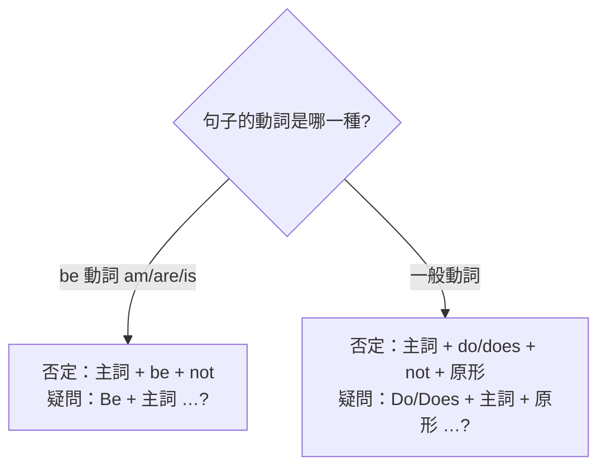

---
tags:
  - 文法/時式
  - 句型公式
  - 對比辨析
  - 易錯點
  - 圖表
book: 謝孟媛英文文法
chapter: 初級文法 · 02 be 動詞、一般動詞（現在式）
source: https://app.notion.com/p/cf9d6aedf5c14740a6d53f9b27dccf17
difficulty: ⭐
status: 學習中
review: []
related: []
---

# be 動詞、一般動詞（現在式）

> [!IMPORTANT]
> **一句話核心**
> 現在式是「時態」的一種（動詞隨時間改變型態）。**be 動詞**（am／are／is 依主詞人稱）造否定就加 not、造疑問把 be 移到句首；**一般動詞**在主詞為第三人稱單數時加 s／es，且**否定與疑問必須靠助動詞 do／does，其後動詞一律回原形**。

> [!NOTE]
> **先備觀念**
> - 現在式 ⇒ 時態的一種。
> - 時態 ⇒ 動詞會隨著時間而改變型態，就叫做「時態」。

---

## 🅱️ be 動詞的現在式（am／are／is）

現在式 be 動詞 ⇒ **am、are、is**，表示**狀態**或**存在**。
- 是（狀態）：We **are** happy.（我們很高興。）
- 在（存在）：She **is** in America.（她在美國。）

### 人稱對應（用哪個 be 動詞由主詞決定）

| 主詞人稱 | be 動詞 | 例 |
| --- | --- | --- |
| 第一人稱（I） | **am** | I **am** a boy.（I 永遠大寫） |
| 第二人稱／複數（you, we, they…） | **are**（複數 be 動詞） | You **are** my sons. |
| 第三人稱單數（he, she, it） | **is**（單數 be 動詞） | He **is** my student. |

### 肯定句　⇒　主詞 + am／are／is + …
- He **is** a good baseball player.（他是位好的棒球員。）

### 否定句　⇒　主詞 + am／are／is + **not** + …
> be 動詞肯定句改否定：**在 be 動詞之後加 not** 即可。

- He **is not** a good baseball player.
  - = He **'s not** a good baseball player.
  - = He **isn't** a good baseball player.

**縮寫**
- 主詞 is not ⇒ 主詞's not、主詞 isn't
- 主詞 are not ⇒ 主詞're not、主詞 aren't
- ⚠️ **I am not ⇒ am not 沒有縮寫，只有 I'm not。**

> [!NOTE]
> **be 動詞 + not 縮寫完整對照　💬 AI 補充**
> 整理自 Notion 補充頁（非謝孟媛講義原文），把各人稱兩種縮寫列全：
>
> | 原式 | 縮寫（兩種） |
> | --- | --- |
> | I am not | I'm not（**無 amn't**） |
> | You are not | You're not／You aren't |
> | He/She/It is not | He's not…／He isn't… |
> | We are not | We're not／We aren't |
> | They are not | They're not／They aren't |

### 疑問句　⇒　Am／Are／Is + 主詞 + …?
> be 動詞肯定句改疑問：**把 be 動詞移到主詞前**、句尾加「?」。

- That **is** his camera. → **Is** that his camera?（那是他的照相機嗎？）
- The girl **is** a junior high school student. → **Is** the girl a junior high school student?

### Yes／No 簡答（用 be 動詞問，就用 be 動詞答）
> - Yes, 主詞 + am／are／is …
> - No, 主詞 + am／are／is + not …

- Is that man your math teacher? → Yes, **he is.** ／ No, **he's not.**
- Are you eating your lunch? → Yes, **I am.** ／ No, **I'm not.**

> [!WARNING]
> **答句注意點**
> - 用 be 動詞問，就用 be 動詞回答。
> - **答句中的主詞必須用代名詞**（he、I…），不重複原本的名詞。

💡 延伸：為什麼答句要用代名詞？

代名詞用來代替已出現過的名詞、避免重複。回答時對象已知，故用代名詞取代先行詞，讓句子更簡潔清晰。

---

## 🟢 一般動詞的現在式

> 舉凡日常生活中**具體**（eat、walk）與**抽象**（like、think）的動作，皆為一般動詞。

### 肯定句　⇒　主詞 + 一般動詞 + …
**主詞為第三人稱單數時，動詞字尾加 s／es**（稱為「單數動詞」）。

| 人稱 | 單數 | 複數 |
| --- | --- | --- |
| 第一人稱 | I like dogs. | We like dogs. |
| 第二人稱 | You like dogs. | You like dogs. |
| 第三人稱 | He **likes** dogs. | They like dogs. |

**加 s／es 的規則**（謝孟媛講義）：
- 大部分動詞 **+s**（有聲字尾 s 發 [z]、無聲發 [s]）：works [ks]、plays [ez]
- 字尾為 **z、o、s、x、sh、ch → +es**：goes、washes、watches
- 字尾為**子音 + y → 去 y + ies**：cry→cries、study→studies（y 與 i 同發 [ɪ]，es 發 [z]）
- 字尾為**母音 + y → 直接 +s**：say→says
- ⚠️ 特殊：**have → has**（He **has** a lot of money.）

> [!NOTE]
> **三單動詞加 s／es／ies 口訣與補充　💬 AI 補充**
> 改寫自外部文章 english.cool[〈加 S 規則〉](https://english.cool/s-es-ies/)（第三方文章，非講義）：
> - 口訣：**「主詞三單現，動詞要加 s」**（第三人稱單數＋現在簡單式 → 動詞 +s）。
> - 更多例字：love→loves、kiss→kisses、fix→fixes、fly→flies、enjoy→enjoys、cost→costs。
> - 判斷訣竅：凡能用 **he／she／it** 代替的主詞都算三單，如 The boy = He、Your watch = It → 動詞要加 s。

### 否定句　⇒　主詞 + **do／does** + not + **原形動詞** + …
> 一般動詞**不可**直接在動詞後加 not，**必須用助動詞 do／does**；其後動詞一律回**原形**。
> - **do**：主詞為 I、you、複數。
> - **does**：主詞為第三人稱單數。

- The twin brothers **do not go**（= **don't go**）to school by bus.
- Sam **does not have**（= **doesn't have**）dinner at the restaurant.

### 疑問句　⇒　Do／Does + 主詞 + **原形動詞** + …?
> 一般動詞**不可**把動詞移到主詞前，一樣要用 do／does，其後動詞回原形。

- You visit… → **Do** you visit your grandmother on Sundays?（on 星期幾s = 每逢星期幾）
- He comes… → **Does** he **come** from England?

### Yes／No 簡答（用助動詞問，就用助動詞答）
> - Yes, 主詞 + do／does
> - No, 主詞 + do／does + not

- Does the little boy go to school? → Yes, **he does.** ／ No, **he doesn't.**

> [!TIP]
> do／does 除了幫一般動詞造否定句、疑問句，還能**代替前面重複的動作**（he does = he goes to school）。

---

## 📊 be 動詞 vs 一般動詞（否定・疑問對照）

| | be 動詞 | 一般動詞 |
| --- | --- | --- |
| 肯定 | He **is** my boyfriend. | He **likes** dogs. |
| 否定 | He **isn't** my boyfriend. | He **doesn't like** dogs. |
| 疑問 | **Is** she beautiful? | **Does** she **love** tennis? |
| 簡答 | Yes, she **is.** | Yes, she **does.** |

---

## ⚠️ 易錯點分析

> [!WARNING]
> **常見錯誤（皆為來源整理的重點）**
> - 一般動詞的否定／疑問 ❌ 直接加 not 或把動詞移到句首；✅ **要用 do／does，且動詞回原形**（❌ Does she loves? → ✅ Does she **love**?）。
> - 主詞三單現，動詞**別漏加 s**（❌ He like dogs → ✅ He **likes** dogs）——這是中文母語者最常漏的地方。
> - **am not 沒有縮寫**，只有 I'm not。
> - have 的三單是 **has**（不是 haves）。
> - 簡答句主詞要用**代名詞**（Yes, **he** is，不是 Yes, the man is）。

---

## 🔗 延伸與對比
- **外部延伸閱讀**（english.cool，第三方文章，非謝孟媛講義）：
  - [【加 S 規則】加 s？加 es？去 y 加 ies？](https://english.cool/s-es-ies/) — 三單動詞加 s 完整版（重點已折入上方「一般動詞 💬」）
- 「be + not 縮寫」補充頁內容已折入上方「be 動詞否定句 💬」段，不另列連結。
- 相關主題：[[01 名詞、冠詞]]（可數名詞複數與此處三單 +s 同理）、[[04 代名詞]]（簡答用代名詞）、[[03 be 動詞、一般動詞（過去式）]]（待建，對照時態）

---

## 🧠 自我測驗　💬 AI 補充
> 複習時作答，答完再看下方答案。（此區為 AI 出題，非來源內容）

- [ ] Q1：把 She is a nurse. 改成否定句與疑問句。
- [ ] Q2：把 They watch TV. 改成「他」為主詞的肯定句、否定句、疑問句。
- [ ] Q3：下列何者正確？(a) Does he likes it? (b) Does he like it? 並說明原因。
- [ ] Q4：I am not 的縮寫是什麼？為什麼不能寫成 amn't？

✅ 解答

A1：否定 She **isn't**（She's not）a nurse.／疑問 **Is** she a nurse?
A2：He **watches** TV.／He **doesn't watch** TV.／**Does** he **watch** TV?（三單 watch→watches；有 does 後動詞回原形 watch）。
A3：(b)。有助動詞 does 時，後面動詞一律回**原形** like，不可再加 s。
A4：**I'm not**。英文習慣上 am not 沒有 amn't 這個縮寫形式。

