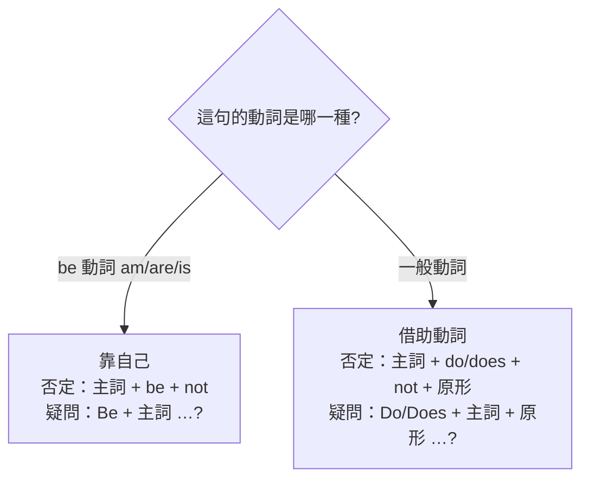

---
tags:
  - 文法/時式
  - 句型公式
  - 對比辨析
  - 易錯點
  - 圖表
source: https://app.notion.com/p/cf9d6aedf5c14740a6d53f9b27dccf17
difficulty: ⭐
status: 學習中
style: 教學型重構
review: []
related: []
---

# be 動詞、一般動詞（現在式）

> [!IMPORTANT]
> **一句話核心**
> 要講「現在」的事，第一步先問：**這句話的動詞是 be 動詞（am／are／is），還是一般動詞？** 這個分岔決定你怎麼造否定與疑問——**be 動詞靠自己**（後面加 not、把它移到句首）；**一般動詞得借助動詞 do／does**，助動詞一出場，動詞就回原形。另外，主詞是第三人稱單數時，一般動詞的肯定句要加 **s／es**。

> [!NOTE]
> **先備觀念**
> - 現在式 ⇒ 「時態」的一種。
> - 時態 ⇒ 動詞會隨著時間而改變型態，就叫做「時態」。

---

## 🧭 為什麼要先分「動詞是哪一種」？

中文的動詞不太挑：「我**是**學生／他**是**學生」，動詞都是「是」，不隨人稱或時間變形。英文不一樣——動詞會隨時間改型態（這就是「時態」），而**現在式**正是其中一種。

真正的關鍵在造**否定句、疑問句**時：英文會走**兩條完全不同的路**，而分岔點只有一個——

只要先認出動詞屬於哪一種，剩下的造句規則就是照著這條路走。下面就一條路、一條路地走。

---

## 🅱️ 第一條路：be 動詞（am／are／is）

### 它在講什麼？——狀態或存在
現在式 be 動詞 ⇒ **am、are、is**，用來表示**狀態**或**存在**：
- 是（狀態）：We **are** happy.（我們很高興。）
- 在（存在）：She **is** in America.（她在美國。）

### 用哪一個？由主詞人稱決定

> [!NOTE]
> **什麼是人稱**
> - **第一人稱**：說話的人。
> - **第二人稱**：聽別人說話的人。
> - **第三人稱**：第一人稱和第二人稱聊天時所提到的人（he、she、it、they）。

| 主詞人稱 | be 動詞 | 例 |
| --- | --- | --- |
| 第一人稱（I） | **am** | I **am** a boy.（我是一個男孩；I 永遠大寫） |
| 第二人稱／複數（you, we, they…） | **are**（複數 be 動詞） | You **are** my sons.（你們是我的兒子） |
| 第三人稱單數（he, she, it） | **is**（單數 be 動詞） | He **is** my student.（他是我的學生） |

肯定句就是把它擺上去：**主詞 + am／are／is + …**
- He **is** a good baseball player.（他是位好的棒球員。）

### 造否定：be 夠力，自己加 not 就行
be 動詞不需要別人幫忙——**直接在它後面加 not**，否定就成立。

**主詞 + am／are／is + not + …**
- He **is not** a good baseball player.（他不是位好的棒球員。）
  - = He **'s not** a good baseball player.
  - = He **isn't** a good baseball player.

**縮寫**
- 主詞 is not ⇒ 主詞's not、主詞 isn't
- 主詞 are not ⇒ 主詞're not、主詞 aren't
- ⚠️ **I am not ⇒ am not 沒有縮寫，只有 I'm not。**

> [!NOTE]
> **be 動詞 + not 縮寫完整對照　💬 AI 補充**
> 整理自 Notion 補充頁（非謝孟媛講義原文），把各人稱兩種縮寫列全：
>
> | 原式 | 縮寫（兩種） |
> | --- | --- |
> | I am not | I'm not（**無 amn't**） |
> | You are not | You're not／You aren't |
> | He/She/It is not | He's not…／He isn't… |
> | We are not | We're not／We aren't |
> | They are not | They're not／They aren't |

### 造疑問：一樣靠自己，把 be 搬到句首
既然 be 動詞夠力，造疑問也不用外援——**整個 be 往前挪到主詞前面**，句尾加「?」。

**Am／Are／Is + 主詞 + …?**
- That **is** his camera.（那是他的照相機。）→ **Is** that his camera?（那是他的照相機嗎？）
- The girl **is** a junior high school student.（那女孩是國中生。）→ **Is** the girl a junior high school student?（那女孩是國中生嗎？）

### 簡答：用 be 問，就用 be 答
> - Yes, 主詞 + am／are／is …
> - No, 主詞 + am／are／is + not …

- Is that man your math teacher?（那個人是你們的數學老師嗎？）→ Yes, **he is.**（是，他是。）／ No, **he's not.**（不，他不是。）
- Are you eating your lunch?（你正在吃你的午餐嗎？）→ Yes, **I am.**（是，我是。）／ No, **I'm not.**（不，我不是。）
  - 中文翻譯要翻得口語化一點——上句若翻成「你在吃『你的』午餐嗎？」感覺會生硬很多。

> [!WARNING]
> **答句注意點**
> - 用 be 動詞問，就用 be 動詞回答。
> - **答句中的主詞必須用代名詞**（he、I…），不重複原本的名詞。

💡 延伸：為什麼答句要用代名詞？

代名詞用來代替已出現過的名詞、避免重複。回答時對象已知，故用代名詞取代先行詞，讓句子更簡潔清晰。

---

## 🟢 第二條路：一般動詞

### 它在講什麼？——具體與抽象的動作
舉凡日常生活中**具體**（吃飯 eat、走路 walk）與**抽象**（喜歡 like、思考 think）的動作，皆為一般動詞。

### 肯定句：主詞三單，動詞加 s／es
**主詞 + 一般動詞 + …**；當**主詞為第三人稱單數時，動詞字尾加 s／es**（稱為「單數動詞」）。

| 人稱 | 單數 | 複數 |
| --- | --- | --- |
| 第一人稱 | I like dogs. | We like dogs. |
| 第二人稱 | You like dogs. | You like dogs. |
| 第三人稱 | He **likes** dogs. | They like dogs. |

**加 s／es 的規則**（謝孟媛講義）：
- 大部分動詞 **+s**（有聲字尾 s 發 [z]、無聲發 [s]）：works [ks]、plays [ez]
- 字尾為 **z、o、s、x、sh、ch → +es**：goes、washes、watches
- 字尾為**子音 + y → 去 y + ies**：cry→cries、study→studies（y 與 i 同發 [ɪ]，es 發 [z]）
- 字尾為**母音 + y → 直接 +s**：say(說)→says
- ⚠️ 特殊：**have（有、吃）→ has**
  - They **have** a lot of money.（他們有許多錢。）
  - He **has** a lot of money.（他有許多錢。）
  - money 是不可數名詞，是所有錢幣的種稱，所以不可以 +s。

> [!NOTE]
> **三單動詞加 s／es／ies 口訣與補充　💬 AI 補充**
> 改寫自外部文章 english.cool[〈加 S 規則〉](https://english.cool/s-es-ies/)（第三方文章，非講義）：
> - 口訣：**「主詞三單現，動詞要加 s」**（第三人稱單數＋現在簡單式 → 動詞 +s）。
> - 更多例字：love→loves、kiss→kisses、fix→fixes、fly→flies、enjoy→enjoys、cost→costs。
> - 判斷訣竅：凡能用 **he／she／it** 代替的主詞都算三單，如 The boy = He、Your watch = It → 動詞要加 s。

### 造否定、疑問：為什麼一般動詞要「請 do／does 幫忙」？
一般動詞沒有 be 動詞那麼萬能：它**沒辦法自己加 not**，也**沒辦法自己搬到句首**。於是英文找來一個專門的助手 **do／does** 來扛「否定」和「疑問」這兩件差事。

**誰用哪一個助手？**
- **do**：主詞為 I、you、複數。
- **does**：主詞為第三人稱單數。

助手一出場，累活由它扛，一般動詞就「功成身退」——回到**原形**：

> [!NOTE]
> **為什麼 do／does 後面要恢復成原形動詞？**
> 因為 do、does 已經表示這個動作發生在現在的時間，所以一般動詞就可以恢復成原形動詞。
> （只要有助動詞出現，後面的動詞一定要恢復成原形動詞。）

**否定句 ⇒ 主詞 + do／does + not + 原形動詞 + …**（不可直接在動詞後加 not）
- The twin brothers **go** to school by bus.（這對雙胞胎兄弟搭公車上學。）
  → The twin brothers **do not go**（= **don't go**）to school by bus.（這對雙胞胎兄弟不搭公車上學。）
- Sam **has** dinner at the restaurant.（Sam 在那家餐廳吃晚餐。）
  → Sam **does not have**（= **doesn't have**）dinner at the restaurant.（Sam 不在那家餐廳吃晚餐。）

> [!TIP]
> **by + 交通工具** ⇒ 搭乘什麼交通工具：by bus、by taxi。

**疑問句 ⇒ Do／Does + 主詞 + 原形動詞 + …?**（不可把動詞移到主詞前）
- You **visit** your grandmother on Sundays.（你每逢假日探訪你祖母。）
  → **Do** you **visit** your grandmother on Sundays?（你每逢星期日探訪你祖母嗎？）
  - on 星期幾s ⇒ 中文翻譯成「每逢星期幾」。
- He **comes** from England.（他來自英國。）
  → **Does** he **come** from England?（他來自英國嗎？）

### 簡答：用助動詞問，就用助動詞答
> - Yes, 主詞 + do／does
> - No, 主詞 + do／does + not

- Does the little boy go to school?（這小男孩上學了嗎？）→ Yes, **he does.** ／ No, **he doesn't.**
  - 答句的 does／doesn't 代替了前面提到的動作 "go to school"，表示他確實上學／不上學。

> [!TIP]
> do／does 除了幫一般動詞造否定句、疑問句，還能**代替前面重複的動作**（he does = he goes to school）。

---

## 📊 兩條路合看：be 動詞 vs 一般動詞

| | be 動詞（靠自己） | 一般動詞（借 do／does） |
| --- | --- | --- |
| 肯定 | He **is** my boyfriend. | He **likes** dogs. |
| 否定 | He **isn't** my boyfriend. | He **doesn't like** dogs. |
| 疑問 | **Is** she beautiful? | **Does** she **love** tennis? |
| 簡答 | Yes, she **is.** | Yes, she **does.** |

一句話記法：**be 動詞什麼都自己來；一般動詞否定／疑問一律叫 do／does，且動詞回原形。**

---

## ⚠️ 易錯點分析

> [!WARNING]
> **常見錯誤（皆為來源整理的重點）**
> - 一般動詞的否定／疑問 ❌ 直接加 not 或把動詞移到句首；✅ **要用 do／does，且動詞回原形**（❌ Does she loves? → ✅ Does she **love**?）。
> - 主詞三單現，動詞**別漏加 s**（❌ He like dogs → ✅ He **likes** dogs）——這是中文母語者最常漏的地方。
> - **am not 沒有縮寫**，只有 I'm not。
> - have 的三單是 **has**（不是 haves）。
> - 簡答句主詞要用**代名詞**（Yes, **he** is，不是 Yes, the man is）。

---

## 🔗 延伸與對比
- **外部延伸閱讀**（english.cool，第三方文章，非謝孟媛講義）：
  - [【加 S 規則】加 s？加 es？去 y 加 ies？](https://english.cool/s-es-ies/) — 三單動詞加 s 完整版（重點已折入上方「一般動詞 💬」）
- 「be + not 縮寫」補充頁內容已折入上方「be 動詞否定句 💬」段，不另列連結。
- 相關主題：[[01 名詞、冠詞]]（可數名詞複數與此處三單 +s 同理）、[[04 代名詞]]（簡答用代名詞）、[[03 be 動詞、一般動詞（過去式）]]（待建，對照時態）

---

## 🧠 自我測驗　💬 AI 補充
> 複習時作答，答完再看下方答案。（此區為 AI 出題，非來源內容）

- [ ] Q1：把 She is a nurse. 改成否定句與疑問句。
- [ ] Q2：把 They watch TV. 改成「他」為主詞的肯定句、否定句、疑問句。
- [ ] Q3：下列何者正確？(a) Does he likes it? (b) Does he like it? 並說明原因。
- [ ] Q4：I am not 的縮寫是什麼？為什麼不能寫成 amn't？

✅ 解答

A1：否定 She **isn't**（She's not）a nurse.／疑問 **Is** she a nurse?
A2：He **watches** TV.／He **doesn't watch** TV.／**Does** he **watch** TV?（三單 watch→watches；有 does 後動詞回原形 watch）。
A3：(b)。有助動詞 does 時，後面動詞一律回**原形** like，不可再加 s。
A4：**I'm not**。英文習慣上 am not 沒有 amn't 這個縮寫形式。

