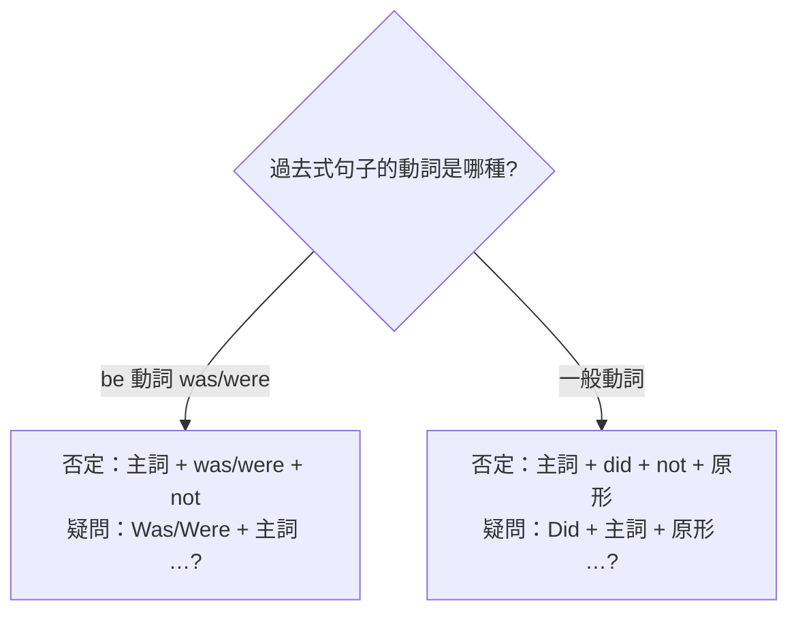

---
tags:
  - 文法/時式
  - 句型公式
  - 對比辨析
  - 易錯點
  - 圖表
source: https://app.notion.com/p/e37c1fef4756419da98c7a1847d71a03
difficulty: ⭐
status: 學習中
review: []
related: []
---

# be 動詞、一般動詞（過去式）

> [!IMPORTANT]
> **一句話核心**
> 過去式講的是「**過去、現在已不存在**」的狀態或動作。be 動詞用 **was／were**（was←am/is、were←are；否定加 not、疑問把 be 移到句首）；一般動詞過去式**規則加 -ed、不規則要背**，而否定與疑問一律用過去式助動詞 **did（不分人稱、後接原形）**。過去式動詞**不分人稱**，第三人稱單數也不加 s。

> [!NOTE]
> **先備觀念**
> - 過去式純粹在講過去，跟「現在」一點關係也沒有——過去已發生的狀態或動作，現在已經沒有了。
> - **時間副詞改變，動詞也必須改變**：時間歸在副詞 → 稱「時間副詞」；動詞隨時間改變型態 → 稱「時態」。

---

## 🅱️ be 動詞的過去式（was／were）

過去式 be 動詞 **was、were**，表示發生在過去的**狀態**或**存在**。
- **was** ⇒ 對應現在式的 am、is
- **were** ⇒ 對應現在式的 are

| | 現在式 | 過去式 |
| --- | --- | --- |
| 例 1 | He **is** busy now.（他現在很忙。） | He **was** busy then.（他那時很忙。） |
| 例 2 | My parents **are** at home now.（我父母現在在家。） | My parents **were** at home yesterday.（我父母昨天在家。） |

### 肯定句　⇒　主詞 + was／were + …
- Mr. Brown **was** a vet.（Brown 先生是一位獸醫。）
  - 過去式的涵義：以前是獸醫，現在不是了。
- Joe and Brian **were** in the living room at that time.（那時 Joe 和 Brain 在客廳。）
  - 過去式的涵義：那時在客廳，現在已經不在客廳了。
  - at that time ＝ then

### 否定句　⇒　主詞 + was／were + **not** + …
> be 動詞肯定改否定：在 be 動詞之後加 not。縮寫：was not → **wasn't**、were not → **weren't**。

- Mr. Brown **was not**（= **wasn't**）a vet.（Brown 先生不是獸醫。）
  - 過去式的涵義：以前不是獸醫，現在是獸醫了。
- Joe and Brian **were not**（= **weren't**）in the living room at that time.（那時 Joe 和 Brian 不在客廳。）
  - 過去式的涵義：那時候不在客廳，現在已經在客廳了。

### 疑問句　⇒　Was／Were + 主詞 + …?
> be 動詞肯定改疑問：把 be 動詞移到主詞前、句尾加「?」。

- Wendy **was** in the seventh grade last year.（Wendy 去年是七年級。）→ **Was** Wendy in the seventh grade last year?（Wendy 去年是七年級嗎？）

### Yes／No 簡答（用 be 動詞問，就用 be 動詞答）
> - Yes, 主詞 + was／were.
> - No, 主詞 + was／were + not.

- Were you a pianist?（你是鋼琴家嗎？）→ Yes, **I was.** ／ No, **I wasn't.**（是，我是。／不，我不是。）
  - 一個字的字尾若是 -ist ⇒ 「什麼樣的人」。

> [!WARNING]
> **答句注意點**：用 be 動詞問就用 be 動詞答；**答句主詞必須用代名詞**（he、I…）。

---

## 🟢 一般動詞的過去式

> 過去的動作 ⇒ 過去式動詞，分為**規則變化**與**不規則變化**（具體動作如 eat、walk；抽象動作如 like、think）。

### 規則變化：加 -ed

| 規則 | 例 |
| --- | --- |
| 一般 → 原形 **+ ed** | help→helped(幫忙)、spell→spelled(拼字)、want→wanted(想要) |
| 字尾有 e → **+ d** | love→loved(愛)、dance→danced(跳舞) |
| 子音 + 短母音 + 子音 → **重複字尾 + ed** | stop→stopped(停止)、plan→planned(計劃) |
| 子音 + y → **去 y + ied** | study→studied(讀書)、cry→cried(哭) |

- **為什麼要重複字尾 + ed**：因為它本身長得比較短，重複字尾可以跟後面的 ed 多一個音節來念。
- **去 y + ied**：y 發 [ɪ] 的音，ed 發 [d]。

**-ed 的發音**：字尾**無聲** → [t]；字尾**有聲** → [d]；字尾本身發 [t]／[d] → [ɪd]。

> [!TIP]
> **去 y 的三式對照**：現在式（三單）去 y **+ies**（studies）／過去式去 y **+ied**（studied）／形容詞比較級去 y **+ier**（happier）。

> [!NOTE]
> **-ed 到底唸 /d/、/t/ 還是 /ɪd/？　💬 AI 補充**
> 改寫自外部文章 [funday〈過去式字尾 -ed 的發音〉](https://archive.funday.asia/blogDesktop/blog.asp?blog=53)（第三方文章，非講義），把發音規則配上例字：
> - **/d/**（有聲子音結尾）：loved、closed、smiled、turned、ordered、rained、cried、studied
> - **/t/**（無聲子音結尾 /p/ /k/ /f/ /s/ /θ/ /ʃ/ /tʃ/）：liked、wiped、talked、walked、laughed、watched、washed
> - **/ɪd/**（字尾音為 /t/ 或 /d/，多一個音節）：wanted、hated、succeeded、needed、recorded

### 不規則變化（需個別記）
| 原形 → 過去式 | 原形 → 過去式 |
| --- | --- |
| eat → ate(吃) | go → went(去) |
| read → read(讀)（拼法同、讀音變） | have → had(有、吃) |
| ride → rode(騎) | see → saw(看) |
| come → came(來) | teach → taught(教)（gh 放在字的中間不發音） |
| give → gave(給) | take → took(拿) |

### 比較現在式、過去式
> 時間副詞改變，動詞也必須改變。

> [!WARNING]
> **主詞為第三人稱單數時，過去式動詞不須加 s——過去式是不分人稱的。**

| | 現在式 | 過去式 |
| --- | --- | --- |
| 例 1 | I **walk** to school every day.（我每天走路去上學。） | I **walked** to school yesterday.（我昨天走路上學。） |
| 例 2 | Mother **goes** to a supermarket every morning.（媽媽每天早上上超市。） | Mother **went** to a supermarket yesterday.（媽媽昨天早上上超市。） |

### 否定句　⇒　主詞 + **did** + not + **原形動詞** + …
> 一般動詞過去式**不可**直接加 not，**必須用過去式助動詞 did（不分人稱）**，其後動詞回**原形**。縮寫：did not → **didn't**。

> [!NOTE]
> **為什麼 did 後面要恢復成原形動詞？**
> 因為 did 已經表示這個動作發生在過去的時間，所以一般動詞就可以恢復成原形動詞。
> （只要有助動詞出現，後面的動詞一定要恢復成原形動詞。）

肯定句 → 否定句：

- He **called** you last night.（他昨晚打電話給你。）
  → He **did not call**（= **didn't call**）you last night.（他昨晚沒打電話給你。）
- My sister and I **watched** TV all day yesterday.（我姐姐昨天和我看了一整天的電視。）
  → My sister and I **did not watch**（= **didn't watch**）TV all day yesterday.（我姐姐昨天和我並沒有整天看電視。）
  - not 跟 all 出現在一起時，兩個字加起來中文解釋叫做「並非」。

### 疑問句　⇒　Did + 主詞 + **原形動詞** + …?
> 一樣不可把動詞移到主詞前，要用 did，其後動詞回原形。

- His friends **went** to that movie last week.（他的朋友上星期去看了那部電影。）
  → **Did** his friends **go** to that movie last week?（他的朋友上星期去看了那部電影嗎？）
- Grace **wrote** a letter to David.（Grace 寫了一封信給 David。）
  → **Did** Grace **write** a letter to David?（Grace 寫信給 David 了嗎？）

### Yes／No 簡答（用助動詞問，就用助動詞答）
> - Yes, 主詞 + did.
> - No, 主詞 + did + not（didn't）.

- Did his friends go to that movie last week?（他的朋友上星期去看了那部電影嗎？）→ Yes, **they did.** ／ No, **they didn't.**
- Did Grace write a letter to David?（Grace 寫信給 David 了嗎？）→ Yes, **she did.** ／ No, **she didn't.**

> [!TIP]
> did 除了幫過去式一般動詞造否定句、疑問句，還能**代替前面重複的動作**（they did = they went to that movie；she did = she wrote a letter to David）。

> [!WARNING]
> **過去式動詞不分人稱**——第三人稱單數也**不加 s**（walk→walked，不是 walkeds）。只有 be 動詞才分 was／were。

---

## 📊 be 動詞 vs 一般動詞（過去式的否定・疑問對照）

| | be 動詞 | 一般動詞 |
| --- | --- | --- |
| 肯定 | She **was** at home. | She **studied** English. |
| 否定 | She **wasn't** at home. | She **didn't study** English. |
| 疑問 | **Was** he sick? | **Did** he **do** his homework? |

---

## ⚠️ 易錯點分析

> [!WARNING]
> **常見錯誤（皆為來源整理的重點）**
> - 一般動詞過去式的否定／疑問 ❌ 直接加 not 或把動詞移到句首；✅ **用 did，且動詞回原形**（❌ Did he went? → ✅ Did he **go**?）。
> - **過去式動詞不分人稱、三單不加 s**（❌ He walkeds → ✅ He **walked**）。
> - 規則動詞加 -ed 的拼法（重複字尾 stopped、去 y 加 ied studied）與**不規則動詞**（went、saw、took…）要分清、要背。
> - be 動詞才分 **was／were**（was←am/is、were←are）。
> - 簡答句主詞要用**代名詞**（Yes, **they** did）。

---

## 🔗 延伸與對比
- **外部延伸閱讀**（第三方文章，非謝孟媛講義）：
  - [過去式字尾 -ed 的發音 /d/ /t/ /ɪd/](https://archive.funday.asia/blogDesktop/blog.asp?blog=53) — 發音規則完整版（重點已折入上方「規則變化 💬」）
- 相關主題：[[02 be 動詞、一般動詞（現在式）]]（對照現在式的 do/does 與三單 +s）、[[04 代名詞]]（簡答用代名詞）、[[05 時態（現在／過去／進行／未來）]]（待建）

---

## 🧠 自我測驗　💬 AI 補充
> 複習時作答，答完再看下方答案。（此區為 AI 出題，非來源內容）

- [ ] Q1：把 They were happy. 改成否定句與疑問句。
- [ ] Q2：把 She studies English. 改成過去式的肯定句、否定句、疑問句。
- [ ] Q3：下列何者正確？(a) Did you saw him? (b) Did you see him? 並說明原因。
- [ ] Q4：寫出 go、have、teach、stop、cry 的過去式。

✅ 解答

A1：否定 They **weren't** happy.／疑問 **Were** they happy?
A2：She **studied** English.／She **didn't study** English.／**Did** she **study** English?（有 did 後回原形 study）。
A3：(b)。有助動詞 did 時後面動詞一律回**原形** see，不可用過去式 saw。
A4：went、had、taught、stopped、cried。

