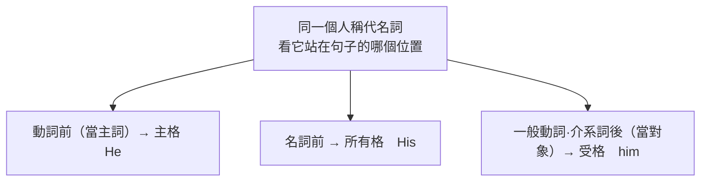

---
tags:
  - 文法/詞類
  - 圖表
  - 對比辨析
  - 易錯點
source: https://app.notion.com/p/e9e38c769b5548109c80daeea3113f7e
difficulty: ⭐⭐
status: 學習中
style: 教學型重構
review: [2026-07-20]
related: []
---

# 代名詞

> [!IMPORTANT]
> **一句話核心**
> 代名詞用來**代替名詞、避免重複**（雙方都知道在講誰／什麼時，第二次就用代名詞）。依用途分五類：**人稱**（主格／所有格／受格）、**所有**（mine…可單獨存在）、**反身**（-self／-selves，主受詞同一人）、**指示**（this/that、so、such、same）、**不定**（some/any、one、both/all、either/neither、other/another…）。

## 🧭 心智圖

```markmap
# 代名詞

## 🗺️ 為什麼要有代名詞

- **代替名詞、避免重複**（雙方都知道在講誰時，第二次就用代名詞）
- 依用途分五類：人稱・所有・反身・指示・不定

## 👤 人稱代名詞

- 核心：同一個人，**站在哪個位置就換哪個格**
  - 動詞前（主詞）→ 主格：**He** likes sports.
  - 名詞前 → 所有格：**His** friends are over there.
  - 一般動詞・介系詞後 → 受格：The girl loves **him** very much.
  - be 動詞後用主格：Who is it? — It's **I**.（現多用 It's me）
- it 的特殊用法
  - 天候・時間・距離：**It** rains a lot in Taipei in spring.
  - 表某一狀況：I like **it** here.／I don't feel like **it**.
  - 假主詞（真主詞太長先頂著）：**It** is difficult to learn Spanish.
    - 有主詞＋動詞用 that：It's important **that** you should tell the truth.
- we／you／they 泛指（不照字面翻）
  - **They** speak English in Canada.／**We** had a heavy rain yesterday.

## 🔑 所有代名詞（mine、yours…）

- ＝**所有格＋名詞**合體，可**單獨存在**
  - Your house is bigger than **mine**（= my house）.
    - ⚠️ 所有格不能單獨存在（my ✗ 單用）
- 雙重所有格：限定詞不可同擠名詞前 → 用 of
  - ❌ a my friend → ✅ an old friend **of mine**
- 名詞版＝所有格：My dog is black, and **Jason's** is white.（= Jason's dog）

## 🪞 反身代名詞（-self／-selves）

- 動作對象**回頭指向主詞自己**
  - The little girl hurt **herself**.／You always talk to **yourself**.（talk to oneself＝自言自語）
- **by＋反身**＝靠自己：He can do it **by himself**.
- 強調用法（緊接所強調的字後）：He **himself** can do it.／I saw the singer **himself**.
  - ⚠️ 反身代名詞**不可當主詞**：❌ Himself can do it.

## 👉 指示代名詞

- this／that：近用 this(these)、遠用 that(those)
  - **This** is my mask, and **that** is Mary's.
  - 電話 Who is **this**?／敲門 Who is **it**?／當面 Who are **you**?
- that／those **代替前面名詞**（須有修飾語；this／these 無此用法）
  - The weather in Taipei is cooler than **that**（= the weather）in Kaohsiung.
- so：代替前面字句／副詞「也」
  - 當受詞：Will it be fine tomorrow? — I hope **so**.
  - 倒裝「也…」：Nancy can play the violin, and **so can I**.
  - 「的確如此」：She is smart. **So she is.**（主詞在前不倒裝）
- such：**such as**＝例如／I don't know **such a man**.
- same：通常加 the：Give me **the same**, please.／the same typewriter **as** I do

## ❓ 不定代名詞

- 判準：**後接名詞＝形容詞；單獨當主受詞＝代名詞**
  - **Some** of the boys like English.（代名詞）／**Some** boys like English.（形容詞）
- one／ones vs it
  - **one**＝a/an＋名詞（不特定）：I have lost my watch and I have to buy **one**.
  - **it**＝the＋名詞（特定）：I bought a good camera. I'll lend **it** to you.
- both／all：兩者都／三以上全部
  - **Both** of her children went to New York.／**All** of my money was stolen.
  - 部分否定：**Not all** of them come from England.（並非全部）
- either／neither：兩者任一／兩者都不
  - Do you know **either** of the visitors?
  - ⚠️ neither 已含否定，**不可再與 not 同用**
  - 「也／也不」：so＋助/be＋主（**So is she**）↔ …, too；neither＋助/be＋主（**neither did Ken**）↔ …, either
- some／any：some 用肯定句（及請求問句）；any 用否定・疑問・條件句
  - Please lend me some money if you have **any**.
- other／another
  - 總數 2：one … **the other**；總數 3+ 逐一點：one … another … **the other**
  - 剩下多個：**the others**；泛指無限定：some … **others**
  - show me **another**（3+）vs show me **the other**（兩個之中）
- none／several／most
  - **None** of the telephones is／are working.（單複皆可）
  - **Several** of my friends attended the meeting.（限可數複數）
  - Most of the people **know** it.（動詞看所代替的名詞）
```

---

## 🗺️ 先看全景：為什麼有代名詞、分成哪五類

一句話同一個名詞講兩次很累贅——「Mary 拿走了 Mary 的書」。當說話雙方都清楚在指誰／什麼，第二次就用**代名詞**代替，句子更簡潔。代名詞按「**拿來做什麼**」分成五類，先建立這張地圖，後面每一類再細看：

| 類別 | 拿來做什麼 | 代表詞 |
| --- | --- | --- |
| **人稱** | 代替「人」，依它在句中的**位置**換格 | I／my／me… |
| **所有** | 表「…的東西」，一個字扛下「所有格＋名詞」 | mine、yours… |
| **反身** | 動作的對象**就是主詞自己** | myself、themselves… |
| **指示** | 用**遠近**或**前文**指出是哪一個 | this/that、so、such、same |
| **不定** | 指**不特定**或非一定數量的人／物 | some/any、one、both/all… |

---

## 👤 人稱代名詞

人稱代名詞 ⇒ 代替「人的名稱」的代名詞。第一人稱＝說話者；第二人稱＝聽話者；第三人稱＝話題中提到者。

| 人稱 | 主格（單） | 所有格（單） | 受格（單） | 主格（複） | 所有格（複） | 受格（複） |
| --- | --- | --- | --- | --- | --- | --- |
| 第一人稱 | I | my | me | we | our | us |
| 第二人稱 | you | your | you | you | your | you |
| 第三人稱 | he / she / it | his / her / its | him / her / it | they | their | them |

### 核心規則：同一個人，站在哪就換哪個「格」
同一個「他」，隨它在句子裡站的**位置**換字——這是人稱代名詞最關鍵的一條：



- **主格 + 動詞**（動詞前用主格）：**He** likes sports.（他喜歡運動。）
- **所有格 + 名詞**（名詞前用所有格）：**His** friends are over there.（他的朋友們在那裡。）
- **一般動詞 / 介系詞 + 受格**（動作的對象）：The girl loves **him** very much.（那女孩非常愛他。）
- **be 動詞後面用「主格」**：be 動詞沒有動作，理論上該用主格——A: Who is it? B: It's **I**.（或 It's **me**。）→ 現在 **It's me** 較多人用。

> [!NOTE]
> 敲門時用 **Who is it?**（分不清對象／性別時用 it）；當面問陌生人身分用 **Who are you?**

### it 的特殊用法
it 除了代替單數事物，還常拿來「頂位子」：

- **表天候／時間／距離**：
  - It rains a lot in Taipei in spring.（台北春天下很多雨。）→ 天候
  - It was two o'clock when he came back home.（他兩點回到家。）→ 時間
  - It is five kilometers from here to the airport.（從這裡到機場距離是 5 公里。）→ 距離
- **表某一狀況**（說話者與聽話者都懂的特定狀況）：
  - A: Who knocked at the door?（誰敲門？）B: I thought **it** was Jack.（我想是 Jack。）→ it 指敲門的這個特定狀況
  - It's all up to **you**.（一切由你決定。）→ it 指大家在討論的一件事
  - I like **it** here.（我喜歡這裡。）→ here 是地方副詞，動詞後要用具名詞特性的受詞，故用 it
  - I don't feel like **it**.（我不想。）→ feel like ＝ 想要；it 指雙方都知道的事情
- **當假主詞**（真主詞太長，先用 it 頂著，真主詞為 to V／that 子句／V-ing）：
  - It is difficult **to learn Spanish**.（西班牙文很難學。）→ it 代替 to learn Spanish
  - It's important **that you should tell the truth**.（你該說實話，這很重要。）→ 有主詞＋動詞 → 用 that
  - It's no use **telling him about it**.（告訴他這件事是沒用的。）→ 也可 It's no use to tell him about it.

### we／you／they 的泛指用法（用來講天氣、或泛指一般人時，不照字面譯「我們／你們／他們」）
- **We** had a heavy rain yesterday.（昨天下了一場大雨。）→ 雨下在「我方」所在地
- **You** don't see many Chinese there.（在那裡看不到許多中國人。）→ 泛指「你若去也一樣」
- **They** speak English in Canada.（在加拿大說英語。）→ they 指第三地的人

---

## 🔑 所有代名詞（mine, yours…）

| 人稱 | 所有格（單） | 所有代名詞（單） | 所有格（複） | 所有代名詞（複） |
| --- | --- | --- | --- | --- |
| 第一人稱 | my | **mine** | our | **ours** |
| 第二人稱 | your | **yours** | your | **yours** |
| 第三人稱 | his / her / its | his / **hers** / its | their | **theirs** |

**為什麼它能單獨站？** 因為 **所有代名詞 = 所有格 + 名詞** 合體，一個字就把重複的名詞收進去了（同類型才可省略名詞）：
- Your house is bigger than **mine**（= my house）.（你家比我家大。）
- My bicycles are here and **his**（= his bicycles）are there.（我的腳踏車在這裡，而他的在那裡。）

> [!WARNING]
> **所有格不能單獨存在**（後面一定要有名詞）；**所有代名詞可以單獨存在**。所代替的名詞要與前者單複數相同。

- **雙重所有格**：冠詞、所有格、指示形容詞、不定形容詞**不可同時**放在名詞前 → 改用 of：
  - I met **one of my old friends** on the way home. = I met **an old friend of mine** on the way home.（我在回家途中遇到我的一位老朋友。mine = my friends；遇到 of 要由後往前翻譯）

> [!NOTE]
> **「雙重所有格」這名字怎麼來？　💬 AI 補充**
> 此為 AI 補充、非來源內容。
> - **「所有格」**：同一個「所有」被標了**兩層**——`of` 本身就表「…的」（of 所有格），後面的 `mine`／`Jason's` 又是一個所有格。兩層相疊，即 **「雙重」**。
> - **為什麼要拆成兩段**：冠詞、所有格這些**限定詞不能同時擠在名詞前**（❌ **a my** friend），只好把其中一個用 `of` 挪到名詞後 → ✅ a friend **of mine**（a 留原位、my → of mine）。
> - **名詞版同理**：an old friend **of John's**（`of` 一次＋`'s` 一次，同樣雙重）。

- **名詞的所有代名詞 = 所有格**：My dog is black, and **Jason's**（= Jason's dog）is white.（我的狗是黑的，而 Jason 的是白的。）

---

## 🪞 反身代名詞（-self／-selves）

**什麼時候用**：當一個動作的**對象回頭指向主詞自己**時，受詞就用反身代名詞（不是普通受格）。

**形成**：第 1、2 人稱＝**所有格 + self/selves**；第 3 人稱＝**受格 + self/selves**（複數去 f 加 ves）。

| 人稱 | 單數 | 複數 |
| --- | --- | --- |
| 第一人稱 | myself | ourselves |
| 第二人稱 | yourself | yourself（yourselves） |
| 第三人稱 | himself / herself / itself | themselves |

> [!WARNING]
> **反身代名詞不可以當主詞。**

- **主詞和受詞是同一對象時**：
  - You always talk to **yourself**.（你老是自言自語。）→ 介系詞 to 後用受格；talk to oneself ＝ 自言自語
  - The little girl hurt **herself**.（這小女孩受傷了。）
- **by + 反身代名詞 = 靠自己**：He can do it **by himself**.（他能夠獨自做這件事。）
- **強調用法**（緊接在**所強調的名詞／代名詞正後方**，可為**主詞**或**受詞**，強調「本人／親自」）：
  - 強調**主詞**：He **himself** can do it.（他親自做得到。把反身代名詞挪到主詞後，即成強調句。）
  - 強調**受詞**：I saw the singer **himself**.（我看見那位歌手**本人**。強調的是受詞 the singer——用 himself 而非 myself，即可證明強調的不是主詞 I。）
  - ⚠️ 但反身代名詞**仍不可當主詞**：❌ Himself can do it. → ✅ He himself can do it.

---

## 👉 指示代名詞（this/that、so、such、same）

指示代名詞靠「**指**」來確定對象——或用遠近、或指回前文。

### this(these) / that(those)
- **遠近**：離說話者**近**用 this(these)、**遠**用 that(those)。
  - **This** is my mask, and **that** is Mary's.（這是我的面具，而那是 Mary 的。Mary's = Mary's mask，名詞的所有代名詞用法）
  - 電話用語：**Who is this?**（你是誰？正在跟你講電話的，較近）／**Who was that** on the telephone?（電話上那人是誰？較遠）／敲門用 Who is it?／當面用 Who are you?
  - Things are easier **these days**.（這幾天事情簡單多了。these days ＝ 最近；these 此處是形容詞）
- **代替前面名詞（避免重複）**：代替前面已提、且**後有修飾語**的重複名詞——代替**單數**用 **that**、**複數**用 **those**；**this/these 無此用法**。
  - The weather in Taipei is cooler than **that**（= the weather）in Kaohsiung.（台北的天氣比高雄涼爽。in Taipei 就是修飾語）
  - Her interests are different from **those**（= the interests）of her childhood.（她現在的興趣和她童年時的不同。of her childhood 就是修飾語；看到 of 要由後往前翻譯）

> [!NOTE]
> **什麼是「修飾語」？　💬 AI 補充**
> 補自 Notion 補充頁（非講義）：**修飾語＝形容詞或副詞**，用來描述／限制其他詞的意義。如 the **tall** building（修飾名詞）、sings **beautifully**（修飾動詞）、**extremely** happy（修飾形容詞）、ran **very** quickly（修飾副詞）。指示代名詞的「代替用法」須是「名詞＋修飾語」時才成立。

### so（兩種用法別混在一起）
**① 代替前面的字句，當受詞或補語**——so 指前面出現過的狀況：
- A: Will it be fine tomorrow?（明天天氣好嗎？）B: I hope **so**.（我希望如此。so = that it will be fine tomorrow，當 hope 的受詞）
- Do you still feel sick? If **so**, you must see the doctor.（你還覺得不舒服嗎？如果是這樣，你一定要去看醫生。so 指前面的狀況 you still feel sick）

**② 副詞用法：表「也…」或「的確如此」**——這裡的 so 代替前面的**述語、帶出倒裝**，不是受詞／補語：
- **so + 助動詞／be + 主詞 = 「（某某）也…」**：Nancy can play the violin, and **so can I**.（Nancy 會拉小提琴，而我也會。so can I = I can, too）／She is smart. **So is he.**（她很聰明，他也是。）（否定版「也不…」用 neither + 助/be + 主詞，見下方 either／neither 段）
- **so + 主詞 + 助動詞／be = 強調「的確如此」**（主詞同前）：She is smart. **So she is.**（她很聰明，她的確如此。）

> [!NOTE]
> **①②本是講義同標題下混列，此處按功能拆開　💬 AI 補充**
> 例句與註解皆來源既有；來源把 `so can I` 也放在「受詞／補語」標題下，但它其實是 ② 的倒裝副詞用法（代替述語、非受詞補語），故在此分成兩組對齊。

### such（那樣的事物／人；可當代名詞或形容詞，單複數皆可）
- They will plant flowers **such as** roses, sunflowers.（他們將種些花，例如：玫瑰、向日葵。such as = 例如）
- I don't know **such a man**.（我不認識這樣的人。such + a/an + 形容詞 + 名詞；對方已知時形容詞可省略）
- Have you tasted **any such food** before?（你以前曾經嘗試過任何這樣的食物嗎？此處 such 當形容詞；food 是總稱，屬不可數名詞）
- such 前可接 all、other、another、any、few、every、no 等。

### same（通常加 the，表「相同的～」）
- A: Can I have a cup of coffee, please?（請給我一杯咖啡好嗎？）B: Give me **the same**, please.（我也要咖啡。the 表限定，與前面相同）
- He uses **the same** typewriter **as** I do.（他使用和我相同的打字機。as 為連接詞；do 代替前面動作）

> [!TIP]
> **相同／不同的句型**：A 與 B 相同 ⇒ A 動詞 **the same … as** B；A 與 B 不同 ⇒ A be 動詞 **different from** B。

---

## ❓ 不定代名詞（some/any、one、both/all…）

表示不特定的人或物、或非一定數量的代名詞；同一批字**有時也當形容詞**用。

> [!TIP]
> **貫穿本節的判準——是代名詞還是形容詞？**
> **後面直接接名詞的是形容詞；單獨當主詞／受詞的是代名詞。** 下面每個字都可用這條檢查。
> - **Some** of the boys like English.（這些男孩當中有些喜歡英文。Some 是代名詞、當主詞；of → 有限定）
> - **Some** boys like English.（有些男孩喜歡英文。Some 是形容詞，後接名詞；無限定）

### one / ones
- **one = a/an + 單數名詞**（不特定）；複數用 **ones**。對照 **it = the + 單數名詞**（特定）。
- I have lost my watch and I have to buy **one**.（我弄丟了我的錶，我必須再買一只。one = a watch，沒有限定是同一只）
- I like small cars better than large **ones**.（我喜歡小車勝於大車。ones = cars）
- Here are some apples. Take **one**.（這裡有些蘋果，拿一個吧！one = an apple）／I bought a good camera. I'll lend **it** to you.（我買了一台相機，我會把它借給你。it = the camera）

### both / all
- **both**（兩者都）用於**兩個**人／物，作複數；**all**（全部）用於人或物，可數時**總數 3 以上**，也可代不可數。
- **位置**：be 動詞／助動詞**之後**；一般動詞**之前**；the／所有格／數詞／形容詞**之前**。
  - **Both** of her children went to New York.（她的兩個小孩都去了紐約。只有兩個孩子；對照 Two of her children ＝ 不只兩個）
  - I've read **both** these papers.（我看過這兩份報紙了。）
  - **All** of my money was stolen.（我的錢都被偷了。不定代名詞代替的是可數或不可數，要從後面判斷）
  - You may take **all** these toys. = You may take **them all**.（你可以拿所有的玩具。人稱代名詞先、不定代名詞後）
- **部分否定**：both／all 用於否定句 = 「並非（全部）」。
  - I do not know **both** of her parents.（她的父母我並非都認識。= I know just one of her parents.）
  - **Not all** of them come from England.（他們並非都來自英國。= Just some of them come from England.）

### either / neither
- **either**：兩者中「不論哪一個都行，但只選一個」。
  - Do you know **either** of the visitors?（你認識這兩位訪客中的任何一位嗎？）
- **neither**：both 的否定，「兩者都不」（全部否定）；**本身是否定字，不可再與 not 同用**。
  - 否定字＝本身就有否定含意的字，不可再與 not 同時出現，如 never、nothing、seldom。
- 比較：I don't like **both** hats.（這兩頂帽子我並非都喜歡。）／I like **neither** of the hats.（這兩頂帽子我都不喜歡；neither 此處為受格）
- **副詞用法「也／也不」**：兩種擺法——放**句尾**，或**句首倒裝（助動詞／be + 主詞）**。肯定用 too／so，否定用 either／neither：

| | 「也…」肯定 | 「也不…」否定 |
| --- | --- | --- |
| 放句尾 | …, **too** | …, **either** |
| 句首倒裝 | **so** + 助/be + 主詞 | **neither** + 助/be + 主詞 |

- 肯定：I am a teacher, and she is, **too**. = I am a teacher, and **so is she**.
- 否定：Bill didn't come to my party, and **neither did Ken**. = Bill didn't come to my party, and Ken didn't, **either**.（Bill 沒有來參加我的派對，而 Ken 也沒有。）
- **對應**：neither↔so（都倒裝）、either↔too（都放句尾）；句首倒裝語序同上方 **so ②**。either 解「也不」時，前面一定有否定的 not。

### some / any
- **some**：用於**肯定句**（也用於表請求／邀請的問句：Will you give me some help? How about some tea?）。
  - **Some** of the boys were late.（這些男孩當中有些遲到了。some 代替 boy）
  - **Some** of my money was stolen from my purse.（我皮夾裡有些錢被偷了。some 代替 money；不可數名詞永遠只有單數用法）
- **any**：用於**否定句、疑問句、條件句**。
  - Do you have **any** magazines to read?（你有雜誌可讀嗎？）
- 兩者皆可代可數與不可數名詞。Please lend me some money if you have **any**.（如果你有錢的話，請借我一點。if 引導條件句 → 用 any；any 代替 money）

### other / another
- **other**：其他人事物，複數 **others**；只有 other 時是形容詞，**the other** 才是代名詞。
- **another**（= an + other）：不特定的「另一個」，**無複數**。

| 情境 | 用法 |
| --- | --- |
| 總數 **2 個** | one … **the other** |
| 總數 **3 個以上**、逐一點 | one … another … **the other**（最後一個） |
| 剩下**多個** | one … **the others** |
| 泛指其他（無限定） | some … **others** |

- **總數 2 個**：I have two students.（我有兩個學生。）One is short; **the other** is tall.（一位矮個子，另一個高個子。one = a student）
- **總數 3 個**：I have three flowers.（我有三朵花。）
  - One is red; **the others** are yellow.（一朵紅的；其他黃的。）
  - One is red; **another** is yellow; **the other** is pink.（一朵紅的；另一朵黃的；還有一朵粉紅的。先用 one，接著 another，最後 the other）
- **another vs the other**：I don't like this one, show me **another**.（讓我看另一個。→ 總數 3 或以上）／I don't like this one, show me **the other**.（《兩個之中》讓我看另一個。→ 總數為 2）
- **限定要前後一致**：Some of the boys are here, but where are **the others**?（有些男孩在這裡，但其它人呢？）／Some people said yes and **others** said no.（有些人說是，其它的說不。）
- 原則：**前面有無限定，後面要一致**（前無限定 → others；前有限定 → the others）；反正剩下的都用 **the + other／others**。

### 其他：none / several / most
- **none**：人或物皆可，可數／不可數皆可（當主詞時單複數動詞都行）。
  - **None** of the telephones is/are working.（這些電話中沒有一支可用。work 的主詞是物品時指「運作」）
- **several**：數個，只用於**可數複數**。
  - **Several** of my friends attended the meeting.（我的朋友中有幾位參加了會議。）
- **most**：大部分，可用可數複數或不可數，通常前不加 the；動詞單複數看所代替的名詞。
  - Most of **it** is true.（大部分是真的。指一件事 → is）／Most of the people **know** it.（大部分人都知道這件事情。多人 → 複數動詞）
- **most 當形容詞**＝ many／much 的最高級，前可加 the：
  - Who got **the most** New Year's cards?（誰收到最多新年卡？）
  - She is **the most** beautiful girl that I've ever seen.（她是我看過最美的女孩。）

---

## ⚠️ 易錯點分析

> [!WARNING]
> **常見錯誤（皆為來源整理的重點）**
> - **格要用對**：動詞前用**主格**、名詞前用**所有格**、動詞／介系詞後用**受格**（❌ Me like it → ✅ **I** like it；talk to **yourself** 不是 to you）。
> - **所有格 vs 所有代名詞**：所有格不能單獨（my ✗ 單用）、所有代名詞可單獨（mine ✓）。
> - **反身代名詞不可當主詞**（❌ Himself can do it → ✅ He himself can do it）。
> - **this/these 不能**做「代替前面名詞」用（只有 that/those 可），且須「名詞＋修飾語」。
> - **neither 已含否定**，不可再加 not。
> - **one = a/an+名詞（不特定）vs it = the+名詞（特定）**；別混用。
> - **both/all + 否定 = 部分否定**（「並非全部」），不是「全部都不」。

> [!WARNING]
> **練習卷錯題回填（2026-07-21，[[初級04 代名詞 練習卷]]）　💬 AI 補充**
> - **① 提示詞給主格，就整串照抄沒變形**——這次四題同一個病灶（乙 1／2／4／5），是本章最大失分源。提示詞 `(they)`／`(she)`／`(he)` 只是「指誰」，**該用哪一形要看它在句中的位子**，不是照抄：
>   - 後面**沒有名詞**了 → 所有代名詞（帶 -s）：❌ it's **their** ✅ it's **theirs**；❌ longer than **her** ✅ longer than **hers**（= her hair）。
>   - 動作**繞回主詞自己** → 反身（帶 -self）：❌ The cat licked **it** clean ✅ …licked **itself** clean；❌ finished it by **him** ✅ by **himself**。寫成 it／him 文法沒破，但意思會變成「另一個東西／另一個人」——**這種錯不會被文法檢查抓到**。
> - **② 比較句兩邊要對等**：My hair is longer than **hers**（頭髮比頭髮）；寫 than her 變成「我的頭髮比她這個人長」。判斷法：把省略的字補回去唸一次。
> - **③ 反身當強調時，不能為了「改對」把它刪掉**：❌ Himself repaired… → 只改成 He repaired… 雖然合法，但**強調語氣被刪掉了**，正解是 **He himself** repaired…（不可當主詞 ≠ 不能出現在主詞旁）。
> - **④ 強調的是誰，看用哪個 -self**：I saw the author **himself**——主詞是 I，若強調主詞會寫 myself；寫 himself 就代表它扣的是**受詞 the author**（「作者本人」）。⚠️ 別一律解成「主詞自己」。
> - **⑤ 強調用法 vs 當受詞，判準是「能不能刪」**（不是看它站在主詞後還是受詞後）：He **himself** can do it. → He can do it. ✅ 仍完整 → 強調；She hurt **herself**. → She hurt. ❌ 句子破了 → 當受詞（必要成分）。
> - **⑥ be 動詞後，正式用法接主格**：It was **I**.（口語才說 It was me——考規則面時別用口語直覺。）

---

## 🔗 延伸與對比
- 相關主題：[[01 名詞、冠詞]]（代名詞代替名詞、the/a 對照 one/it）、[[02 be 動詞、一般動詞（現在式）]]（簡答用代名詞）、[[11 形容詞]]（this/some/any 的形容詞用法，待建）

---

## 🧠 自我測驗　💬 AI 補充
> 複習時作答，答完再看下方答案。（此區為 AI 出題，非來源內容）

- [ ] Q1：填入正確的格：___ (I/me) gave the book to ___ (he/him)。
- [ ] Q2：Your car is red, and ___ (my) is blue.（填所有代名詞）
- [ ] Q3：I have three pens. One is black, ___ is blue, and ___ is red.（填 another／the other 等）
- [ ] Q4：改錯：I don't like neither of them.
- [ ] Q5：one 與 it 有何不同？各造一句。

<details>
<summary>✅ 解答</summary>

A1：**I** gave the book to **him**.（主格當主詞、介系詞後用受格）
A2：Your car is red, and **mine** is blue.
A3：One is black, **another** is blue, and **the other** is red.（三個以上：one…another…the other）
A4：neither 已含否定，不能再用 don't → 改 I like **neither** of them.（或 I don't like **either** of them.）
A5：one = a/an + 單數名詞（不特定），如 I need a pen; can you lend me **one**?；it = the + 單數名詞（特定），如 I bought a pen and I gave **it** to him.

</details>
