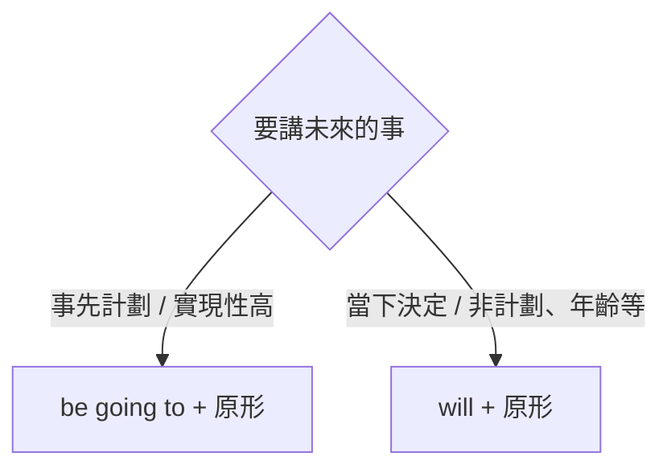

---
tags:
  - 文法/時式
  - 句型公式
  - 對比辨析
  - 易錯點
  - 圖表
source: https://app.notion.com/p/9b19cd7a13e740b4a50c4f92b7b3f02d
difficulty: ⭐⭐
status: 已複習
style: 教學型重構
review: [2026-07-20]
related: []
---

# 時態（現在／過去／進行／未來）

> [!IMPORTANT]
> **一句話核心**
> 時態 = **動詞**會隨**時間**改變型態（時間歸在副詞，稱「時間副詞」；時間副詞一改，動詞就要跟著改）。五種基本時態：**現在簡單**（現況／習慣／真理）、**過去簡單**（過去、現已無）、**現在進行**（am/are/is＋V-ing，正在）、**過去進行**（was/were＋V-ing，過去某時點正在）、**未來**（will／be going to＋原形）。

## 🧭 心智圖

```markmap
# 時態

## 🗺️ 先定位：兩個問題

- ① 什麼**時間**？現在／過去／未來（時間副詞透露：now、yesterday、tomorrow…）
- ② 什麼**樣態**？簡單＝事實・習慣・狀態｜進行＝某刻正在（be＋V-ing）

## ⏰ 現在簡單

- 形式：am／are／is；一般V **三單＋s**｜副詞：now、every＋時間
- 現在狀態・動作
  - There **are** many visitors in the zoo.
  - ⚠️ There／Here 開頭，真主詞在後：Here **comes** the bus.（＝The bus comes here）
- 習慣性動作（often、every…）
  - My parents **take** exercise in the park every morning.
  - ⚠️ exercise 當「運動」不可＋s；有分項目的用 sports（I like **sports**, such as baseball…）
- 不變的真理
  - The earth **moves** around the sun.（唯一事物加 the）

## 🕰️ 過去簡單

- 形式：was／were；V-ed／不規則｜副詞：yesterday、last＋、＋ago、then
  - ago 前要有明確時間（two hours **ago**）；before 可單獨＝「以前」
- 過去發生・現已無
  - I **bought** this yesterday.（昨天買，現在沒在買）
  - There **was** an old temple over there.（以前有，現在沒了）
- 過去習慣：**used to＋原形**
  - My father **used to** smoke.（過去式與現在無關 → 已隱含現在不抽）

## 🔄 進行式 be＋V-ing

- 公式不變：**be 標時間、V-ing 永遠不動**｜V-ing：＋ing／去e＋ing／重複字尾（put→putting）
- 現在進行 am／are／is＋V-ing
  - 正在進行：John **is watching** the baseball game on television.
  - 重複發生（always、all the time）：He **is always complaining**.（always 放 be 後）
  - 最近的未來（come／go／leave…）：**I'm leaving** for Kenting tomorrow.（leave for＝前往）
- 過去進行 was／were＋V-ing
  - 過去「定點時間」正在：We **were playing** chess at eight yesterday evening.
    - 對照：過去「時段」用過去簡單（We **played** chess yesterday evening.）
  - Lily **was taking** a bath when the doorbell rang.
  - 過去期間反覆（勿翻「正在」）：Whenever I visited him, he **was watching** TV.
- ⚠️ 感官 see・情感 love・狀態 have／know：是狀態非動作，**不用進行式**
  - ❌ I'm seeing the bird → ✅ I'm **looking at** the bird.

## 🔮 未來

- 副詞：tomorrow、next＋、in＋時間（…之後）
- **be going to＋原形**：事先計劃・實現性高
  - **I'm going to** visit my uncle tomorrow.
  - I'm afraid **I'm going to** be sick.（實現性高）
- **will＋原形**：當下決定・非計劃
  - A: I can't move the large box. B: **I'll do** it for you.
  - 非計劃性事實也用 will（❌ be going to）：I **will be** fifteen years old next year.（年齡免計劃）
  - 否定 will not＝**won't**：I **won't** change my mind.
- 📎 Will you～?＝請求／邀約（語氣，非時態）
  - **Will you** look after the baby for me?
  - ⚠️ 答應與否用 **can**（Sure.／I'm sorry, but I can't.）
```

---

## 🗺️ 先定位：什麼「時間」＋什麼「樣態」

看到一句話要選時態，先問兩個問題，五種時態就各就各位：

1. **什麼時間？** ——現在／過去／未來（由時間副詞透露：now、yesterday、tomorrow…）。
2. **什麼樣態？** ——是講一個**事實／習慣／狀態**（簡單式），還是**某一刻正在進行**（進行式）？

| 時間 ＼ 樣態 | 簡單式（事實／習慣／狀態） | 進行式（be + V-ing，某刻正在） |
| --- | --- | --- |
| **現在** | 現在簡單（The earth **moves**…） | 現在進行（**is watching**…） |
| **過去** | 過去簡單（I **bought**…） | 過去進行（**was playing**…） |
| **未來** | 未來 will／be going to（**will leave**…） | （進行式少用，此處略） |

> [!TIP]
> **一條貫穿的公式規律**：進行式不管現在或過去，公式都是 **be + V-ing**——**變的只有 be 的時態**（現在用 am／are／is、過去用 was／were），V-ing 永遠不動。認得這條，現在進行與過去進行其實是同一招（接回 [[02 be 動詞、一般動詞（現在式）]]／[[03 be 動詞、一般動詞（過去式）]] 的 be 動詞）。

### 五種時態總覽（速查）

| 時態 | 結構 | 主要用途 | 常見時間副詞 |
| --- | --- | --- | --- |
| 現在簡單 | be（am/are/is）／一般動詞（三單 +s） | 現在狀態動作、習慣、不變真理 | now、every… |
| 過去簡單 | was/were／過去式動詞（規則 -ed、不規則） | 過去動作狀態（現已無）、過去習慣 used to | yesterday、last…、…ago、then |
| 現在進行 | **am/are/is + V-ing** | 正在進行、重複動作、最近的未來 | now、at the moment |
| 過去進行 | **was/were + V-ing** | 過去某時點正在、過去期間反覆 | at eight last night、when… |
| 未來 | **will + 原形**／**be going to + 原形** | 未來的動作或狀態 | tomorrow、next…、in… |

> 動詞有**三態**：原形動詞、過去式動詞、過去分詞。現在分詞 `V-ing`＝動作進行／主動；過去分詞 `p.p`＝被動／完成（皆不等於時態本身）。

---

## ⏰ 現在簡單式（＝現在式）

**講的是**：現在的事實、反覆的習慣、不變的真理——時間軸上「一直如此」的事，而非「此刻正在」。

- **動詞形式**：be 動詞 am/are/is（狀態或存在）；一般動詞（動作），主詞第三人稱單數加 s/es。
- **時間副詞**：now、every + 時間。

**使用時機**
- **現在的狀態或動作**：
  - There **are** many visitors in the zoo.（動物園裡有許多遊客。）
  - Here **comes** the bus.（公車來了。= The bus comes here，但外國人習慣把 there／here 這類副詞擺前面）
  - ⚠️ there／here 放句首時，**真正的主詞在後面**（visitors、bus）——主詞不一定在動詞前。
- **習慣性動作**：
  - David often **sleeps** during class.（David 常在上課時睡覺。從 often 就可判斷是習慣性動作）
  - My parents **take** exercise in the park every morning.（我父母每天早上在公園做運動。）
    - ⚠️ exercise 當「運動」解釋時**不可 +s**；解釋成「習題」才可以，如 math exercises。有分項目的是 sport：I like sports, such as baseball, basketball and bowling.（我喜歡運動，例如棒球、籃球和保齡球。）
  - 動作若在過去、現在、未來三時態都分布 → **規定以現在式為主**。
- **不變的事實、真理**：The earth **moves** around the sun.（地球繞著太陽轉。自然界唯一事物加定冠詞 the：the earth、the sun）

---

## 🕰️ 過去簡單式（＝過去式）

**講的是**：過去發生、與現在無關的動作或狀態——時間軸上「已經結束」的一點。

- **動詞形式**：be 動詞 was/were；一般動詞過去式（規則 -ed／不規則）。
- **時間副詞**：yesterday、last +時間、時間+ ago、before、then（= at that time）。
  - **ago vs before**：ago 前面要加明確時間（two hours ago）；before 可單獨存在，純指「以前」。

**使用時機**
- **過去的動作或狀態**（與現在無關）：
  - I **bought** this yesterday.（我昨天買了這個。→ 昨天買了，現在沒有在買）
  - There **was** an old temple over there.（那裡以前有座古廟。→ 以前有，現在沒有了）
- **過去習慣性動作**：常用 **used to + 原形動詞**——My father **used to** smoke, but now he doesn't.（我父親以前常吸菸，但現在不抽了。）
  - 其實只說 My father used to smoke 就夠了——過去式與現在無關，已隱含現在不抽；句尾的 doesn't 是代替前面重複的動作（smoke）。

---

## 🔄 現在進行式

樣態換成「進行」，鏡頭拉近到**此刻正在發生**的畫面。公式就是那條貫穿規律：

> **結構 ⇒ be 動詞（am／are／is）+ V-ing**——**be 標時間**（現在，由主詞決定 am/are/is），**V-ing 標「動作進行中」**。

**V-ing 的形成**

| 規則 | 例 |
| --- | --- |
| 大部分動詞 → 原形 **+ ing** | talk→talking、say→saying、speak→speaking |
| 字尾有 e → **去 e + ing** | have→having、write→writing、come→coming |
| 子音+短母音+子音 → **重複字尾 + ing** | put→putting、cut→cutting、swim→swimming |

**使用時機**
- **正在進行的動作**：John **is watching** the baseball game on television.（John 正在看電視上的棒球賽。）
- **重複發生**（常伴 always、all the time、again and again）：
  - He **is always complaining**.（他老是抱怨。always 是頻率副詞，放 be 動詞之後；要講抱怨的對象用 complain about + 受詞）
  - The car **is breaking down** all the time.（這輛車老是故障。all the time 通常擺句尾）
- **最近的未來**（常用來去動詞 come／go／start／leave／arrive；「最近」由講話者判斷）：
  - I **'m leaving** for Kenting tomorrow.（我明天前往墾丁。leave ＝ 離開；leave for ＝ 前往）
  - My boyfriend **is coming** to see me this afternoon.（我男朋友今天下午即將來看我。to see me 是不定詞當副詞用、表目的）

> [!WARNING]
> **感官／情感／狀態動詞通常不用進行式。**
> 進行式（be + V-ing）強調動作「正在做、下一秒可停」；而下面這些詞表示的是一直如此的**狀態或感知**，本來就沒有「開始／結束」的過程：
> - **感官**：see、hear、smell（睜眼就看見，不是一秒一秒在做）
> - **情感**：love、like（背景感受；標語例外 I'm loving it）
> - **狀態**：have（擁有）、know（穩定狀態，不會開開關關）
>
> ❌ I'm **seeing** the bird → ✅ I'm **looking at** the bird
>（see 是自動知覺；要講「正在看」須改用主動的 look at）

- 對照三態（同一動作在不同時態）：
  - 現在式：We **eat** breakfast every morning.（我們每天早上吃早餐。）
  - 過去式：We **ate** breakfast before **going** to school.（我們上學前已經吃過早餐。介系詞 before 後動詞必 +ing、**無例外**——介系詞後要接受詞，只有名詞能當受詞，而 V-ing 就是動名詞）
  - 現在進行式：We **are eating** breakfast.（我們現在正在吃早餐。be 由 We 決定 → are）

---

## ⏳ 過去進行式

**同一招 be + V-ing，只把 be 換成過去式 was／were**——鏡頭拉近到**過去某一刻正在進行**的畫面。

> **結構 ⇒ was／were + V-ing**（was/were 由主詞決定）

- 示範：He **was playing** frisbee in the park then.（那時他在公園玩飛盤。was 表過去、playing 表動作進行）

**使用時機**
- **過去某一「定點時間」正在進行**：
  - We **were playing** chess **at eight** yesterday evening.（昨晚 8 點我們正在下棋。）
  - Lily **was taking** a bath **when** the doorbell rang.（門鈴響時 Lily 正在洗澡。take a bath ＝ 盆浴；take a shower ＝ 淋浴）
  - 對照：過去某一「時段」用**過去簡單**（We **played** chess yesterday evening）；某一「時點」用**過去進行**。
- **過去某期間反覆的動作**：
  - Whenever I visited him, he **was watching** TV.（無論何時我去看他，他都在看電視。）
  - In those days, we **were getting up** at seven o'clock.（在那些日子，我們總是在七點起床。此處指習慣性行為，**不要翻成「正在」**七點起床）

---

## 🔮 未來式

未來有兩種語氣：**計劃好的**（be going to）與**當下決定／單純事實**（will）。

> 表示未來的動作或狀態，常用 **will** 或 **be going to**。時間副詞：tomorrow、next +時間、in +時間（…之後）、the day after tomorrow。

### be going to + 原形動詞（計劃好、實現性高）
- 多表**事先計劃好**或**實現性很高**的事。
- I **'m going to** visit my uncle tomorrow.（明天我要去探望我叔叔。）
- I have to buy the ladder because I **'m going to** paint the house.（我必須買個樓梯，因為我打算油漆房子。paint 是拿刷子漆／畫；draw 是拿鉛筆素描）
- I don't feel good; I'm afraid (that) I **'m going to** be sick.（我覺得不舒服；恐怕我要生病了。that 引導的名詞子句當受詞時可省略）
- 疑問：**Are** they **going to** have a party on Christmas Eve?（聖誕前夕他們打算開派對嗎？）

### will + 原形動詞（當下決定、非計劃事實）
- will 是表未來的**助動詞、不分人稱**，後接**原形**。
- We **will leave** junior high school soon.（不久我們將自國中畢業。）
  - ＝ We **are going to leave** junior high school soon. ＝ We **are leaving** junior high school soon.（同一件事的三種未來寫法）
- 多表**當下決定／非計劃**：A: I can't move the large box.（我搬不動這大箱子。）B: I **'ll do** it for you.（我來幫你。非事先計劃 → 不可用 be going to）
- **非計劃性的事實**也用 will：I **will be** fifteen years old next year.（明年我就 15 歲了。年齡不需事先計劃，**不可**用 be going to）
- **Will** people **live** on Mars in the future?（人類未來會在火星上生存嗎？）
- 否定：will not = **won't**——I **will not change** my mind.（我將不會改變主意。）= I'll not change my mind. = I won't change my mind.

> [!TIP]
> **be going to vs will**



### 📎 Will you ~?：請求／邀約（will 的語氣用法，非時態）

> [!NOTE]
> 這裡的 will **不表未來**，而是借 will 疑問句表「**請求／邀約**」的語氣；跟時態無關，只因共用 will 這個字才在此一併帶過（謝孟媛原教材也是獨立一節）。

- 請求：Will you look after the baby for me?（請你替我照顧這寶寶好嗎？look after = take care of）→ 答 Sure.／OK.／All right.／No, I can't.／I'm sorry, but I can't.（抱歉，我不能。用 but 有事與願違的意思）
- 邀約：Will you have another cup of coffee?（你要再來杯咖啡嗎？）→ 答 Yes, please.（請再給我一杯。）／Yes, thank you.／No, thank you.（不，謝謝。）
- ⚠️ 一般是助動詞問、助動詞答，但 will 例外——**能否答應請求用 can**。

---

## ⚠️ 易錯點分析

> [!WARNING]
> **常見錯誤（皆為來源整理的重點）**
> - **進行式 = be + V-ing**，別漏 be（❌ He watching TV → ✅ He **is** watching TV）。
> - **感官／情感／狀態動詞**通常不用進行式（see → **look at**；love/have 一般不加 -ing）。
> - **介系詞後動詞一律 + ing**（before **going** to school），無例外。
> - **過去時點用過去進行、過去時段用過去簡單**（at eight… were playing／yesterday… played）。
> - **年齡、當下決定**用 **will**，不可用 be going to。
> - 現在式的**真理／習慣**別忘了主詞三單動詞 **+s**（The earth move**s**）。
> - **Will you~?** 的回答用 can（請求）或 Yes, please／No, thank you（邀約），不是 will。

> [!WARNING]
> **練習卷錯題回填（2026-07-21，[[初級05 時態（現在／過去／進行／未來）練習卷]]）　💬 AI 補充**
> - **① 規則講得出來，填空時卻不會自己觸發**——本章最大失分源（乙 2／4／6／10 連犯 4 次，全是「該用進行式／be going to，卻一律填了簡單式」）。⚠️ 證據：同一條規則在**改錯題**（丙 4）我判得又快又準，換成**填空**就默認填簡單式——**認得出錯 ≠ 生得出對**，別把「看得懂解答」當成會了。
>   - 病因是只做了半步：確認「什麼時候發生」（過去的事→過去式 ✅）就收工，漏掉第二步。
>   - **填時態走兩段式**：① 什麼時候（現在／過去／未來）→ ② **拍那一刻的畫面，還是報告這件事發生過**（畫面 → 進行式）。
> - **② 別拿「中文有沒有『正在』」當判準**：❌ Whenever I called him last winter, he **studied** ✅ he **was studying**（過去某期間反覆處在該狀態 → 過去進行）。中文不說「正在」照樣要用進行式。
> - **③ 現在進行／be going to／will 是三條線，別擠成一條**：❌ Look at those black clouds — it **is raining** soon ✅ **is going to rain**（雲是**徵兆**，雨還沒下，soon 已明說是未來）。分法：此刻正在下 → it's raining／看徵兆判斷要下 → it's going to rain／單純預測 → it will rain。
> - **④ 改錯題要抓「文法破的地方」，不是「語氣多餘的地方」**：Will you please **to** close the window? 錯的是 **to**（**助動詞 will 後接原形**），please 完全該留——請求語氣是 will 給的、禮貌程度是 please 給的，兩者不同層、不衝突。
> - **⑤ will not 的縮寫是不規則的 won't**，❌ 沒有 willn't（同類不規則：shall not → shan't）。用 I'll 時 not 留在後面：I **'ll not** change／I **won't** change。
> - **⑥ lie → lying**（**ie → y + ing**，同 die→dying、tie→tying），❌ laying 是另一個動詞 **lay（放置）** 的 V-ing——這兩字本來就最常混。
> - **⑦ 重音位置決定要不要雙寫字尾**：begin（be-**GIN**，重音在後）→ beginn**ing**；open（**O**-pen，重音在前）→ open**ing**。只說「一般字直接加 ing」會漏掉判準。
> - 💬 附註：`Before to go to bed` 這題我**整題空白**——規則就在上面那條「介系詞後動詞一律 + ing」（→ Before **going** to bed）。完整版歸 [[09 動名詞]] 管，讀到那篇時再展開，此處只記「讀過但沒留下痕跡」。

---

## 🔗 延伸與對比
- 相關主題：[[02 be 動詞、一般動詞（現在式）]]、[[03 be 動詞、一般動詞（過去式）]]（be／一般動詞造否定疑問的基礎）、[[09 動名詞]]（V-ing 當名詞，待建）、[[08 不定詞]]（to + 原形，待建）

---

## 🧠 自我測驗　💬 AI 補充
> 複習時作答，答完再看下方答案。（此區為 AI 出題，非來源內容）

- [ ] Q1：用正確時態填空：Look! The baby ___ (cry) now.
- [ ] Q2：改錯：I am knowing the answer.
- [ ] Q3：at eight last night 用過去簡單還是過去進行？為什麼？
- [ ] Q4：「明年我 20 歲」用 will 還是 be going to？為什麼？
- [ ] Q5：寫出 swim、write、come 的 V-ing。

<details>
<summary>✅ 解答</summary>

A1：The baby **is crying** now.（now＋正在 → 現在進行 be + V-ing）
A2：know 是狀態動詞，不用進行式 → I **know** the answer.
A3：**過去進行**（was/were + V-ing）。at eight last night 是過去的「定點時間」，強調那一刻正在進行。
A4：**will**（I will be 20 next year）。年齡不需事先計劃，故不用 be going to。
A5：swimming、writing、coming。

</details>
