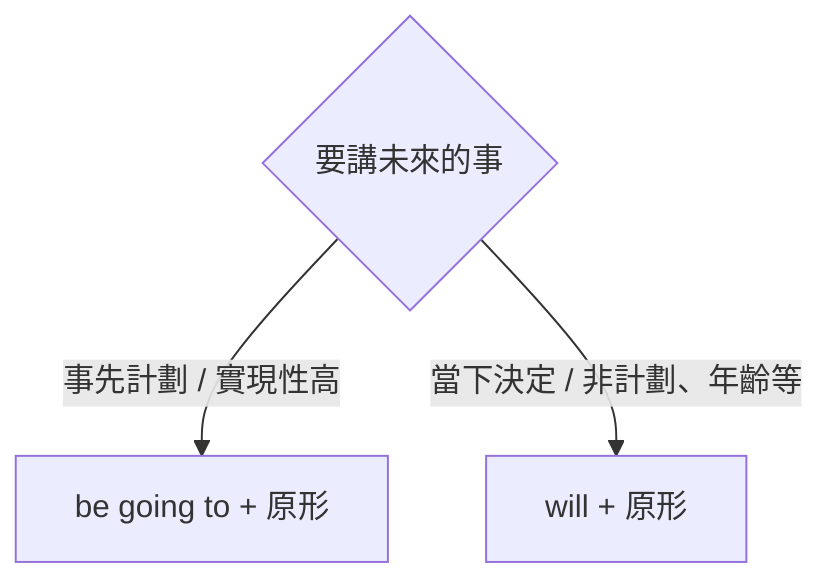

---
tags:
  - 文法/時式
  - 句型公式
  - 對比辨析
  - 易錯點
  - 圖表
book: 謝孟媛英文文法
chapter: 初級文法 · 05 時態（現在／過去／進行／未來）
source: https://app.notion.com/p/9b19cd7a13e740b4a50c4f92b7b3f02d
difficulty: ⭐⭐
status: 學習中
review: []
related: []
---

# 時態（現在／過去／進行／未來）

> [!IMPORTANT]
> **一句話核心**
> 時態 = **動詞**會隨**時間**改變型態（時間歸在副詞，稱「時間副詞」；時間副詞一改，動詞就要跟著改）。五種基本時態：**現在簡單**（現況／習慣／真理）、**過去簡單**（過去、現已無）、**現在進行**（am/are/is＋V-ing，正在）、**過去進行**（was/were＋V-ing，過去某時點正在）、**未來**（will／be going to＋原形）。

## 📊 五種時態總覽

| 時態 | 結構 | 主要用途 | 常見時間副詞 |
| --- | --- | --- | --- |
| 現在簡單 | be（am/are/is）／一般動詞（三單 +s） | 現在狀態動作、習慣、不變真理 | now、every… |
| 過去簡單 | was/were／過去式動詞（規則 -ed、不規則） | 過去動作狀態（現已無）、過去習慣 used to | yesterday、last…、…ago、then |
| 現在進行 | **am/are/is + V-ing** | 正在進行、重複動作、最近的未來 | now、at the moment |
| 過去進行 | **was/were + V-ing** | 過去某時點正在、過去期間反覆 | at eight last night、when… |
| 未來 | **will + 原形**／**be going to + 原形** | 未來的動作或狀態 | tomorrow、next…、in… |

> 動詞有**三態**：原形動詞、過去式動詞、過去分詞。現在分詞 `V-ing`＝動作進行／主動；過去分詞 `p.p`＝被動／完成（皆不等於時態本身）。

---

## ⏰ 現在簡單式（＝現在式）

- **動詞形式**：be 動詞 am/are/is（狀態或存在）；一般動詞（動作），主詞第三人稱單數加 s/es。
- **時間副詞**：now、every + 時間。

**使用時機**
- **現在的狀態或動作**：There **are** many visitors in the zoo.／Here **comes** the bus.
  - ⚠️ there／here 放句首時，**真正的主詞在後面**（visitors、bus）——主詞不一定在動詞前。
- **習慣性動作**：David often **sleeps** during class.／My parents **take** exercise every morning.
  - 動作若在過去、現在、未來三時態都分布 → **規定以現在式為主**。
- **不變的事實、真理**：The earth **moves** around the sun.（自然界唯一事物加定冠詞 the：the earth、the sun）

---

## 🕰️ 過去簡單式（＝過去式）

- **動詞形式**：be 動詞 was/were；一般動詞過去式（規則 -ed／不規則）。
- **時間副詞**：yesterday、last +時間、時間+ ago、before、then（= at that time）。
  - **ago vs before**：ago 前面要加明確時間（two hours ago）；before 可單獨存在，純指「以前」。

**使用時機**
- **過去的動作或狀態**（與現在無關）：I **bought** this yesterday.／There **was** an old temple over there.
- **過去習慣性動作**：常用 **used to + 原形動詞**——My father **used to** smoke, but now he doesn't.

---

## 🔄 現在進行式

> **結構 ⇒ be 動詞（am／are／is）+ V-ing**（be 由主詞決定、V-ing 表動作進行）

**V-ing 的形成**
| 規則 | 例 |
| --- | --- |
| 大部分動詞 → 原形 **+ ing** | talk→talking、say→saying、speak→speaking |
| 字尾有 e → **去 e + ing** | have→having、write→writing、come→coming |
| 子音+短母音+子音 → **重複字尾 + ing** | put→putting、cut→cutting、swim→swimming |

**使用時機**
- **正在進行的動作**：John **is watching** the baseball game on TV.
- **重複發生**（常伴 always、all the time、again and again）：He **is always complaining**.
- **最近的未來**（常用來去動詞 come／go／start／leave／arrive）：I**'m leaving** for Kenting tomorrow.／My boyfriend **is coming** to see me this afternoon.

> [!WARNING]
> **某些動詞不用於進行式**——因為進行式強調「暫時、正在、下一秒可停」：
> - **感官**動詞：see、hear、smell…
> - **情感**動詞：love、like…（**標語例外**，如 I'm loving it）
> - **狀態**動詞：have（擁有）、know…
> - 例：我正在看樹上那隻鳥 → ❌ I'm **seeing** the bird → ✅ I'm **looking at** the bird.（see 是眼睛的基本功能，不會下一秒就看不到）

- 對照三態：現在 We **eat** breakfast every morning.／過去 We **ate** breakfast before **going** to school.（介系詞 before 後動詞必 +ing，無例外）／現在進行 We **are eating** breakfast.

---

## ⏳ 過去進行式

> **結構 ⇒ was／were + V-ing**（was/were 由主詞決定）

**使用時機**
- **過去某一「定點時間」正在進行**：We **were playing** chess **at eight** yesterday evening.／Lily **was taking** a bath **when** the doorbell rang.
  - 對照：過去某一「時段」用**過去簡單**（We **played** chess yesterday evening）；某一「時點」用**過去進行**。
- **過去某期間反覆的動作**：Whenever I visited him, he **was watching** TV.／In those days, we **were getting up** at seven.

---

## 🔮 未來式

> 表示未來的動作或狀態，常用 **will** 或 **be going to**。時間副詞：tomorrow、next +時間、in +時間（…之後）、the day after tomorrow。

### be going to + 原形動詞
- 多表**事先計劃好**或**實現性很高**的事。
- I**'m going to** visit my uncle tomorrow.／I have to buy the ladder because I**'m going to** paint the house.
- 疑問：**Are** they **going to** have a party on Christmas Eve?

### will + 原形動詞
- will 是表未來的**助動詞、不分人稱**，後接**原形**。
- 多表**當下決定／非計劃**：A: I can't move the box. B: I**'ll do** it for you.（非事先計劃 → 不用 be going to）
- **非計劃性的事實**也用 will：I **will be** fifteen next year.（年齡不需計劃，**不可**用 be going to）
- 否定：will not = **won't**（I'll not change… = I won't change…）。
- **Will you ~?** 另可表**請求**或**邀約**：
  - 請求：Will you look after the baby? → 答 Sure.／I'm sorry, but I can't.（能否答應用 **can**）
  - 邀約：Will you have another cup of coffee? → 答 Yes, please.／No, thank you.

> [!TIP]
> **be going to vs will**

---

## ⚠️ 易錯點分析

> [!WARNING]
> **常見錯誤（皆為來源整理的重點）**
> - **進行式 = be + V-ing**，別漏 be（❌ He watching TV → ✅ He **is** watching TV）。
> - **感官／情感／狀態動詞**通常不用進行式（see → **look at**；love/have 一般不加 -ing）。
> - **介系詞後動詞一律 + ing**（before **going** to school），無例外。
> - **過去時點用過去進行、過去時段用過去簡單**（at eight… were playing／yesterday… played）。
> - **年齡、當下決定**用 **will**，不可用 be going to。
> - 現在式的**真理／習慣**別忘了主詞三單動詞 **+s**（The earth move**s**）。
> - **Will you~?** 的回答用 can（請求）或 Yes, please／No, thank you（邀約），不是 will。

---

## 🔗 延伸與對比
- 相關主題：[[02 be 動詞、一般動詞（現在式）]]、[[03 be 動詞、一般動詞（過去式）]]（be／一般動詞造否定疑問的基礎）、[[09 動名詞]]（V-ing 當名詞，待建）、[[08 不定詞]]（to + 原形，待建）

---

## 🧠 自我測驗　💬 AI 補充
> 複習時作答，答完再看下方答案。（此區為 AI 出題，非來源內容）

- [ ] Q1：用正確時態填空：Look! The baby ___ (cry) now.
- [ ] Q2：改錯：I am knowing the answer.
- [ ] Q3：at eight last night 用過去簡單還是過去進行？為什麼？
- [ ] Q4：「明年我 20 歲」用 will 還是 be going to？為什麼？
- [ ] Q5：寫出 swim、write、come 的 V-ing。

✅ 解答

A1：The baby **is crying** now.（now＋正在 → 現在進行 be + V-ing）
A2：know 是狀態動詞，不用進行式 → I **know** the answer.
A3：**過去進行**（was/were + V-ing）。at eight last night 是過去的「定點時間」，強調那一刻正在進行。
A4：**will**（I will be 20 next year）。年齡不需事先計劃，故不用 be going to。
A5：swimming、writing、coming。

