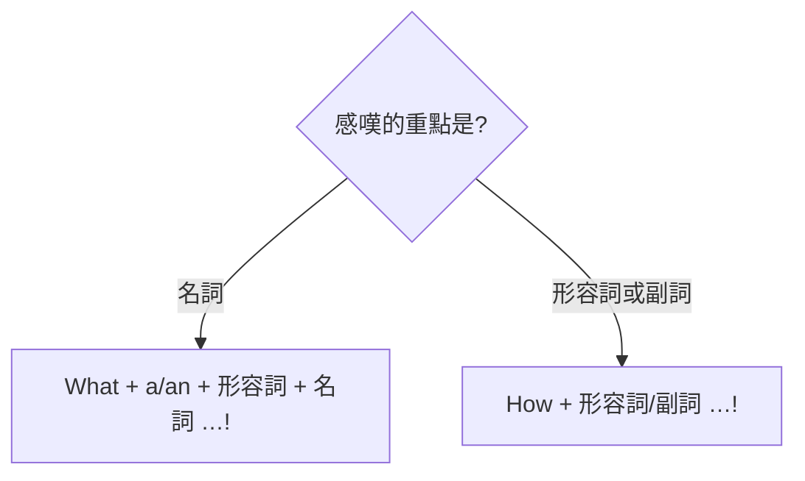

---
tags:
  - 文法/疑問句
  - 句型公式
  - 對比辨析
  - 圖表
  - 易錯點
source: https://app.notion.com/p/3511c1af15594ee7b5f68107f7bdcc18
difficulty: ⭐⭐
status: 未讀
style: 教學型重構
review: []
related: []
---

# WH 問句、祈使句、感嘆句

> [!IMPORTANT]
> **一句話核心**
> **WH 問句**用疑問詞（what/who/which/whose 是疑問代名詞、when/where/why/how 是疑問副詞、what/which 也可當疑問形容詞）開頭，**後面接「問句句型」**（be＋主詞／助動詞＋主詞＋原形）。**祈使句**省略主詞 you、用**原形動詞**（否定 Don't／Never、提議 Let's）。**感嘆句**用 **What + a/an + 形容詞 + 名詞** 或 **How + 形容詞/副詞** 表讚嘆。

## 🧭 心智圖

```markmap
# WH 問句、祈使句、感嘆句

## 🗺️ 同一件事，四種語氣

- 直述：You are a good girl.／疑問：Who is that girl?／祈使：Be a good girl.／感嘆：What a good girl!

## ❓ WH 問句（問特定資訊，不能用 Yes/No 回答）

- 造句前先判斷：**疑問詞是不是主詞？**
  - 是主詞 → **不倒裝**，直接替換：**Who** is cooking in the kitchen?
    - ⚠️ 疑問詞當主詞**視為單數**（Who **is**…?）
  - 非主詞 → 先變 Yes/No 骨架，再把疑問詞提句首：You want what → **What** do you want?
    - ⚠️ ❌ What you want? → ✅ What **do** you want?（一般動詞要助動詞）
- 疑問詞分三類
  - 疑問代名詞 what・who・which・whose（可當主詞／補語／受詞）
    - 當補語：**Whose** are these toys?（← These toys are whose）
    - 當受詞：**What** do you want to take?
  - 疑問副詞 when・where・why・how
    - **Where** do you come from?（= Where are you from?）／**How** did you come here?
  - 疑問形容詞 what・which＋名詞
    - **Which one** do you like best?／**Whose house** is this?
- what／how 常見問句
  - What time（幾點）・What day（星期幾）・What date（幾月幾日）
  - 天氣：有 like 用 what：What's the weather **like**? ＝ **How**'s the weather?
  - **How tall**（問人）vs **How high**（問物）：How high is Mt. Everest?
  - **How many**＋可數複數 vs **How much**＋不可數（coffee）
  - How long（多久／多長）・How often（多常）・How far（多遠）

## 📢 祈使句（省略主詞 you＋原形動詞）

- 對面前的你講 → you 不言自明省略；動詞用**原形**
  - **Be** quiet, please.（be 是原形）＝ Please be quiet.
    - ⚠️ 人名不可和 please 同放句尾
  - Please **stop talking** and listen to me.（stop＋V-ing＝停止某動作）
- 否定：**Don't／Never**＋原形（never 語氣更強）
  - **Never** make the same mistake again.
- 邀請提議：**Let's**＋原形
  - **Let's** go for a walk. → Yes, let's.／No, let's not.
    - Let's（我們一起…提議）vs Let us（拜託你讓我們…請求）

## 🎉 感嘆句（讚嘆的重點落在哪個詞？）

- 重點在**名詞** → **What**＋a/an＋形容詞＋名詞(＋主詞＋動詞)!
  - **What** a beautiful dress this is!
- 重點在**形容詞／副詞** → **How**＋形/副(＋主詞＋動詞)!
  - **How** beautiful this dress is!／How **fast** he runs!（修飾動詞用副詞）
    - ⚠️ ❌ How a beautiful flower it is! → 名詞用 **What**
- 可省略：What a day!（形容詞省略）／What a good girl (you are)!（雙方都知道時）
```

---

## 🗺️ 先看全景：句子的四種語氣

同一件事，換個「語氣」就換一種句型。以「你是個好女孩」為例，一次看懂本篇三種句型各自的位置：

| 語氣 | 拿來做什麼 | 標誌 | 例 |
| --- | --- | --- | --- |
| 直述 | 陳述事實 | 主詞 + 動詞 | You are a good girl. |
| **疑問（WH）** | 問一項**特定資訊**（誰／什麼／何時…） | 疑問詞 + 問句句型 | Who is that girl? |
| **祈使** | 命令／請求／建議 | **省略 you** + 原形動詞 | Be a good girl. |
| **感嘆** | 讚嘆、驚呼 | What…! ／ How…! | What a good girl! |

本篇處理後三種。下面每一種都先講「**為什麼長這樣**」，再看細部句型。

---

## ❓ WH 問句

問句分兩大類：**Yes/No 問句**（be 動詞或助動詞開頭、可用 Yes/No 回答）／**WH 問句**（問特定資訊，**不能**用 Yes/No 回答）。

**造 WH 問句前，先看疑問詞在句中是不是「主詞」——兩種情況、做法不同：**

- **疑問詞＝主詞**：不倒裝、不加助動詞，直接拿疑問詞替換掉原本的主詞，語序**和直述句一樣**。
  - Kate is cooking… → **Who** is cooking…?（骨架＝肯定句，**不是** Yes/No 問句）
- **疑問詞＝非主詞**（受詞／補語／時間地點等資訊）：走兩步驟——
  1. 先把句子變成 **Yes/No 問句的骨架**（be＋主詞，或 助動詞＋主詞＋原形）。
  2. 把想問的**未知資訊換成疑問詞、提到句首**。
  - You want what → Do you want…? → **What** do you want?

疑問詞放句首才是 WH 問句；疑問詞放句中則變成**間接問句**（見 [[18 間接問句]]）。

### 疑問詞（Wh～及 how）分三類

| 類別 | 疑問詞 | 特性 |
| --- | --- | --- |
| 疑問代名詞 | what、who、which、whose | 可當名詞（主詞／補語／受詞） |
| 疑問副詞 | when、where、why、how | 問時間／地點／原因／方法 |
| 疑問形容詞 | what、which | 其後直接接名詞 |

### 疑問代名詞：看它在句中扮演什麼角色
疑問代名詞可當主詞、補語或受詞——**它原本是哪個角色，就決定要不要接完整的問句句型**：

- **當主詞**　⇒　疑問詞 + 動詞～?（未知本身就是主詞，已經在句首，**不必再倒裝**。疑問詞當主詞**視為單數**，接單數動詞——「狀況不明視為單數」）
  - A: Who **is** cooking in the kitchen?（誰在廚房做飯？）B: Kate and Mary are.（是 Kate 和 Mary。）
  - What is (there) under your bed?（你床底下有什麼？there 可省略，與地點「床底下」相呼應）
- **當補語**　⇒　疑問詞 + be 動詞 + 主詞～?
  - Whose are these toys?（這些玩具是誰的？← These toys are whose）
  - Who is that tall boy?（那高個子男孩是誰？← That tall boy is who）
- **當受詞**　⇒　疑問詞 + 助動詞 + 主詞 + 原形動詞～?
  - What do you want to take?（你想要拿什麼？← You want to take what → 疑問詞放句首、緊跟問句句型 → 一般動詞造問句需助動詞幫忙）

### 疑問副詞：問時間／地點／原因／方法
> 句型：疑問副詞 + be 動詞 + 主詞～? ／ 疑問副詞 + 助動詞 + 主詞 + 原形動詞～?（後面都是「問句句型」）

- When are you leaving America?（你何時離開美國？現在進行可表最近的未來）
- Where do you come from?（你來自哪裡？= Where are you from?）
- Why is he absent?（他為何缺席了？）
- How did you come here?（你如何到這裡？）

> 副詞的種類：時間、地點、條件、原因、理由、目的、方法——when 問時間、where 問地點、why 問原因、how 問方法。

### 疑問形容詞：what／which 後面直接接名詞
> what 及 which 當形容詞，其後接名詞：疑問詞 + 名詞 + be／助動詞 + 主詞…?

- Which one do you like best?（你最喜歡哪一個？like best ＝ 最喜歡；best 是副詞，強調動詞的程度）
- Whose house is this?（這是誰的房子？← This is whose house → whose house 整個名詞片語當補語；whose 在片語內修飾 house）

### what／how 的常見問句

| 問句 | 回答 |
| --- | --- |
| **What time** is it?（現在幾點？） | It's eight-ten.（現在 8 點 10 分。） |
| **What day** is it?（今天星期幾？） | It's Sunday.（今天星期日。） |
| **What date** is it?（今天幾月幾日？） | It's October 10.（今天 10 月 10 日。） |
| **What's the weather like** today? = **How's the weather** today?（今天天氣如何？） | It's cold.（很冷。） |
| **How old** will you be next year?（你明年幾歲？） | I'll be ten.（我明年 10 歲。） |
| **How tall** are you?（你多高？→ 問人） | I'm 160 centimeters tall.（我 160 公分。）／I'm five feet three inches tall.（我 5 呎 3 吋高。） |
| **How high** is Mt. Everest?（聖母峰有多高？→ 問物） | It's 8848 meters high.（高 8848 公尺。） |
| **How many** cups of coffee do you drink every day?（你每天喝幾杯咖啡？→ 可數複數） | — |
| **How much** coffee do you drink every day?（你每天喝多少咖啡？→ 不可數） | — |
| **How long** will you stay in Taipei?（你將在台北待多久？→ 時間） | For two weeks.（2 星期。） |
| **How long** is the rope?（這條繩子多長？→ 長度） | It's two meters long.（2 公尺。） |
| **How often** do you play tennis?（你多久打一次網球？） | Once a month.（一個月一次。） |
| **How far** is it from here to the post office?（從這裡到郵局有多遠？） | It's about ten minutes' walk.（走路大約 10 分鐘。） |

- **What day is it** = What day is it today = What day is today——沒加 today 怎麼知道是今天？看 be 動詞就知道。
- 問天氣有 like（介系詞「像」）時用 **what**，沒有 like 時用 **how**。
- **How many／How much**：問幾杯就答幾杯、問量就答多少量。

---

## 📢 祈使句

**為什麼省主詞、用原形？** 祈使句一定是對「**面前的你／你們**」講的——主詞 you 不言自明，就省掉了（絕不會省 he/she）；動詞則用**原形**（you 本來就配原形）。這是「請求、希望、命令、要求、建議」都在用的句型。

| 類型 | 句型 |
| --- | --- |
| 一般祈使句 | **原形動詞 + …** |
| 否定祈使句 | **Don't（Never）+ 原形動詞 + …**（never 語氣更強） |
| 邀請／提議 | **Let's + 原形動詞 + …** |

- **Be** quiet, please.（請安靜。be 是所有 be 動詞的原形）= Please be quiet.
  - please 放句尾要加逗點；⚠️ **人名不可和 please 同放句尾**（可寫「人名, Be quiet, please」「Please be quiet, 人名」）。
- Please **stop talking** and listen to me.（請不要講話聽我說。）
  - ＝ Will you please stop talking and listen to me.（此處 will you 不是「你將要」，而是「請你～好嗎」，表請求）
  - **stop + V-ing** ＝ 停止某個動作（如 stop smoking）——一般動詞後要接受格、受格須具名詞身分，故動詞變動名詞。
- Don't drink before you drive.（開車前請勿喝酒。drink 後面沒接對象時，指的就是喝酒）
- Never make the same mistake again.（別再犯同樣的錯誤。）
- **Let's** go for a walk.（我們去散步吧。）→ Yes, let's.（好的。）／ No, let's not.（不，不要。）

> [!TIP]
> **Let's vs Let us**：Let's play outside.（我們一起到外面玩吧。→ **提議**）／Let us play outside.（拜託妳讓我們到外面玩。→ **請求**）

---

## 🎉 感嘆句

表示驚訝、驚喜、感動、難過等，帶讚嘆或感嘆意味的句子。用 What 還是 How，看**你要感嘆的重點落在哪個詞**：



**句型：**
- **What + a/an + 形容詞 + 名詞 + (主詞 + 動詞)!**　→ 重點在名詞
- **How + 形容詞／副詞 + (主詞 + 動詞)!**　→ 重點在形容詞／副詞

- What a beautiful dress this is!（這洋裝好美啊！）= **How** beautiful this dress is!
- How interesting this novel is!（這本小說好有趣啊！）
- How **fast** he runs!（他跑得好快啊！修飾一般動詞用副詞，故 fast 為副詞）
- What a day!（多棒／多壞的一天！感嘆句有時省略形容詞，聽者須靠說話內容或表情判斷）

> [!NOTE]
> **一句三型對照**
> - 直述句：You are a very good girl.（你是很棒的女孩。）
> - 祈使句：Be a very good girl.（當個乖女孩。）
> - 感嘆句：What a good girl (you are)!（你真是一位很棒的女孩！雙方都知道時 you are 可省略）

---

## ⚠️ 易錯點分析

> [!WARNING]
> **常見錯誤（皆為來源整理的重點）**
> - **非主詞**的 WH 問句，疑問詞後接「問句句型」（be＋主詞 或 助動詞＋主詞＋原形）、一般動詞造問句要用助動詞（❌ What you want? → ✅ What **do** you want?）；**但疑問詞當主詞時不倒裝**、直接接動詞（Who **is** cooking?）。
> - 疑問詞**當主詞視為單數**（Who **is** …?）。
> - **How tall**（問人）vs **How high**（問物）；**How many**（可數複數）vs **How much**（不可數）。
> - 問天氣：句中有 like 用 **what**（What's the weather **like**?）、無 like 用 **how**（**How**'s the weather?）。
> - **感嘆句**：What 接**名詞**（a/an＋形容詞＋名詞）、How 接**形容詞／副詞**，別互換。
> - **祈使句**用**原形**（Be quiet，不是 Are quiet）；否定用 Don't／Never；人名不可與 please 同放句尾。

> [!WARNING]
> **練習卷錯題回填（2026-07-21，[[初級06 WH 問句、祈使句、感嘆句 練習卷]]）　💬 AI 補充**
> **感嘆句語序**（本章主要失分，丁 1／丁 2／戊 2）——先把兩式的骨架釘死，**主詞和動詞永遠壓在最後**：
> - `What + a/an + 形容詞 + 名詞 + 主詞 + 動詞!`　／　`How + 形容詞／副詞 + 主詞 + 動詞!`
> - **① What／How 就是 very 的升級版，兩者不並存**：This is a **very** exciting game. → 抽掉 very、換 What 頂到句首 → **What an exciting game this is!** ❌ What a **very** exciting game this is（等於強調兩次）。
> - **② How 後面絕對不能接名詞**：❌ How very delicious **soup** this is ✅ **How delicious this soup is!**——一旦句子的重點詞是名詞（soup），就只能走 What 那一式。⚠️ 判準「修飾名詞還是形容詞」我講得出來，落筆時卻沒回頭確認名詞真的被排除掉了。
> - **③ 感嘆句不倒裝**：❌ How exciting **this is game**! ✅ How exciting **this game is**!——How + 形容詞之後，剩下的部分回到正常語序（主詞＋動詞），別套問句的倒裝。
> - **④ a／an 看緊跟單字的發音**：❌ What **a** exciting game ✅ What **an** exciting game（exciting 母音開頭）。
> - **⑤ 針對某部分提問時，其餘部分不可改動**：原句 two cups of **tea** 卻問成 how many cups of **coffee**——句型對了也答錯，因為那已經是另一個問題。
> - 💬 附註：甲 10（Which looks better on me?）錯在**疑問詞當主詞卻加了助動詞又倒裝**——但這條規則我在同一份卷的己 1 答得完全正確。錯因不在本章知識，歸「**規則說得出、換個包裝就漏**」的作答習慣，見 [[易錯點總表]]。

---

## 🔗 延伸與對比
- 相關主題：[[04 代名詞]]（疑問代名詞 who/which/whose）、[[15 附加問句]]（另一種問句，待建）、[[18 間接問句]]（疑問詞放句中，待建）

---

## 🧠 自我測驗　💬 AI 補充
> 複習時作答，答完再看下方答案。（此區為 AI 出題，非來源內容）

- [ ] Q1：把 You come from Japan. 改成問「你來自哪裡」。
- [ ] Q2：問「這座山多高」與「你多高」分別用哪個疑問詞？
- [ ] Q3：改錯：How a beautiful flower it is!
- [ ] Q4：把 You are quiet. 改成祈使句與否定祈使句。
- [ ] Q5：What's the weather ___ today?（填空並說明為何不用 how）

<details>
<summary>✅ 解答</summary>

A1：**Where do you come from?**（= Where are you from?）
A2：山（物）用 **How high**；人用 **How tall**。
A3：flower 是名詞 → 用 What：**What a beautiful flower it is!**（How 後面接形容詞/副詞）。
A4：祈使 **Be** quiet.／否定 **Don't be** quiet.
A5：What's the weather **like** today?——句中有 like（介系詞「像」）時疑問詞用 what；若無 like 則用 How's the weather today?

</details>
