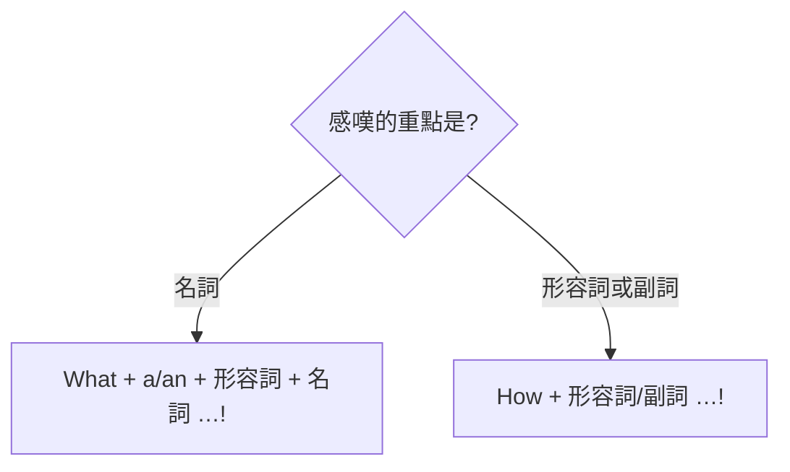

---
tags:
  - 文法/疑問句
  - 句型公式
  - 對比辨析
  - 圖表
  - 易錯點
source: https://app.notion.com/p/3511c1af15594ee7b5f68107f7bdcc18
difficulty: ⭐⭐
status: 學習中
review: []
related: []
---

# WH 問句、祈使句、感嘆句

> [!IMPORTANT]
> **一句話核心**
> **WH 問句**用疑問詞（what/who/which/whose 是疑問代名詞、when/where/why/how 是疑問副詞、what/which 也可當疑問形容詞）開頭，**後面接「問句句型」**（be＋主詞／助動詞＋主詞＋原形）。**祈使句**省略主詞 you、用**原形動詞**（否定 Don't／Never、提議 Let's）。**感嘆句**用 **What + a/an + 形容詞 + 名詞** 或 **How + 形容詞/副詞** 表讚嘆。

---

## ❓ WH 問句

**疑問詞（Wh～及 how）分三類：**

| 類別 | 疑問詞 | 特性 |
| --- | --- | --- |
| 疑問代名詞 | what、who、which、whose | 可當名詞（主詞／補語／受詞） |
| 疑問副詞 | when、where、why、how | 問時間／地點／原因／方法 |
| 疑問形容詞 | what、which | 其後直接接名詞 |

- 問句兩大類：**Yes/No 問句**（be 動詞或助動詞開頭）／**WH 問句**（不回答 Yes/No）。
- WH 問句：**疑問詞放句首、後接「問句句型」**；疑問詞放句中則為**間接問句**（見 [[18 間接問句]]）。

### 疑問代名詞的用法
- **當主詞**　⇒　疑問詞 + 動詞～?（疑問詞當主詞**視為單數**，接單數動詞——「狀況不明視為單數」）
  - Who **is** cooking in the kitchen?（B: Kate and Mary are.）／What is (there) under your bed?
- **當補語**　⇒　疑問詞 + be 動詞 + 主詞～?
  - Whose are these toys?（← These toys are whose）／Who is that tall boy?
- **當受詞**　⇒　疑問詞 + 助動詞 + 主詞 + 原形動詞～?
  - What do you want to take?（← You want to take what → 一般動詞需助動詞幫忙）

### 疑問副詞的用法
> 句型：疑問副詞 + be 動詞 + 主詞～? ／ 疑問副詞 + 助動詞 + 主詞 + 原形動詞～?（後面都是「問句句型」）

- When are you leaving America?（現在進行可表最近的未來）／Where do you come from?（= Where are you from?）／Why is he absent?／How did you come here?

### 疑問形容詞的用法
> what 及 which 當形容詞，其後接名詞：疑問詞 + 名詞 + be／助動詞 + 主詞…?

- Which one do you like best?／Whose house is this?

### what／how 的常見問句

| 問句 | 回答 |
| --- | --- |
| **What time** is it? | It's eight-ten. |
| **What day** is it? | It's Sunday. |
| **What date** is it? | It's October 10. |
| **What's the weather like** today? = **How's the weather** today? | It's cold. |
| **How old** will you be next year? | I'll be ten. |
| **How tall** are you?（問人） | I'm 160 centimeters tall. |
| **How high** is Mt. Everest?（問物） | It's 8848 meters high. |
| **How many** cups of coffee…?（可數） / **How much** coffee…?（不可數） | — |
| **How long**（時間／長度）/ **How often** / **How far**? | For two weeks. / Once a month. / About ten minutes' walk. |

---

## 📢 祈使句

> 表示「請求、希望、命令、要求、建議」的句子。**省略主詞 you，動詞用原形（現在式）**——因為一定是對面前的你／你們說，絕不會省略 he/she。

| 類型 | 句型 |
| --- | --- |
| 一般祈使句 | **原形動詞 + …** |
| 否定祈使句 | **Don't（Never）+ 原形動詞 + …**（never 語氣更強） |
| 邀請／提議 | **Let's + 原形動詞 + …** |

- **Be** quiet, please.（be 是所有 be 動詞的原形）= Please be quiet.
  - please 放句尾要加逗點；⚠️ **人名不可和 please 同放句尾**（可寫「人名, Be quiet, please」「Please be quiet, 人名」）。
- Please **stop talking** and listen to me.（stop + V-ing＝停止某動作；= Will you please…＝請求）
- Don't drink before you drive.／Never make the same mistake again.
- **Let's** go for a walk. → Yes, let's. ／ No, let's not.

> [!TIP]
> **Let's vs Let us**：Let's play outside.（**提議**：我們一起玩吧）／Let us play outside.（**請求**：拜託讓我們去玩）。

---

## 🎉 感嘆句

> 表示驚訝、驚喜、感動、難過等，帶讚嘆或感嘆意味的句子。

**句型：**
- **What + a/an + 形容詞 + 名詞 + (主詞 + 動詞)!**
- **How + 形容詞／副詞 + (主詞 + 動詞)!**

- What a beautiful dress this is! = **How** beautiful this dress is!
- How interesting this novel is!
- How **fast** he runs!（修飾一般動詞用副詞，fast 為副詞）
- What a day!（感嘆句有時省略形容詞，靠語氣／表情判斷）

> [!NOTE]
> **一句三型對照**
> - 直述句：You are a very good girl.
> - 祈使句：Be a very good girl.
> - 感嘆句：What a good girl (you are)!（雙方都知道時 you are 可省略）

---

## 📊 感嘆句 What vs How

---

## ⚠️ 易錯點分析

> [!WARNING]
> **常見錯誤（皆為來源整理的重點）**
> - WH 問句疑問詞後**一定接「問句句型」**（be＋主詞 或 助動詞＋主詞＋原形）；一般動詞造問句要用助動詞（❌ What you want? → ✅ What **do** you want?）。
> - 疑問詞**當主詞視為單數**（Who **is** …?）。
> - **How tall**（問人）vs **How high**（問物）；**How many**（可數複數）vs **How much**（不可數）。
> - 問天氣：句中有 like 用 **what**（What's the weather **like**?）、無 like 用 **how**（**How**'s the weather?）。
> - **感嘆句**：What 接**名詞**（a/an＋形容詞＋名詞）、How 接**形容詞／副詞**，別互換。
> - **祈使句**用**原形**（Be quiet，不是 Are quiet）；否定用 Don't／Never；人名不可與 please 同放句尾。

---

## 🔗 延伸與對比
- 相關主題：[[04 代名詞]]（疑問代名詞 who/which/whose）、[[15 附加問句]]（另一種問句，待建）、[[18 間接問句]]（疑問詞放句中，待建）

---

## 🧠 自我測驗　💬 AI 補充
> 複習時作答，答完再看下方答案。（此區為 AI 出題，非來源內容）

- [ ] Q1：把 You come from Japan. 改成問「你來自哪裡」。
- [ ] Q2：問「這座山多高」與「你多高」分別用哪個疑問詞？
- [ ] Q3：改錯：How a beautiful flower it is!
- [ ] Q4：把 You are quiet. 改成祈使句與否定祈使句。
- [ ] Q5：What's the weather ___ today?（填空並說明為何不用 how）

✅ 解答

A1：**Where do you come from?**（= Where are you from?）
A2：山（物）用 **How high**；人用 **How tall**。
A3：flower 是名詞 → 用 What：**What a beautiful flower it is!**（How 後面接形容詞/副詞）。
A4：祈使 **Be** quiet.／否定 **Don't be** quiet.
A5：What's the weather **like** today?——句中有 like（介系詞「像」）時疑問詞用 what；若無 like 則用 How's the weather today?

