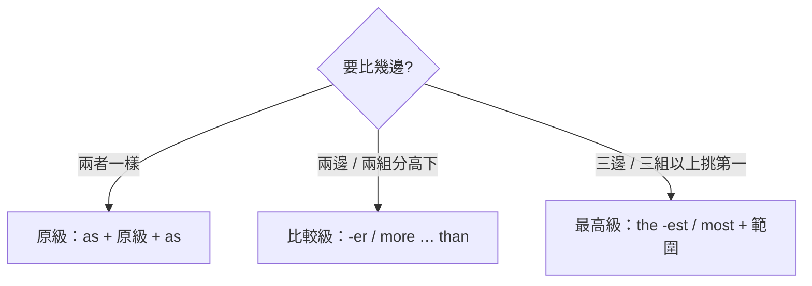

---
tags:
  - 文法/詞類
  - 句型公式
  - 對比辨析
  - 圖表
  - 易錯點
source: https://app.notion.com/p/6387fcc0fe8b4b05b08d475bb1d9ac13
difficulty: ⭐⭐
status: 學習中
style: 教學型重構
review: [2026-07-20]
related: []
---

# 比較

> [!IMPORTANT]
> **一句話核心**
> 形容詞／副詞依程度分三級：**原級**（`as + 原級 + as`，一樣…）、**比較級**（`-er／more … than`，用於**兩邊／兩組**）、**最高級**（`the -est／most`，用於**三邊／三組以上**）。變化有**規則**（+er/est、more/most）與**不規則**（good→better→best…）。

## 🧭 心智圖

```markmap
# 比較

## 🗺️ 先問：要比幾邊？

- 兩者**一樣** → 原級 as＋原級＋as
- **兩邊／兩組**分高下 → 比較級 -er／more … than（不是指數量 2）
- **三邊／三組以上**挑第一 → the＋最高級＋範圍

## 📊 三級怎麼變

- 規則變化
  - 直接＋er／est（short）；字尾 e＋r／st（nice）；短母音＋子音→**重複字尾**（hot→hotter）；子音＋y→去 y＋ier（easy→easier）
  - 兩音節以上 → **more／most**＋原級（more beautiful）
- 不規則變化
  - good／well→**better**→**best**；bad／ill→**worse**→**worst**
  - many／much→**more**→**most**；little→**less**→**least**
  - far→farther（距離）／further（程度）；old→older／elder（elder＝長幼：elder brother）
  - late→later／**latter**（後者）→latest（時間最新）／**last**（順序最後）
    - the **latter** 後者 ↔ the **former** 前者

## 🟰 原級：as＋原級＋as

- This jacket is **as expensive as** this sweater.
- Your hair is **as long as** mine.（mine＝my hair）
- 否定：**not as／so**＋原級＋as
  - This question is **not as difficult as** it seems.

## 🔼 比較級：-er／more … than

- Your article is **longer than** mine.
  - than 詞性：後接主詞＋動詞＝連接詞；省略後＝介系詞（接受格：than **her**）
- **the**＋比較級＋**of the two**（範圍限定 2 要加 the）
  - Kevin is **the older of the two** boys.／Jack is **the more active of the twins**.
- 修飾比較級：**much／far／a lot**（…得多）・**even**（更加）・**a little**（…一點）
  - He is **much busier** than me.
    - ⚠️ 不可用 very 修飾比較級
- -or 結尾形容詞用 **to** 不用 than：junior・senior・major・minor
  - She is **senior to** me by two years.（= two years older than me）
- 慣用表現
  - 比較級 and 比較級＝越來越…：**more and more interesting**／taller and taller
  - the 比較級…, the 比較級…＝越…越…：**The more, the better.**
  - **more than**＝超過（= over）：The man is **more than** eighty years old.

## 🔝 最高級：the＋最高級＋範圍

- Mt. Everest is **the highest** mountain **in the world**.／Helen is **the best** student **of all**.
- 同一個「最」四種說法（＝Taipei is the biggest city in Taiwan.）
  - 比較級＋**any other**＋單數：bigger than any other **city**
  - 比較級＋**all the other**＋複數：bigger than all the other **cities**
  - **No other** city … is bigger than Taipei.
  - **No other** cities … are as big as Taipei.
- 為什麼加 other？——**自己不能跟自己比**
  - 主角在範圍內 → 加：New York is bigger than any **other** city in America.
  - 主角不在範圍內 → 免：New York is bigger than any city in Taiwan.

## 🏃 副詞的比較

- 字尾無 ly → ＋er／est：fast→faster→fastest
- 字尾有 ly → more／most：quickly→more quickly（many、much 只有 much 能當副詞）
- 副詞最高級 **the 可省**：My father gets up **(the) earliest** of us all.
  - 對照：形容詞最高級 **the 不可省**（Tom is **the** fastest boy of all.）

## 🧩 疑問詞＋比較

- 兩者選一 → 比較級：Which fruit do you like **better**, apples or oranges?
- 三者以上 → 最高級：Which do you like **(the) best**, apples, oranges or peaches?
```

---

## 🗺️ 先問一句：要「比幾邊」？

用哪一級，不是看形容詞，而是看**你手上有幾個東西在比**。這條決定了整篇該套哪個公式：



- **比較級**用於「**兩邊／兩組**」的比較（**不是指數量 2**）；**最高級**用於「**三邊／三組以上**」的比較（不是指數量剛好 3）。
- 對應中文：比較級＝「比較怎麼樣」、最高級＝「最怎麼樣」。（例：Tom 比班上其他人高 ⇒ Tom 自己是一組、班上其他人是一組。）

先照這條選對級別，再照下面「怎麼變出三級」把字變好，最後套各級句型。

---

## 📊 三級怎麼變出來（規則／不規則）

> 原級 → 比較級 → 最高級（紅 → 比較紅 → 最紅）。

### 規則變化
| 規則 | 原級 | 比較級 | 最高級 |
| --- | --- | --- | --- |
| 直接 +er／est | short | shorter | shortest |
| 字尾有 e → +r／st | nice | nicer | nicest |
| 短母音+子音 → 重複字尾 +er／est | hot | hotter | hottest |
| 子音+y → 去 y +ier／iest | easy | easier | easiest |
| 兩音節以上 → more／most + 原級 | beautiful | more beautiful | most beautiful |

- 去 y +ier/iest：因為留著 y 會發 [j] 改變發音，去 y 加 i 才不變音。
- 「剛好兩音節」若不屬上表 2–4，常有兩式：modern → moderner／more modern。

### 不規則變化
| 原級 | 比較級 | 最高級 |
| --- | --- | --- |
| bad 壞／ill 生病 | worse | worst |
| good 好／well 健康 | better | best |
| many（可數）／much（不可數） | more | most |
| little 少 | less | least |
| far 遠 | farther／further | farthest（距離）／furthest（程度、數量、距離） |
| late 晚 | later／latter（後者） | latest（時間，最新）／last（順序，最後） |
| old 老／舊 | older／elder | oldest（年紀、新舊）／eldest（長幼） |

- **latest**（與時間有關的「最新」）≠ **new**（東西的新舊程度）。
- **older = elder**：哥哥 older/elder brother、姊姊 older/elder sister。
- the **latter** 後者／the **former** 前者：As for French and German, the **latter** is more difficult for me than the **former**.（就法文和德文而言，我覺得後者比前者難。as for ＝ 就～而言；加 the 表限定，latter 指德文、former 指法文）
- **later**（晚的）：He was happy in his **later** life.（他晚年很快樂。遇到 life 介系詞通常用 in）

---

## 🟰 原級：兩邊一樣 → as + 原級 + as

兩個東西「打成平手」時用原級——中間夾**原級**（不變形）。

- This jacket is **as expensive as** this sweater.（這件夾克和這件毛衣一樣貴。）
- Your hair is **as long as** mine.（你的頭髮和我的一樣長。mine = my hair）
- **否定**：`not as／so + 原級 + as`（「不像…一樣」；not 放 be 動詞後）
  - This question is **not as difficult as**（= not so difficult as）it seems.（這問題並不像表面上的那麼困難。seems ＝ 似乎、看起來）

---

## 🔼 比較級：兩邊分高下 → -er／more … than

兩邊比出高低時用比較級，關鍵字是 **than**（「比」）。

- Your article is **longer than** mine.（你的文章比我長。mine = my article；比較對象性質不同時不可省略）
- Mary is **more beautiful than** she (is)／her.（瑪麗比她漂亮。比較結構常省略重複動詞；現多用**受格**，此時 than 為介系詞）
  - **than 的詞性**：後面寫出主詞＋動詞時 than 是**連接詞**；主詞動詞省略後就變成**介系詞**（故接受格）。
- **the + 比較級 + of the two…**：一般比較級不加 the，但遇 **of the two**（限定「2」的範圍）要加 the；同理 of the both、of the twins、of the parent。
  - Kevin is **the older of the two** boys.（Kevin 是兩位男孩中年紀較大的。）
  - Jack is **the more active of the twins**.（Jack 是這對雙胞胎中較活躍的。）
- **修飾比較級**：**much／a lot／far** + 比較級（…得多）、**even** + 比較級（更加）、**a little** + 比較級（…一點）。
  - He is **much busier** than I／me.（他比我忙碌得多了。完整為 than I am）
  - This is **a little cheaper** than that.（這個比那個便宜一點。）
  - The price of the blue pants is **far higher** than **that** of the green pants.（藍褲子的價格比綠褲子的價格高得多。主詞是 price 故用 is；that 代替 the price，其後須有修飾語 of the green pants）
    - ⚠️ price 的形容詞只能用 **high／low**（at the high／low price ＝ 以很高／低的價格）。
  - The weather in Kaohsiung is **far hotter** than **that** in Taipei.（高雄的天氣比台北的天氣更加炎熱。）
    - ＝ The weather is **far hotter** in Kaohsiung than in Taipei.
    - ⚠️ 比較時，若**主題相同或語意上清楚明白，than 以下部分可省略**（The weather is far hotter in Kaohsiung.）。
  - They live a **more pleasant** life than (they did) before.（他們現在比以前過著更愉快的生活。live a … life ＝ 過什麼樣的生活；did 代替前面的 live，但為過去式）
- **用 to 不用 than**：junior（年幼）、senior（年長）、major（大）、minor（小）等字尾 -or 的形容詞本身已含比較概念，**不加 -er、也用 to**（介系詞，後接受格）。
  - She is two years older than me.（她比我大 2 歲。）= She is **senior to** me by two years.（by 後面加的是時間）
  - major／minor 指的是**程度**的大小，不是東西的大小；big 指體積大、不指年紀。
- **慣用表現**：
  - **比較級 and 比較級 = 越來越…**：多音節 more and more interesting（❌ more interesting and more interesting）；單音節 taller and taller。
    - The story became **more and more interesting**.（這故事變得越來越有趣。）
  - **the 比較級 …, the 比較級 … = 越…越…**（比較級後可加主詞＋動詞，如例 2）：
    - **The more, the better.**（越多越好。）
    - **The more** we get, **the happier** we'll be.（我們得到越多就越快樂。）
  - **more than 超過／less than 少於**：two hours（兩個小時）→ **more than** two hours（兩個多小時）。
    - The man is **more than** eighty years old.（這個人超過 80 歲。）= The man is **over** eighty years old.

---

## 🔝 最高級：三邊／三組以上挑第一 → the + 最高級 + 範圍

三邊／三組以上挑「最」的那一個時用最高級。這裡的「三者以上」是指比較範圍有三個以上對象、類別或組別，不是單純看物品數量。因為指的是獨一無二的那個，前面**一定加定冠詞 the**；範圍常用 of all、of the three、in the world。
- Helen is **the best** student **of all**.（海倫是所有學生中最好的。）
- Mt. Everest is **the highest** mountain **in the world**.（聖母峰是世界上最高的山。）

### 同一個「最」，四種說法輪流換

下面四句意思都 ＝ `Taipei is the biggest city in Taiwan.`（台北是台灣最大的城市）——最高級可以拆成比較級或原級來講：

| 改寫句型 | 例句 | 要點 |
| --- | --- | --- |
| 比較級 + any other | Taipei is **bigger than any other city** in Taiwan. | any + **單數** city |
| 比較級 + all the other | Taipei is **bigger than all the other cities** in Taiwan. | all + **複數** cities |
| No other + 比較級 | **No other city** in Taiwan **is bigger than** Taipei. | 台灣沒有其他城市比台北大 |
| No other + as 原級 as | **No other cities** in Taiwan **are as big as** Taipei. | 台灣沒有其他城市像台北一樣大 |

（no 後面可接單數、複數、甚至不可數名詞，所以動詞單複數都行。）

### 為什麼要加 other？——因為自己不能跟自己比

四句裡都出現 **other**，這是最容易卡住的地方，但道理很單純：

台北**本身就是**「台灣的一個城市」。若寫成 `bigger than any city in Taiwan`（沒有 other），「台灣任何城市」這個範圍**會把台北自己也算進去**，整句就變成——

> 台北比「台灣任何城市（含台北）」都大 → 台北比**台北自己**還大 ❌（自己不可能比自己大）

加上 **other（其他的）**，就是把主角自己從範圍裡挖掉：「台北比台灣**其他**城市都大」，這樣才說得通。

**一眼判斷：主角在不在 than 後面那個範圍裡？**　在範圍內 → 加 other（排除自己）；不在 → 免。

| 例句 | 主角 vs 範圍 | other |
| --- | --- | --- |
| New York is bigger than any **other** city in **America**. | 紐約**在**美國 → 範圍含自己 | ✅ 要加 |
| New York is bigger than any city in **Taiwan**. | 紐約**不在**台灣 → 範圍不含自己 | ❌ 免加 |

> [!TIP]
> 同理，`No other city … is bigger than Taipei` 也要 other——這句講的正是「台北**以外**」的城市，台北自己當然不會比台北大。

---

## 🏃 副詞的比較級、最高級

副詞比較和形容詞同理，只是變形看「有沒有 ly」：

### 規則變化
| 規則 | 原級 | 比較級 | 最高級 |
| --- | --- | --- | --- |
| 副詞字尾**無 ly** → +er／est | fast | faster | fastest |
| 副詞字尾**有 ly** → more／most + 副詞 | quickly | more quickly | most quickly |

### 不規則變化
badly/ill → worse → worst；well → better → best；much → more → most；little → less → least；far → farther/further → farthest（距離）/furthest（程度）。（many、much 都可當形容詞，但**只有 much 能當副詞**）

- **副詞比較級 + than**：
  - He can sing **better than** Lisa.（他可以唱得比麗莎好。）
  - I study **harder than** my friends.（我比我的朋友們更努力。）
- **the + 副詞最高級**（**the 可省略**）：
  - My father gets up **(the) earliest** of us all.（我父親是我們之中最早起的。）
  - Cathy dances **(the) most** beautifully.（凱西是跳舞跳得最美的。）

> [!TIP]
> **形容詞 vs 副詞最高級——the 能不能省？**
> - 形容詞最高級 **the 不可省**：Tom is **the** fastest boy of all.（湯姆是所有男孩中最快的。）→ 形容詞配表狀態的 be 動詞（He is fast）
> - 副詞最高級 **the 可省**：Tom runs **(the)** fastest of all.（湯姆是所有男孩中跑得最快的。）→ 副詞配一般動詞（He runs fast）

---

## 🧩 含比較的句型（疑問詞 + 比較）

回到那句「比幾邊」——連問句也照這條走：
- 兩者選一 → **比較級**：Which fruit do you like **better**, apples or oranges?（你比較喜歡哪一種水果，蘋果或柳橙？可數名詞要表現出複數 → apples、oranges）
- 三邊／三組以上 → **最高級**：Which do you like **(the) best**, apples, oranges or peaches?（蘋果、柳橙和桃子，你最喜歡哪一種？最高級的 the 可省略）

> [!WARNING]
> **兩邊／兩組之間用比較級；三邊／三組以上用最高級。**

---

## ⚠️ 易錯點分析

> [!WARNING]
> **常見錯誤（皆為來源整理的重點）**
> - **兩邊／兩組用比較級、三邊／三組以上用最高級**；別搞反。
> - **最高級（形容詞）一定加 the**；**副詞最高級 the 可省**。
> - 原級句用 **as…as**（原級形容詞）；否定 not as／so…as。
> - 修飾比較級用 **much／far／a lot／a little／even**，**不是 very**。
> - **junior／senior／major／minor** 等 -or 字用 **to**，不用 than（也不加 -er）。
> - 最高級互換：**any other + 單數**、**all the other + 複數**；加 **other** 避免和自身比較。
> - **latest**（時間最新）vs **last**（順序最後）；**farther**（距離）vs **further**（程度）；**older/elder**、**latter/former**。

---

## 🔗 延伸與對比
- 相關主題：[[11 形容詞]]、[[12 副詞]]（比較是形容詞／副詞的字形變化，待建）、[[04 代名詞]]（than/as 後 mine、that/those 代替用法）

---

## 🧠 自我測驗　💬 AI 補充
> 複習時作答，答完再看下方答案。（此區為 AI 出題，非來源內容）

- [ ] Q1：寫出 hot、easy、good、many 的比較級與最高級。
- [ ] Q2：用 as…as 造句「你的包包和我的一樣重（heavy）」。
- [ ] Q3：改錯：She is senior than me.
- [ ] Q4：把 Taipei is the biggest city in Taiwan. 用「比較級 + any other」改寫。
- [ ] Q5：apples、oranges 兩者「你比較喜歡哪個」用比較級還最高級？句子怎麼寫？

<details>
<summary>✅ 解答</summary>

A1：hotter/hottest、easier/easiest、better/best、more/most。
A2：Your bag is **as heavy as** mine.
A3：senior 用 **to**：She is **senior to** me.
A4：Taipei is **bigger than any other city** in Taiwan.（any + 單數）
A5：兩者 → **比較級**：Which do you like **better**, apples or oranges?

</details>
