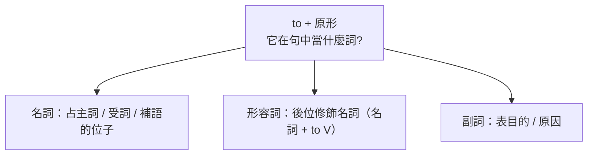

---
tags:
  - 文法/非限定動詞
  - 句型公式
  - 對比辨析
  - 圖表
  - 易錯點
source: https://app.notion.com/p/6b9addaada8b4f1eafaedb2a5feeed52
difficulty: ⭐⭐
status: 學習中
style: 教學型重構
review: []
related: []
---

# 不定詞

> [!IMPORTANT]
> **一句話核心**
> 不定詞 = **to + 原形動詞**，身分不固定（不再是動詞），在句中當 **名詞**（主詞／受詞／補語）、**形容詞**（後位修飾名詞）、**副詞**（表目的／原因）。**否定為 `not + to + 原形`**（不需助動詞）。

---

## 🗺️ 為什麼叫「不定」詞？

`to + 原形` 這個組合一旦成形，就**不再是動詞**，它的詞性也**不固定**——要看它在句中做什麼，才知道當下是名詞、形容詞還是副詞。這正是「不**定**（詞性未定）詞」名字的由來，也是它最好用的地方：一個 to V 能兼三種差事。

| 用法 | 功能 | 例 |
| --- | --- | --- |
| **名詞用法** | 當主詞、受詞、補語 | **To buy** things in a flea market must be fun.（在跳蚤市場買東西一定很好玩。） |
| **形容詞用法** | **後位**修飾名詞 | I have a lot of things **to buy**.（我有很多東西要買。） |
| **副詞用法** | 表目的、原因等 | I went there **to buy** notebooks.（我去那裡買筆記本。） |

先記三個共通點，後面就好懂：
- 名詞用法常可與**動名詞（V-ing）**代換（To buy… = Buying…）。
- 形容詞用法一律**後位修飾**（一個字的形容詞放名詞前、兩字以上放名詞後；to+原形是兩字以上 → 放名詞後）。
- 否定一律 **`not + to + 原形`**，不需助動詞（原因見下方「當補語」的說明）。

---

## 📗 名詞用法（占名詞的位子：主詞／受詞／補語）

不定詞當名詞，就能站名詞能站的每個位子。（能當名詞的有：不定詞、動名詞、名詞片語、名詞子句；名詞才能當主詞、受詞，補語則可用名詞或形容詞。）

### 當主詞
> [!WARNING]
> **不定詞當主詞時視為「一件事」，後接單數動詞。**

- To travel around the world **is** fun.
- To answer this question **is** difficult for me.（對我而言回答這個問題是困難的。即使 question 是複數，動詞仍用單數——真正的主詞是不定詞、視為一件事；for + 人 ＝ 對某人而言）
- **假主詞 it**：不定詞當主詞太長 → 用 it 代替、事件放後面，解決頭重腳輕：**It is difficult to answer this question.**（回答這個問題是困難的。）
  - To solve pollution problems **is** difficult for people in Taiwan.（對台灣民眾而言，要解決污染問題是困難的。）
    - ＝ It is difficult for people in Taiwan to solve pollution problems.
    - question 指有疑問的問題，配的動詞是 **answer**；problem 指難以解決的事情，配的動詞是 **solve**。
  - To be patient with others **is** best for you.（你對別人有耐心是最好的。）
    - ＝ It is best for you to be patient with others.
    - be patient with somebody ＝ 對～有耐心；patient 是形容詞、表狀態故配 be 動詞，其原形即 be（to be 中文不必譯出）。
- **句型**：
  - `It's + 形容詞(修飾事物) + for + 人 + to + 原形…`
  - `It's + 形容詞(修飾人) + of + 人 + to + 原形…`
  - **for／of 由前面的形容詞決定**。修飾**人**的形容詞：good、nice、kind、brave、clever、careless、honest、bad、stupid、silly、selfish、polite…
  - It's **kind of** you to help me.（你真好幫我的忙。）= **You're kind** to help me.（of 句型可改用「人」當主詞；修飾事物的 for 句型則不行）
  - It's **stupid of** him to speak ill of others.（他說別人壞話是愚蠢的。）= **He is stupid** to speak ill of others.（speak ill of + 人 ＝ 說別人的壞話）

### 當受詞
- I like **to play** baseball.
- **必用不定詞當受詞的動詞**：decide、hope、want、expect、volunteer…
  - I decided **to quit** the job.（我決定辭掉工作。quit ＝ 辭掉、戒掉，其後只能接 V-ing——動詞後須接受詞、受詞須具名詞身分：I decided to quit **smoking**.）
  - He hoped **to be** there on time.（他希望準時到那裡。to be = to get）
  - I want **to see** a movie with my friends.（我想要和我的朋友們一起看電影。）＝ I would like to see…（would like 較客氣，用法同 want）
- **to 後動詞與前面相同時，動詞可省略**（只省動詞、**留 to**）：You needn't go if you don't want **to** (go).（你不需要去，如果你不想去的話。）

### 當補語
- **主詞補語**（放 be 動詞／連綴動詞後，補充說明主詞）：
  - My work is **to prepare** dinner.
  - My aim in life is **to become** a famous singer.（我人生的目標是成為名歌手。in life 兩個字以上，故後位修飾 my aim）
  - **To see is to believe.**（眼見為憑。）
- **受詞補語**（主詞＋動詞＋受詞＋受詞補語）：
  - He wants me **to do** it.
  - He told me **to give up** smoking.（他告訴我要戒煙。give up = quit，其後只能接 V-ing）
  - She **got** her husband **to clean up** the house.（她叫她先生打掃房子。to clean up the house 補充說明受詞 her husband）
  - **用不定詞當受詞補語的動詞**：want、ask、teach、tell、get、show…
- **否定不定詞 `not + to + 原形`**：He asked me **not to tell** her the truth.（他要求我不要跟她說實話。不定詞的否定不需助動詞）
  - 比較：He **didn't ask** me to tell her the truth.（他沒要求我跟她說實話。→ 否定的是本動詞 ask）
  - 主詞後第一個動詞叫**本動詞**，後面不管有幾個動詞，**只有本動詞能表現時態**，其否定一定要用「助動詞 + not + 原形動詞」——這正是不定詞否定只需 not、不需助動詞的原因。
  - the truth 一定加 the、不能說 a truth：truth 是不可數名詞，且說實話必是針對某件事說出實際狀況 → 表限定。

---

## 📘 形容詞用法（後位修飾名詞）

不定詞是「to+原形」兩字以上，所以當形容詞修飾**名詞**或 something/anything/nothing/everything 等代名詞時，一律**後位修飾**：名詞／something… + to + 原形。

- **修飾名詞**（to write／to do 不可換成動名詞，因為此處是形容詞）：
  - I have **letters to write**.（我有信要寫。letters to write ＝ 要寫的信）
  - My mother has a lot of **housework to do** every day.（我媽媽每天有很多家事要做。housework to do ＝ 要做的家事；現在習慣性動作用現在式）
- **修飾 something 等**：指事用 something/everything/anything/nothing；指人用 somebody/everybody/anybody/nobody。
  - I'll give you **something to eat**.（我會給你東西吃。）
  - Do you have **anything to read**?（你有什麼東西可讀嗎？）
- ⚠️ **有些不定詞後會伴隨介系詞**（別漏掉）——判斷方法是**倒回去看**：
  - They have a lot of **things to talk about**.（他們有許多事要談。← talk about things）
  - Please give me a **ball-point pen to write with**.（請給我一枝原子筆寫字。← write with a pen；with ＝ 用）

---

## 📙 副詞用法（表目的／原因）

- **表目的**（可用 **in order to** ＝「為了」+ 原形代替）：
  - She went to London **to study** English.（她去倫敦學英語。→ 去倫敦的目的是學英文）
  - ＝ She went to London **in order to** study English.
  - ⚠️ **go／come 後常不接不定詞，改用 and 連接**：Come **and** see me.（來看我。）
- **表原因**（跟在表**感情**的形容詞後）：
  - I am glad **to see** you.（很高興見到你。→ 高興的原因是見到你）
  - We are sorry **to hear** the news.（我們聽到這消息很難過。sorry 有抱歉、難過、遺憾的意思）

---

## 🧩 含不定詞的句型

### 疑問詞 + to 原形（名詞片語，可當主／受／補）
- 當主詞：**Which way to go** is a big problem.（要走哪一條路是個大問題。）
- 當受詞：I know **how to operate** the machine.（我知道如何操作這機器。）
- 當補語：He told me **where to take** the bus.（他告訴我哪裡可以搭公車。）

### too … to …（太…而不能）
> `too + 形容詞／副詞 + to 原形`（形容詞配 be 動詞、副詞配一般動詞）。**只有前面有 too，to + V 才翻成「不能」**。

- You are **too young to understand** the whole thing.（你太年輕無法了解整件事。）
- The water is **too hot** for me **to drink**.（對我而言水太熱無法喝。不定詞後受詞與主詞相同 → **受詞一定要省略**：to drink ~~it~~，it 指水）
- He worked **too slowly to finish** it.（他工作得太慢無法完成這件事。）

### … enough to …（夠～可以～）
> `形容詞／副詞 + enough + to 原形`

- My younger brother is **old enough to go** to school.（我弟弟年紀夠大可以上學。old 指年紀、big 指體型）
  - **to go** 的 to 後接原形動詞 → 是**不定詞**；**go to school** 的 to 後接名詞 → 是**介系詞**。
- Bob worked **hard enough to pass** the exam.（Bob 夠用功可以過考試。hard 形容詞副詞同形，此處因修飾動詞 work 而為副詞）

---

## ⚠️ 易錯點分析

> [!WARNING]
> **常見錯誤（皆為來源整理的重點）**
> - 不定詞當主詞**視為一件事 → 單數動詞**（To answer these questions **is**…）。
> - **否定不定詞用 `not to V`**，不用助動詞（asked me **not to tell**…）。
> - `It's…to V` 句型：修飾**事物**用 **for**、修飾**人**用 **of**（kind **of** you）。
> - **too…to** 已含否定（「不能」）；後面受詞與主詞相同時要**省略**（too hot to drink，不是 to drink it）。
> - **疑問詞 + to V** 是名詞片語，可當主／受／補。
> - 記住必接不定詞的動詞：受詞 decide/hope/want/expect；受詞補語 want/ask/tell/get/show。
> - to 省略時**只省動詞、留 to**（want **to**）。
> - 形容詞用法**後位修飾**，別漏伴隨的介系詞（a pen to write **with**）。

---

## 🔗 延伸與對比
- 相關主題：[[09 動名詞]]（V-ing 當名詞，與不定詞當受詞對照）、[[05 時態（現在／過去／進行／未來）]]（V-ing）、[[11 形容詞]]、[[12 副詞]]（不定詞的形容詞／副詞功能，待建）

---

## 🧠 自我測驗　💬 AI 補充
> 複習時作答，答完再看下方答案。（此區為 AI 出題，非來源內容）

- [ ] Q1：用假主詞 it 改寫：To learn English is important.
- [ ] Q2：填 for 或 of：It's careless ___ you to make the same mistake.
- [ ] Q3：合併成 too…to：The box is very heavy. I can't carry it.
- [ ] Q4：把 He asked me to tell her. 改成否定（他要求我「不要」跟她說）。
- [ ] Q5：「我有很多信要寫」用不定詞形容詞用法怎麼寫？

✅ 解答

A1：**It is** important **to learn** English.
A2：**of**（careless 是修飾「人」的形容詞 → 用 of）。
A3：The box is **too heavy** for me **to carry**.（受詞 it 省略）
A4：He asked me **not to tell** her.（否定不定詞 not to V）
A5：I have a lot of **letters to write**.

