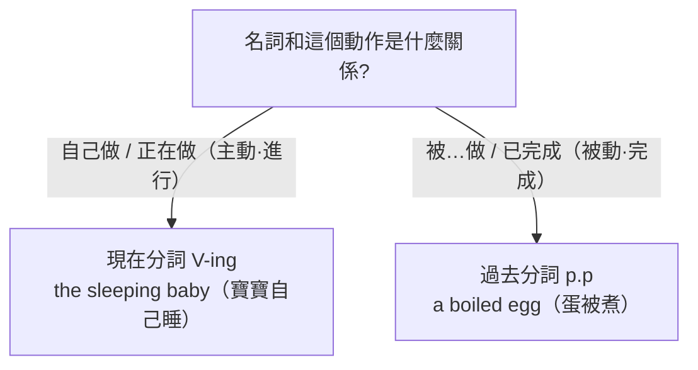

---
tags:
  - 文法/非限定動詞
  - 對比辨析
  - 圖表
  - 易錯點
source: https://app.notion.com/p/263375594a3c4d1c905bc73b5846d132
difficulty: ⭐⭐
status: 未讀
style: 教學型重構
related: []
---

# 分詞

> [!IMPORTANT]
> **一句話核心**
> 分詞是「**形容詞概念**」的動詞變形：**現在分詞（V-ing）表進行／主動**，**過去分詞（p.p）表完成／被動**（都**不代表時態**）。分詞可**前位**（單字）或**後位**（帶受詞／修飾語）修飾名詞，也可當**補語**。主動用現在分詞、被動用過去分詞——判斷靠「**名詞與動作之間的關係**」。

---

## 🗺️ 一個判斷定全局：主動還是被動？

分詞就是「**把動詞拿來當形容詞**」。它長哪個樣、該用哪一個，全由**一個問題**決定：這個名詞和動作之間，是**自己做（主動／正在做）**，還是**被…做（被動／已完成）**？

| 分詞 | 形式 | 表示 |
| --- | --- | --- |
| **現在分詞** | 原形動詞 + ing | **動作進行、主動** |
| **過去分詞** | 規則 +ed／不規則 | **動作完成、被動** |

- **主動 vs 被動的判斷**：看「對象」能否自己做出「動作」。人 → 吃（主動）；蛋糕 → 被吃（被動）。現在分詞「進行」與「主動」擇一解釋即可。（分詞本身是形容詞概念，都**不代表時態**。）
- **一條共用的擺位規則**：**單字分詞放名詞前（前位）；帶受詞或修飾語的分詞片語放名詞後（後位）。** 兩種分詞都適用。

下面現在分詞、過去分詞兩節，其實都是同一條判斷在套用。

---

## 🟢 現在分詞（V-ing：進行／主動）
- **表進行**：The girl **is talking** with Joe.（那女孩正和 Joe 講話。）
- **表主動**：The girl **having long hair** is Mary.（長頭髮的女孩是瑪麗。留長髮是主動；having long hair 補充說明 the girl、是形容詞不是動詞，故不可譯成「正在有長髮的女孩」）

### 形容詞用法
- **單獨的現在分詞 → 前位**（放名詞前）：the **sleeping** baby、the **rising** sun。
  - Don't wake the **sleeping baby**.（別吵醒睡眠中的寶寶。）
  - The **rising sun** is very beautiful.（日出非常美麗。大自然唯一的東西一定要加 the）
- **帶受詞／修飾語 → 後位**（名詞 + 現在分詞 + 修飾語，一定要先寫現在分詞）：
  - I saw a man **working in the garden**.（我看到一個人在花園工作。人與工作是主動關係 → 現在分詞）
  - I saw a girl **playing the piano on the stage**.（我看到一個女孩在舞台上彈鋼琴。play + the + 樂器要加 the；play + 運動則直接接運動名稱）
  - I saw a child **sleeping on the grass**.（我看到一個小孩睡在草地上。）

### 名詞用法（整個分詞片語當主／受／補）
- **當主詞**：
  - The woman **sitting in the middle** is Bob's mother.（坐在中間的女人是 Bob 的母親。真正的主詞是 the woman，故用 is）
  - Some of the people **waiting for the bus** became angry.（等公車中的有些人變得很生氣。真正的主詞是 Some；全句時態為過去式 became）
- **當受詞**：
  - I know the boy **running in the park**.（我認識在公園跑步的男孩。基本結構是 I know the boy，running in the park 修飾 the boy）
  - Do you have any friends **living in Japan**?（你有任何住在日本的朋友嗎？）
- **當補語**：
  - The subway is the railway **running under the ground**.（地鐵是在地下行駛的鐵路。subway ＝ sub〔下〕+ way〔路〕，美式；underground 則是英式）
    - 鐵路與行駛為何算主動？看的是整體概念（火車在行駛）；若要強調是人為駕駛，就變成被動——依觀點決定。
  - A nurse is a person **taking care of sick people**.（護士是照顧病人的人。）
    - ＝ Nurses are people who take care of sick people.（可數名詞須表現單複數，不可只寫 nurse）

---

## 🔵 過去分詞（p.p：完成／被動）
- **形式**：規則 **+ed**（walk-walked-walked，與過去式同形）；不規則（bite-bit-**bitten**）。
- **表完成**：David **has** just **used** the pen.（David 剛用過那枝筆。現在完成 have/has + p.p；just ＝ 剛才，放 have/has 與過去分詞之間）
- **表被動**：
  - This is the pen **used by** David.（這是 David 用過的筆。動詞是 is → 現在式；used by David 修飾 the pen）
  - The pen **was used by** David.（這枝筆被 David 用過。by＝被；分詞是形容詞 → 配 be 動詞表狀態，時態由 was 表現，used 不是過去式）

### 形容詞用法
- **單獨 → 前位**：the **lost** pen、a **used** car。
  - I found the **lost pen**.（我找到那支遺失的筆。為何不用 losing？因為弄丟的動作已完成，且筆不會自己弄丟 → 被動）
  - She bought a **used car**.（她買了一輛二手車。）
- **兩種含義**：
  - **被動**：a **spoken** language（說的語言，語言不會自己說）、a **boiled** egg（煮熟的蛋，蛋只會被煮）、a **wounded** soldier（受傷的士兵，受傷絕非自願；hurt 指身體受到傷害、wound 通常指槍傷刀傷）、a **decayed** tooth（蛀牙）。
  - **完成**（可譯「已經…」）：**fallen** leaves（已經飄落的葉子）、a **retired** teacher（已經退休的老師）、the **risen** sun（已經昇起的太陽）、a **faded** flower（凋謝的花）。
- **帶修飾語 → 後位**：
  - This is a picture **painted about 200 years ago**.（這是一幅兩百年前畫的圖畫。）
  - We have some story books **written in easy English**.（我們有些用簡單英文寫成的故事書。故事書一定是被寫 → 被動）

### 名詞用法（主／受／補）
- **當主詞**：The language **spoken in America** is English.（美國說的語言是英語。語言不會自己說 → 被動；分詞要緊跟所修飾的名詞，才知道在補充說明誰）
- **當受詞**：I look at a lot of pictures **taken in Kenting**.（我看了許多在墾丁拍的照片。基本結構是 I look at pictures，taken in Kenting 補充說明 pictures）
- **當補語**：This is a dress **made for her**.（這是為她做的洋裝。for + 人 ＝ 為了某人；洋裝一定是被做 → 被動）

---

## ⚖️ 現在分詞 vs 過去分詞（形容詞用法對照）

同一個動作，看名詞是主動還是被動，就換不同分詞：

| | 現在分詞 | 過去分詞 |
| --- | --- | --- |
| 表示 | 動作**進行**、**主動** | 動作**完成**、**被動** |
| 例（人畫畫） | The girl **drawing** the picture is my sister.（畫這幅畫的女孩是我姊。） | The picture **drawn** by my sister is nice.（這幅我姊姊所畫的畫不錯。） |
| 例（水） | **boiling** water（正在沸騰的水） | **boiled** water（已煮好的開水，拿給別人喝的是這種） |
| 例（葉） | **falling** leaves（正在飄落的葉子） | **fallen** leaves（已經飄落的葉子） |

---

## 🧩 分詞當補語（其他用法）

### S + V + 現在分詞（主詞補語）
- **keep + V-ing**（動作持續／重複）：
  - He **kept standing** for three hours.（他一直站了三小時。）
  - The dog **kept barking** all night.（那隻狗整晚叫個不停。狗叫用 bark；叫別人名字用 call、叫某人做事用 have。別直譯中文的「不」「停」，要從語意翻——叫個不停＝一直在叫）
- **come／stand／sit／lie + V-ing**（兩動作同時進行；用現在分詞是因為主動，若為被動則改用過去分詞）：
  - Jack **stood looking** at the monkeys.（Jack 站著看猴子。）

### S + V + O + 現在分詞（受詞補語）
> 感官動詞 hear／see／feel 及 keep／leave 等，用現在分詞當受詞補語。

- I saw her **crossing** the road.（我看見她穿越馬路。分詞放在受詞後面，可知補充說明的是受詞 → 受詞補語）
- Don't leave her **waiting** outside in the rain.（別讓她在外面雨中等待。leave 此處不譯「離開」——`leave + 地點` 才是離開；這裡是「讓某人處於某種狀態」）
- ⚠️ 感官動詞後可用 **V-ing（動作進行中）** 或 **原形（看到整個過程）**：see her **crossing**（正在過）vs see her **cross**（看完整個過馬路過程）。

### S + V + O + 過去分詞（受詞補語，被動）
> make、have、see、hear、feel、want、wish、would like 等 + 受詞 + p.p（受詞被…）。

> make／have ＝ 叫某人做事（make 亦作「使得」）；let ＝ 讓某人去做事，請求意味較濃。

- I could not make myself **understood** in English.（我的英文別人聽不懂。字面：我無法使得我用英文被了解。全句動詞與時態由 could not make 表現 → understood 是過去分詞、不是過去式）
- She heard her name **called**.（她聽到有人叫她的名字。字面：她聽到她的名字被叫。完整可作 She heard her name called **by Tom**.；叫的人不明確時 by + 人 可省略）
- I had my hair **cut**.（我剪頭髮了。字面：我使得我的頭髮被剪；此處 cut 是過去分詞）

---

## 🔀 動名詞 vs 現在分詞（同形 V-ing，功用不同）

現在分詞和動名詞（見 [[09 動名詞]]）長得一模一樣，但工作不同：

| | 動名詞 | 現在分詞 |
| --- | --- | --- |
| 詞性 | **名詞**（當主／受／補） | 進行式（be + V-ing）／**形容詞** |
| 例 | Tom's hobby is **painting**.（Tom 的嗜好是畫畫。→ 畫畫這件事） | Tom is **painting**.（Tom 正在畫畫。） |

> [!TIP]
> **判斷法**：能翻成「**正在…**」的就是**現在分詞**（用在進行式）；否則多半是**動名詞**。

---

## ⚠️ 易錯點分析

> [!WARNING]
> **常見錯誤（皆為來源整理的重點）**
> - **主動／進行用現在分詞、被動／完成用過去分詞**——看「名詞與動作的關係」（a boiled egg 蛋被煮 → p.p；a sleeping baby 寶寶自己睡 → V-ing）。
> - 分詞當形容詞：**單字前位、帶受詞或修飾語後位**（a man **working in the garden**）。
> - 過去分詞當形容詞**配 be 動詞表狀態**，別誤當過去式動詞（The pen **was used**：was 表時態、used 是形容詞）。
> - **S+V+O+p.p**：make／have + 受詞 + p.p（I had my hair **cut**，不是 cutting）。
> - **動名詞與現在分詞同形**，用「能否翻『正在』」區分。

---

## 🔗 延伸與對比
- 相關主題：[[05 時態（現在／過去／進行／未來）]]（進行式 be + V-ing）、[[09 動名詞]]（同形 V-ing 對照）、[[14 現在完成式]]（have/has + p.p，待建）、[[16 被動語態]]（be + p.p，待建）

---

## 🧠 自我測驗　💬 AI 補充
> 複習時作答，答完再看下方答案。（此區為 AI 出題，非來源內容）

- [ ] Q1：填現在分詞或過去分詞：a ___ (break) window（破掉的窗）。
- [ ] Q2：boiling water 與 boiled water 意思差在哪？
- [ ] Q3：改錯：I saw a man worked in the garden.
- [ ] Q4：填空：I had my car ___ (repair).（我把車拿去修了）
- [ ] Q5：painting 在 Tom is painting. 與 Tom's hobby is painting. 分別是什麼？

✅ 解答

A1：窗戶是「被」打破 → 過去分詞：a **broken** window。
A2：boiling water＝正在沸騰的水（現在分詞，主動/進行）；boiled water＝已煮好的開水（過去分詞，完成）。
A3：人在花園工作是主動 → 用現在分詞後位修飾：I saw a man **working** in the garden.
A4：車被修 → 過去分詞：I had my car **repaired**.
A5：Tom is painting → **現在分詞**（進行式，正在畫）；Tom's hobby is painting → **動名詞**（名詞，畫畫這件事）。

