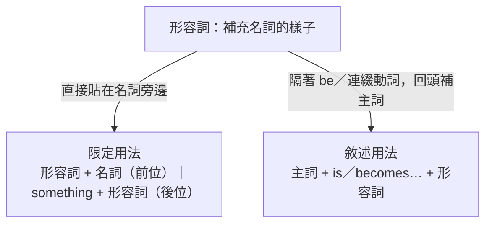

---
tags:
  - 文法/詞類
  - 圖表
  - 對比辨析
  - 易錯點
source: https://app.notion.com/p/a402bf09a38a486ebae4adba194605fa
difficulty: ⭐⭐
status: 學習中
style: 教學型重構
review: []
related: []
---

# 形容詞

> [!IMPORTANT]
> **一句話核心**
> 形容詞主要**修飾名詞**，有兩種用法：**限定用法**（形容詞＋名詞，前位；something 等後接形容詞為後位）與**敘述用法**（放 be 動詞／連綴動詞後補充說明主詞）。**數量形容詞**要看可數／不可數（many/much、a few/a little、few/little、some/any）。**數詞**分基數與序數，另有整數、小數、分數、年月日、時刻等讀法。

---

## 🧭 兩種站位：限定 vs 敘述

形容詞的工作就是**修飾名詞、補充它是什麼樣子**。同一個形容詞，站的位置分兩種：

- **限定用法**：形容詞緊貼名詞，直接「限定」是哪個——a **useful** book。
- **敘述用法**：形容詞隔著 be 動詞或連綴動詞，回頭「敘述」主詞的狀態——He **is** old.

### 限定用法（修飾名詞）
- **形容詞 + 名詞**（前位）：a **useful** book（一本有用的書；字尾是 ful 的字絕對是形容詞）、**physical** education（體育）。
- **多個形容詞的順序**：**限詞 → 數量 → 品質 → 性質/狀態 → 名詞**

| 限詞 | 數量 | 品質 | 性質、狀態 | 名詞 |
| --- | --- | --- | --- | --- |
| an | | expensive | gold | watch |
| this | | | red silk | tie |
| | five | | tall strong Korean | boys |
| a few | | useful | oblong black | boxes |

  - 限詞＝所有格／冠詞／this、that；性質狀態內部順序：**大小形狀 → 顏色新舊 → 材料地點**（與中文語序大致相同）。
- **something 等代名詞 + 形容詞**（後位）：指事 something/everything/anything/nothing；指人 somebody/everybody/anybody/nobody。
  - an important thing（一件重要的事）→ something **important**（某件重要的事）
  - He eats nothing **sweet**.（甜的東西他一概不吃。）
  - Something **terrible** is about to happen.（某件可怕的事即將要發生。is about to ＝ 很短時間內即將；對照 be going to 指有計畫或實現性很高的事）
- **國家的形容詞**（形容詞與該國語言同字；全國人民加 the、單複同形）：

| 國名 | 形容詞 | 語言 | 全國人民 |
| --- | --- | --- | --- |
| China | Chinese | Chinese | the Chinese |
| Japan | Japanese | Japanese | the Japanese |
| Korea | Korean | Korean | the Koreans |
| France | French | French | the French |
| Germany | German | German | the Germans |
| Spain | Spanish | Spanish | the Spanish |

  - Korean、German 全國人民要加 s（Koreans、Germans）；Chinese、Japanese、Spanish、French 單複同形。
  - ⚠️ 對照：businessman 是 business + man 的**組合字**，複數為 businessmen；German 不是組合字，故直接字尾 +s。

### 敘述用法（放 be 動詞／連綴動詞後，補充說明主詞）
> 連綴動詞：become、get、grow、taste… 等。連綴動詞概念同 be 動詞——只說主詞＋動詞並不完整，需形容詞補語回頭說明主詞。

- He **is** old and sick.（他又老又病。old、sick 講的是主詞的狀況）
- Mark **became** hungry after two hours' work.（在工作兩小時後，Mark 變得很餓。只說 Mark became 並不完整，需補語說明主詞）
- Sea water **tastes** salty.（海水嘗起來鹹鹹的。salty 不限定某樣東西，純粹敘述主詞的狀態 → 敘述用法）

---

## 🔢 表示數量的形容詞

挑哪個字，看兩件事：名詞**可數還不可數**、你要講**多還是少（肯定還是否定）**。

| 意思 | 接可數複數名詞 | 接不可數名詞 |
| --- | --- | --- |
| 許多 | **many** | **much** |
| 一些（肯定） | **a few** | **a little** |
| 很少、幾乎沒有（否定） | **few** | **little** |

> [!TIP]
> **一個好記的訣竅**：看「有沒有 a」——**有 a 的（a few／a little）是肯定的「一些」；沒 a 的（few／little）是否定的「幾乎沒有」。**

- **many／much = a lot of／lots of**（後兩者可數、不可數皆可）：
  - Did he make **many mistakes** on the test?（他考試犯了許多錯誤嗎？make mistakes ＝ 犯錯；mistake 是可數名詞）
  - Is there **much wine** in the bottle?（瓶子裡有許多酒嗎？酒是液體 → 不可數名詞，永遠只有單數用法，故用 is）
  - much 亦可當副詞：Thank you very **much**.（非常謝謝你。）
- **a few／a little = some**（little 接可數名詞時解「小的」，如 a little girl）：
  - These were **a few children** in the yard at that time.（那時有些小朋友在院子裡。）＝ These were **some** childre in the yard at that time.（a few 數量不多但可確定；some 未明確指定數量）
  - I gave her **a little trouble**.（我給她添了一些麻煩。trouble 是抽象名詞、不可數）＝ I gave her **some** trouble.（a little 強調程度輕微；some 未指定程度）
- **few／little** 是**否定字**（含 not 之意）→ **不可再與 not 同用**：
  - He is a man of **few words**.（他是個不太愛說話的人。a man of… ＝ 什麼樣的人；of 由後往前翻）
  - There is **little hope** of his recovery.（他幾乎沒有復元的希望。）
  - 「很少、幾乎沒有」是**說話者比例概念**的問題——本來要來 200 人卻只到 2、3 位，就是很少。
- **some（肯定句）vs any（否定、疑問、條件句）**：
  - He collects **some** foreign stamps.（他收集了一些外國郵票。）
  - There is **not any** tea in the cup.（杯子裡沒有茶了。not any ＝ no，但 not any 有強調意味）
  - ⚠️ **勸誘、請求、期待對方答 Yes 的問句也可用 some**：
    - Would you like **some** wine?（想要些葡萄酒嗎？would 雖是 will 的過去式，此處非過去，而是婉轉詢問意願）
    - May I have **some** more coffee?（我可以再要些咖啡嗎？have 後接食物飲料時解「吃、喝」；more ＝ 再～，須放在表數量的字後面：one more、two more、some more）

---

## 🔤 數詞（基數／序數）

數詞是表數量的形容詞，分**基數**（數量：one、two…）與**序數**（順序：first、second…，前常加 the）。

### 基數 vs 序數
| 基數 | 序數 | 基數 | 序數 |
| --- | --- | --- | --- |
| one | first (1st) | eleven | eleventh |
| two | second (2nd) | twelve | twelfth |
| three | third (3rd) | twenty | twentieth |
| four | fourth (4th) | twenty-one | twenty-first |
| five | fifth (5th) | thirty | thirtieth |
| nine | ninth (9th) | hundred | hundredth |

- 序數規則：**4 起字尾加 th**；**fifth**（去 ve+f，遷就發音較好唸）、**ninth**（e 在字尾不發音，直接加 th 恐使 e 發音，故去 e+th）、**eighth**（本有 t 直接 +h）；13–19 直接 +th；整十數 **去 y + ieth**（twentieth）；兩位數 **十位基數 - 個位序數**（twenty-**first**，中間要連字號）。
- ⚠️ **1st 要唸 first**，不可唸成 one st——那只是縮寫。

### 數的讀法（慣例，查得到就好）
- **整數**：thousand（千）、million（百萬）、billion（十億）——英文**沒有「萬」**（1,000,000,000 由右數來第一個逗號是 thousand、第二個是 million、第三個是 billion）；前有數字時單位**不加 s**；百位與十位間可加 and（常省略）。
  - 12,345 → twelve thousand three hundred and forty-five
  - 3,874,516 → three million eight hundred and seventy-four thousand five hundred and sixteen
- **小數**：小數點讀 **point**，小數後逐字讀。
  - 3.14 → three point one four
  - 27.08 → twenty-seven point zero eight（zero 也有人唸成英文字母 o：twenty-seven o eight）
- **分數**：**分子用基數、分母用序數**；分子 > 1 則分母 + s。1/3 → one third；2¾ → two and three fourths
- **年月日**：月日一組（由小到大）+ 逗號；用**基數**唸；年兩位兩位分開（年不講也可以，要講則 the year 放句首）。
  - 1984/7/4 → July four(th), nineteen eighty-four（4 日唸 four 或 fourth 皆可；84 中間一定要有連字號）
  - 2000 年 → (the year) two thousand——2000 拆成 20 與 00 會很奇怪，故 2000 年之後改唸 two thousand、two thousand (and) one、two thousand (and) five…依此類推。
- **時刻**：6:15 → six fifteen／a quarter **past** six（一圈 60 分，15 分是 1/4 → quarter）；7:30 → seven thirty／half **past** seven（half ＝ 30 分；l 與 f 相連時 l 不發音）；8:59 → eight fifty-nine／one **to** nine
  - 點與分之間可不加連字號，但**分若超過兩位數字，連字號不可省**。
- **溫度**：degree(s)（超過 2 度要加 s）；攝氏 centigrade／Celsius、華氏 Fahrenheit。
  - 攝氏 25 度 → twenty-five degrees centigrade（Celsius）
  - 華氏 93 度 → ninety-three degrees Fahrenheit
- **電話號碼**：基數逐字；中文寫連字號，英文寫逗號。
  - 2834-7509 → two eight three four, seven five zero nine
  - 2834-7500 → two eight three four, seven five **double** zero（double O 為英文字母 O）
  - 2834-7000 → two eight three four, seven thousand（或 seven **triple** zero；triple ＝ 3 倍）

> [!NOTE]
> **時刻的 past 與 to　💬 AI 補充**
> 補自 Notion 補充頁（非講義）：**（分鐘）past（整點）＝幾點過幾分**、**（分鐘）to（整點）＝再幾分到整點**。以 half（30 分）為界：**30 分前用 past、30 分後用 to**（half 本身搭 past）。用 to 時整點要 **+1**（1:31 → thirty-one **to** two）。分鐘為一般數字時可加 minutes（It's five minutes to three.）。

---

## 🧩 數詞的慣用表現
- **hundreds／thousands／millions of + 複數名詞**（數以百／千／百萬計）：前面**沒有**數字時才加 s + of；前面**有**數字則不加 s。
  - **Hundreds of children** gathered in the playground.（數以百計的小朋友聚集在運動場。of 是介系詞，後面接名詞）
  - He has **one hundred kinds** of stamps.（他有 100 種郵票。複數表現在後面的名詞 kinds 上；此處 of 是跟著 kind、不是跟著 hundred）
- **in + one's／the + 數詞複數形**（某時間範圍；one's 指所有格，沒有所有格就用 the）：
  - She is **in her twenties／teens**.（她 20 幾歲／10 幾歲。teens ＝ 13～19，因 13～19 字尾都是 teen）
  - There was an antiwar movement **in the nineteen-sixties**.（在 1960 年代有一項反戰運動。指 1960～1969；movement 此處指社會運動）
- **數詞-單數名詞 = 形容詞**（用連字號，名詞去複數 s——形容詞沒有複數；冠詞與名詞之間用的就是形容詞）：
  - It's only a **ten-minute** walk from here to the station.（從這裡走路到車站只要十分鐘路程。一般說 ten minute**s**，當形容詞須去 s）
  - The young man married a **70-year-old** woman.（那年輕人娶了一位 70 歲的女士。marry 可解娶或嫁；問人結婚了沒要用 be 動詞 + married）
  - 同類：five-year plan（五年計劃）、three-bedroom house（三居室房屋）、blue-eyed girl（藍眼睛的女孩）。

---

## ⚠️ 易錯點分析

> [!WARNING]
> **常見錯誤（皆為來源整理的重點）**
> - **many**（可數複數）／**much**（不可數）；a lot of／lots of 兩者皆可。
> - **a few／a little（肯定，一些）vs few／little（否定，很少）**；few／little 已含否定，**不與 not 同用**。
> - **some（肯定）／any（否定、疑問、條件）**；但勸誘／請求的問句用 some。
> - 形容詞順序：**限詞 → 數量 → 品質 → 性質/狀態 → 名詞**。
> - **something 等 + 形容詞為後位**（something important）。
> - **數詞-名詞當形容詞要去複數 s**（**ten-minute** walk、**70-year-old**）。
> - hundred／thousand／million 前**有數字時不加 s**。

---

## 🔗 延伸與對比
- 相關主題：[[07 比較]]（形容詞的比較級／最高級）、[[04 代名詞]]（some／any／this 的形容詞用法）、[[01 名詞、冠詞]]（限詞中的冠詞）、[[12 副詞]]（待建）

---

## 🧠 自我測驗　💬 AI 補充
> 複習時作答，答完再看下方答案。（此區為 AI 出題，非來源內容）

- [ ] Q1：填 many／much：How ___ money do you have? ／ How ___ books do you have?
- [ ] Q2：a few 與 few 意思差在哪？
- [ ] Q3：排序：a / gold / expensive / watch。
- [ ] Q4：讀出 6:45（用 to 的說法）。
- [ ] Q5：把 It's a walk of ten minutes 改成「數詞-名詞形容詞」寫法。

✅ 解答

A1：money 不可數 → **much**；books 可數複數 → **many**。
A2：**a few**＝一些（肯定）；**few**＝很少、幾乎沒有（否定）。
A3：an **expensive gold** watch（限詞 an → 品質 expensive → 材料 gold → 名詞）。注意 expensive 前用 an。
A4：6:45 → a quarter **to** seven（差一刻到 7 點，整點 +1）。
A5：It's a **ten-minute** walk.（minute 去 s，加連字號當形容詞）。

