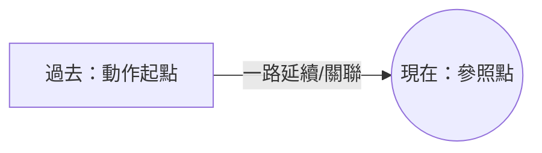

---
tags:
  - 文法/時式
  - 句型公式
  - 對比辨析
  - 圖表
  - 易錯點
source: https://app.notion.com/p/463af86e8c09406aac6fb85e71b198f0
difficulty: ⭐⭐
status: 學習中
review: []
related: []
---

# 現在完成式

> [!IMPORTANT]
> **一句話核心**
> 現在完成式 = **have／has + 過去分詞**，表示**過去發生、且延續到／影響現在**的動作。三大用法：**持續**（for／since）、**完成**（already／just／yet）、**經驗**（ever／never／次數）。動作起點都在過去。否定 have not + p.p.、疑問 Have + 主詞 + p.p.?

---

## 🧭 形式與概念
- **肯定句：主詞 + have／has + 過去分詞**（has 用於第三人稱單數，其餘用 have）。
- 「現在」由 have／has 表現、「完成」由過去分詞表現；**動作起點在過去，一路延續／關聯到現在**。
  - He **has studied** for two days.／He **has been** busy since yesterday.

> [!NOTE]
> **「參照點」概念　💬 AI 補充**
> 改寫自外部文章 [TKB〈現在完成式圖解〉](https://www.tkbgo.com.tw/zone/english/article/toArticleDetail.jsp?article_id=1171)：完成式是「從一個**參照點（reference time）用回溯觀點看事情**」。**現在完成式的參照點就是「現在」**，句子包含①參照點②參照點之前發生的事。（對照：過去完成式參照點是「過去某時間點」。）

---

## 📊 三大用法

| 用法 | 意義 | 常見副詞 |
| --- | --- | --- |
| **持續** | 過去到現在持續進行 | for、since、how long、all day、lately、recently |
| **完成** | 動作（剛）完成／尚未完成 | already、just、yet |
| **經驗** | 到現在為止有過…的經驗 | ever、never、once／twice／…times、before |

### 持續
- **for + 時間長度**（持續多久；for 是介系詞，後只能接名詞）：I have learned English **for** three years.
- **since + 時間起點**（過去時間點／過去式子句；since 可當介系詞或連接詞）：…**since** three years ago／**since** we were children.
- I **haven't seen** you **for** a long time. = It **has been** a long time **since** I last saw you.（it 當時間主詞時 has been 可換 is）
- **how long（問時間）vs how often（問頻率）**：How long **have** you **lived** in Taipei? → for ten years／since 1994.

### 完成
- **already**（已經）：放 have/has 與 p.p. 之間或句尾，多用於**肯定句**（用於疑問句含**驚訝**）：The train **has already arrived**.
- **just**（剛才）：放中間，多用於肯定句：I **have just read** that comic book.
- **yet**（尚、還）：多用於**疑問／否定句**，放句尾或中間：**Have** you **found** it **yet**? → No, **not yet**.
- 對照 **just now**：用過去式＝剛才、現在式＝此刻、未來式＝馬上。

### 經驗
- ever、never、once／twice／…times、before：**Have** you ever **visited** the museum? → No, **never**.（簡答時頻率副詞放助動詞前：No, I **never have**.）
- She **has watched** it five times.
- ⚠️ **表經驗也可用過去式**：Did you ever **visit**…?（經驗可能都發生在過去時間點）。

---

## 🔧 否定句與疑問句
| | 句型 |
| --- | --- |
| 肯定 | 主詞 + have／has + p.p. |
| 否定 | 主詞 + have／has + **not** + p.p. |
| 疑問 | **Have／Has** + 主詞 + p.p. …? |

- He **has heard** a lot of Mr. Li. → He **has not heard**…／**Has** he **heard**…? → Yes, he **has**.／No, he **hasn't**.
- ⚠️ have 當**一般動詞**（有／吃／喝）不可直接加 not；當**助動詞**（無中文義）才可加 not、才可移到句首形成疑問。

---

## ⚠️ 特別注意

### 現在完成式 vs 過去式
- Mr. Green **has gone to** New York on business.（已去，可能在途中或已到 → **與現在有關**）
- Mr. Green **went to** New York on business.（去過、**已回來** → 純敘述過去）
- 差別：現在完成式著重「**與現在的關係**」；過去式只關注「過去那個當下」。

### have been to vs have gone to
- **have been to**＝曾經去過（現在**已回來**）／剛才去了：I **have been to** Japan twice.
- **have gone to**＝已經去了（**還在那／還沒回來**，用於第三人稱）：She **has gone to** Europe.
  - Have you ever **been to** a basketball game?（不可用 gone）

### 瞬間動詞（不可延續）用於現在完成式時，其後不可加「一段時間（for…）」
| ❌ | ✅ |
| --- | --- |
| His father **has died** for ten years. | His father **died** ten years ago.／His father **has been dead** for ten years.（狀態可持續） |
| Amy **has bought** the car for one year. | Amy **has bought** the car already.／Amy bought the car and **has owned** it for one year. |
| Mr. Wang **has gone to** America for three days. | Mr. Wang **has been in** America for three days.（「待在」，非「去」持續三天） |

---

## ⚠️ 易錯點分析

> [!WARNING]
> **常見錯誤（皆為來源整理的重點）**
> - **have／has + 過去分詞**；第三人稱單數用 **has**。
> - **for + 時間長度**（介系詞，接名詞）／**since + 過去時間起點**（可接子句）。
> - **already／just（肯定，放中間）／ yet（否定、疑問，放句尾）**。
> - **been to（去過已回來）vs gone to（已去未回，用第三人稱）**。
> - **瞬間動詞後不加 for + 時間**（die → be dead、buy → own、go → be in）。
> - 表經驗也可用過去式；簡答時頻率副詞放助動詞前（No, I never have）。

---

## 🔗 延伸與對比
- **外部延伸閱讀**（第三方文章，非謝孟媛講義）：
  - [現在完成式 present perfect 圖解、用法、比較](https://www.tkbgo.com.tw/zone/english/article/toArticleDetail.jsp?article_id=1171)（「參照點」概念已折入上方 💬）
- 相關主題：[[03 be 動詞、一般動詞（過去式）]]（完成式 vs 過去式）、[[10 分詞]]（過去分詞 p.p.）、[[05 時態（現在／過去／進行／未來）]]

---

## 🧠 自我測驗　💬 AI 補充
> 複習時作答，答完再看下方答案。（此區為 AI 出題，非來源內容）

- [ ] Q1：填 for／since：I have lived here ___ 2019；I have lived here ___ five years.
- [ ] Q2：改錯：My grandfather has died for twenty years.
- [ ] Q3：been to 或 gone to：My parents ___ Paris（他們去了還沒回來）；I ___ Paris twice（我去過）。
- [ ] Q4：Have you finished ___ ?（填「還沒」的副詞）
- [ ] Q5：has gone to 與 went to 有何不同？

✅ 解答

A1：時間起點 → **since** 2019；時間長度 → **for** five years。
A2：die 是瞬間動詞不可加 for → His grandfather **has been dead** for twenty years.（或 died twenty years ago）。
A3：已去未回、第三人稱 → have **gone to**；曾去過已回 → have **been to**。
A4：Have you finished **yet**?
A5：has gone to＝已經去了、與現在有關（可能還沒回來）；went to＝過去去過、已回來（純敘述過去）。

