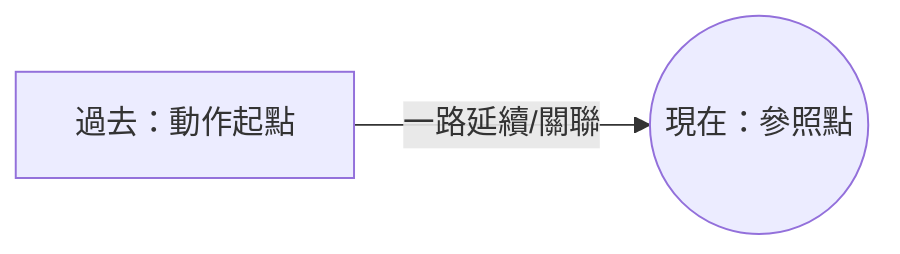

---
tags:
  - 文法/時式
  - 句型公式
  - 對比辨析
  - 圖表
  - 易錯點
source: https://app.notion.com/p/463af86e8c09406aac6fb85e71b198f0
difficulty: ⭐⭐
status: 學習中
style: 教學型重構
review: []
related: []
---

# 現在完成式

> [!IMPORTANT]
> **一句話核心**
> 現在完成式 = **have／has + 過去分詞**，表示**過去發生、且延續到／影響現在**的動作。三大用法：**持續**（for／since）、**完成**（already／just／yet）、**經驗**（ever／never／次數）。動作起點都在過去。否定 have not + p.p.、疑問 Have + 主詞 + p.p.?

---

## 🧭 形式與概念：站在「現在」回頭看
- **肯定句：主詞 + have／has + 過去分詞**（has 用於第三人稱單數，其餘用 have）。
- 拆開看：**have／has 管「現在」、過去分詞管「過去做的那個動作」**。合起來就是——**站在「現在」這個點，回頭看一件過去發生、而且牽連到現在的事**。動作起點在過去，一路延續／關聯到現在。
  - He **has studied** for two days.／He **has been** busy since yesterday.
- 這正是它和**過去式**最大的差別：過去式只看「過去那一刻」、與現在無關；現在完成式硬是把那件過去的事**牽到現在**。（詳細對照見下方「特別注意」。）

> [!NOTE]
> **「參照點」概念　💬 AI 補充**
> 改寫自外部文章 [TKB〈現在完成式圖解〉](https://www.tkbgo.com.tw/zone/english/article/toArticleDetail.jsp?article_id=1171)：完成式是「從一個**參照點（reference time）用回溯觀點看事情**」。**現在完成式的參照點就是「現在」**，句子包含①參照點②參照點之前發生的事。（對照：過去完成式參照點是「過去某時間點」。）

---

## 📊 三大用法：三種「把過去牽到現在」的方式

三種用法都是「動作起點在過去、連到現在」，差別只在**怎麼連**——持續（一路做到現在）、完成（到現在剛做完）、經驗（到現在累積過的經歷）：

| 用法 | 意義 | 常見副詞 |
| --- | --- | --- |
| **持續** | 過去到現在持續進行 | for、since、how long、all day、lately、recently |
| **完成** | 動作（剛）完成／尚未完成 | already、just、yet |
| **經驗** | 到現在為止有過…的經驗 | ever、never、once／twice／…times、before |

### 持續（從過去一直做到現在）
- 起點在過去、且延續到現在才用完成式；**have/has 後面接的是「學」這個持續的動作（learn），不是 began**。
  - I began to learn English three years ago.（→ 只講三年前開始、沒提到現在 → 過去式）
  - I **have learned** English **for** three years.（我學英文三年了。for ＝ 持續）
  - I **have learned** English **since** three years ago.（我從 3 年前開始學英文。有 since → 有持續到現在；沒有 since 的 three years ago 就只是過去時間點 → 過去式）
- **for + 時間長度**（持續多久；for 只是介系詞，後面只能接名詞、不能像 since 接子句）。
- **since + 時間起點**（過去時間點／過去式子句；since 可當介系詞**或連接詞**，故可接子句）。
  - We **have known** each other **for** ten years.（我們彼此認識 10 年了。）= We have known each other **since** ten years ago. = We have known each other **since** we were children.
- I **haven't seen** you **for** a long time.（好久不見。→ 沒見面的這段時間持續到現在）
  - = It **has been** a long time **since** I last saw you.（it 此處指時間；last 是副詞、＝上一次）
  - = It **is** a long time since I last saw you.（**只有 it 當主詞代表時間時** has been 才可換 is——不變的事實用現在式。語感上 has been 強調時間間隔對關係的影響、is 較注重時間間隔本身）
  - = Long time no see.／for a long time、for years、for ages 都是「好久」。
- **其他持續副詞**（all day、these days、lately、recently、always、this week）：I **have had** a headache all day (long).（我頭痛了一整天了。`have + a + 病名` ＝ 生了什麼病）
- **how long（問時間）vs how often（問頻率）**：
  - How long **has** he **played** the piano?（他彈琴彈多久了？）→ For two hours.（兩小時。也可答 since two hours ago.）
  - How long **have** you **lived** in Taipei?（你們在台北住多久了？）→ We **have lived** in Taipei for ten years.（我們住在台北十年了。）／We **have lived** in Taipei since 1994.（從 1994 年起我們就住在台北了。）
  - How often do you go to a beauty parlor?（你多久上一次美容院？）→ Once a week.（一星期一次。）

### 完成（到現在為止，(剛)完成了）
> 完成用法強調的是**「現在」這個動作是否完成**（已完成／剛完成／尚未完成）——動作沒完成一樣用完成式，別被名稱誤導。

- **already**（已經）：放 have/has 與 p.p. 之間或句尾，多用於**肯定句**（用於疑問句含**驚訝**）：The train for Kaohsiung **has already arrived**.（往高雄的火車已經到了。for Kaohsiung 後位修飾 the train，for 此處解「前往」；真正的主詞是 train 不是 Kaohsiung）
- **just**（剛才）：放中間，多用於肯定句（just 亦可用於過去式）：I **have just read** that comic book.（我剛讀過那本漫畫書。讀書報雜誌的內容用 read）
- **yet**（尚、還）：多用於**疑問／否定句**，放句尾或中間：**Have** you **found** my digital camera **yet**?（你找到我的數位相機了嗎？）→ No, I **haven't found** it **yet**.（不，我還沒找到。）→ 重複處可省略，只剩 No, **not yet**.（不，還沒。not 沒有重複故不可省）
- **其他副詞**：today、this morning、lately、recently、now 等。（now 也能用於現在完成式——完成式本來就跟現在有關，只是動作起點在過去。）
- 對照 **just now**：用過去式＝剛才、現在式＝此刻、未來式＝馬上（因為有時強調 just、有時強調 now，配上不同時態就有不同意思）：
  - Tom came in **just now**; he's probably upstairs.（湯姆剛才進來；他大概在樓上。→ 剛才）
  - He is **just now** answering the call.（他此刻正在接電話。→ 此刻）
  - I'll do it **just now**.（我馬上做。→ 馬上）

### 經驗（到現在為止，有過…的經歷）
- ever、never、once／twice／…times、before（twice = two times；3 次以上用 times）：
  - **Have** you ever **visited** National Palace Museum?（你曾參觀過故宮博物院嗎？）
    - → No, I **have never visited** there before.（不，我從未參觀過故宮。用 have 問就用 have 答）
    - → No, I **never have**.（簡答時頻率副詞要放助動詞**之前**）
    - → No, **never**.（助動詞跟著主詞走，主詞省略時助動詞也一併省略，最後只剩 never）
- My younger sister really likes that movie.（陳述事實用現在式）She **has watched** it five times.（我妹妹真的很喜歡那部電影。她已看了五次。→ 表經驗用現在完成式）
- **ever + 現在式**則表「現在的習慣性或重複性動作」：Do you ever visit National Palace Museum in your free time?（你空閒時會去參觀故宮嗎？）
- ⚠️ **表經驗也可用過去式**（經驗可能都發生在過去時間點）：Did you ever **visit** National Palace Museum?（你曾參觀過故宮博物院嗎？）→ No, I never visited there before.／No, I **never did**.（用 did 問就用 did 答）

---

## 🔧 否定句與疑問句
| | 句型 |
| --- | --- |
| 肯定 | 主詞 + have／has + p.p. |
| 否定 | 主詞 + have／has + **not** + p.p. |
| 疑問 | **Have／Has** + 主詞 + p.p. …? |

- 肯定：He **has heard** a lot of Mr. Li.（他久仰李先生的大名。`hear … of + 對象` ＝ 聽說；a lot 是副詞，修飾 hear ＝ 聽到許多）
- 否定：He **has not heard** a lot of Mr. Li.
- 疑問：**Has** he **heard** a lot of Mr. Li? → Yes, he **has**.（= Yes, he has heard a lot of Mr. Li，重複處省略）／No, he **hasn't**.
- ⚠️ have 當**一般動詞**（有／吃／喝）不可直接加 not；當**助動詞**（無中文義）才可加 not、才可移到句首形成疑問。
  - 英文裡**只有 be 動詞與助動詞可以加 not**。助動詞三特性：後面可加 not 成否定、可移到主詞前成疑問、用助動詞問就用助動詞答（be 動詞問則用 be 動詞答）。

---

## ⚠️ 特別注意：三個坑，都回到「與現在有關」

下面三個常見坑，其實都是同一個核心在把關——現在完成式必須「**與現在有關**」，不然就該用過去式。

### 現在完成式 vs 過去式
- Mr. Green **has gone to** New York on business.（格林先生已經去紐約出差了。→ 表完成：可能在途中或已抵達，**與現在有關**；on business 出差、on vacation 渡假）
- Mr. Green **went to** New York on business.（格林先生去紐約出差回來了。→ 純敘述過去做過這件事）
- 差別：現在完成式著重「**與現在的關係**」；過去式只關注「過去那個當下」。

### have been to vs have gone to
- **have been to**＝曾經去過（強調過去的經歷，現在**已回來**／不在那裡）／剛才去了：
  - I **have been to** Japan twice.（我曾去過日本兩次，現在已回來。）
  - I **have** just **been to** the station to see her off.（我剛才去了車站為她送行。→ 「剛才去了」用法；see off ＝ 送行，有受格時為 see + 受格 + off；to see her off 是不定詞表目的）
  - **Have** you ever **been to** the library?（你曾經去過圖書館嗎？）
- **have gone to**＝已經去了（強調動作結果，**還在那／還沒回來**，用於第三人稱）：She **has gone to** Europe.（她已經去歐洲了。）
- 比較：Did you ever **go to** a basketball game?（你曾經去看籃球賽？此處 go to 即 watch 之意）／**Have** you ever **been to** a basketball game?（不可用 gone——have gone to 用於第三人稱、意思是已經去了）

### 瞬間動詞（不可延續）用於現在完成式時，其後不可加「一段時間（for…）」

> 瞬間動詞指動作無法持續者，如 die（死）；但 **dead 是形容詞、表狀態，狀態可以持續**。「一段時間」即 for + 時間。

| ❌ | ✅ |
| --- | --- |
| His father **has died** for ten years.（他父親過逝十年。） | His father **died** ten years ago.（過去式，與現在無關）／His father **has been dead** for ten years.（死亡的**狀態**才可持續；pass away 是較好的說法） |
| Amy **has bought** the car for one year.（艾咪那輛車買一年了。） | Amy **has bought** the car already.（強調動作完成）／Amy bought the car and **has owned** it for one year.（買不能持續，**擁有**才可持續） |
| Mr. Wang **has gone to** America for three days.（王先生已經去美國三天了。） | Mr. Wang **has gone to** America.（已經去美國了——可能在途中或已抵達）／Mr. Wang **has been in** America for three days.（「**待在**」美國三天，非「去」這個動作做了三天；been 的原形是 be，表存在、狀態） |

---

## ⚠️ 易錯點分析

> [!WARNING]
> **常見錯誤（皆為來源整理的重點）**
> - **have／has + 過去分詞**；第三人稱單數用 **has**。
> - **for + 時間長度**（介系詞，接名詞）／**since + 過去時間起點**（可接子句）。
> - **already／just（肯定，放中間）／ yet（否定、疑問，放句尾）**。
> - **been to（去過已回來）vs gone to（已去未回，用第三人稱）**。
> - **瞬間動詞後不加 for + 時間**（die → be dead、buy → own、go → be in）。
> - 表經驗也可用過去式；簡答時頻率副詞放助動詞前（No, I never have）。

---

## 🔗 延伸與對比
- **外部延伸閱讀**（第三方文章，非謝孟媛講義）：
  - [現在完成式 present perfect 圖解、用法、比較](https://www.tkbgo.com.tw/zone/english/article/toArticleDetail.jsp?article_id=1171)（「參照點」概念已折入上方 💬）
- 相關主題：[[03 be 動詞、一般動詞（過去式）]]（完成式 vs 過去式）、[[10 分詞]]（過去分詞 p.p.）、[[05 時態（現在／過去／進行／未來）]]

---

## 🧠 自我測驗　💬 AI 補充
> 複習時作答，答完再看下方答案。（此區為 AI 出題，非來源內容）

- [ ] Q1：填 for／since：I have lived here ___ 2019；I have lived here ___ five years.
- [ ] Q2：改錯：My grandfather has died for twenty years.
- [ ] Q3：been to 或 gone to：My parents ___ Paris（他們去了還沒回來）；I ___ Paris twice（我去過）。
- [ ] Q4：Have you finished ___ ?（填「還沒」的副詞）
- [ ] Q5：has gone to 與 went to 有何不同？

✅ 解答

A1：時間起點 → **since** 2019；時間長度 → **for** five years。
A2：die 是瞬間動詞不可加 for → His grandfather **has been dead** for twenty years.（或 died twenty years ago）。
A3：已去未回、第三人稱 → have **gone to**；曾去過已回 → have **been to**。
A4：Have you finished **yet**?
A5：has gone to＝已經去了、與現在有關（可能還沒回來）；went to＝過去去過、已回來（純敘述過去）。

