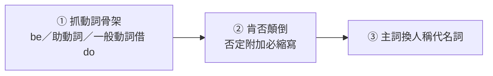

---
tags:
  - 文法/疑問句
  - 句型公式
  - 對比辨析
  - 圖表
  - 易錯點
source: https://app.notion.com/p/d8180abc2cb0491399cbe24cf621dfd4
difficulty: ⭐⭐
status: 學習中
style: 教學型重構
related: []
---

# 附加問句

> [!IMPORTANT]
> **一句話核心**
> 附加問句依附在直述句／祈使句尾，用來**詢問**或**徵求同意**。**三原則**：①肯定直述句→**否定**附加問句（反之亦然）；②附加問句的 be／助動詞**依前面直述句判斷**，且**否定附加必縮寫**；③附加問句主詞用**人稱代名詞**。語調**上升↗＝詢問**、**下降↘＝尋求認同**。

---

## 🗺️ 附加問句是什麼、怎麼造

附加問句就是句尾「回頭反問一句、確認一下」。**語調**決定它是真的在問還是求認同：
- 語調**上升↗＝詢問事物**（等於一般問句，可 Yes/No 回答）：You are from Japan, **aren't you**?↗（你來自日本，是嗎？= Are you from Japan? → 答 Yes, I am.／No, I am not.）
- 語調**下降↘＝心中已有定見、尋求認同**：You should follow traffic rules, **shouldn't you**?↘（你應該遵守交通規則，對吧？）

**造附加問句，固定三步（就是三原則變成的操作步驟）：**

---

## 📐 三步驟拆解

### 步驟 ①：抓「動詞骨架」（依直述句判斷）
看直述句用的是哪種動詞，附加問句就用對應的那個；一般動詞沒有現成骨架，就借助動詞 **do／does／did**。

| 直述句 | 附加問句 |
| --- | --- |
| be 動詞 | be 動詞 |
| 一般動詞 | 助動詞 **do／does／did** |
| 助動詞 will／can／should… | 同一助動詞 |

### 步驟 ②：肯否顛倒（否定附加**必縮寫**）
肯定直述句 → **否定**附加問句；否定直述句 → **肯定**附加問句。否定的那一邊一定要縮寫（isn't、can't…）。

### 步驟 ③：主詞換**人稱代名詞**
| 直述句主詞 | 附加問句主詞 |
| --- | --- |
| Tom、John… | he |
| Mary、Amy… | she |
| Tom and Mary | they |
| this、that | **it** |
| baby、child | **it** |
| 不定詞、動名詞 | **it** |

- 人稱優先序：第一人稱 > 第二 > 第三（我＋你／我＋Tom → **we**；你＋Tom → **you**）。
- **this／that → it**：it 不僅指單數，還指沒有生命的東西。
- **baby／child → it**：it 也可用於分不清性別、分不清對象時（如敲門問 Who is it?）。
- **不定詞／動名詞 → it**：兩者當主詞時可能很長，故用 it 代替（指一件事情）。

**例句（三步一次到位）**
- It's cold and humid, **isn't it**?（天氣又冷又濕，不是嗎？it 可指天氣、時間、一件事、對象不明等；用現在式 is 就知道講的是今天的天氣。wet 是可擰出水的濕、humid 指含水氣的濕）
- Dad was good at sports, **wasn't he**?（爸以前運動很行，不是嗎？be good at ＝ 精通；用過去式表示現在已不那麼行了）
- Tarzan fell in love with a beautiful girl, **didn't he**?（泰山愛上一位美麗的女孩，不是嗎？`fall in love with + 人` ＝ 愛上某人）
- People can't use fake credit cards, **can they**?（人們不能使用假的信用卡，是嗎？若說話者也把自己算進去可用 can we；用 can they 表示在告誡別人）
- This is really an embarrassing experience, **isn't it**?（這真是個令人尷尬的經驗，不是嗎？）
- Eating too much junk food isn't good for health, **is it**?（吃太多垃圾食物對健康無益，是嗎？動名詞當主詞指一件事，故用 is——不是因為 food 不可數）
- That baby fell asleep, **didn't it**?（那寶寶睡著了，不是嗎？feel sleepy ＝ 想睡、fall asleep ＝ 睡著）

---

## ⚠️ 特別注意（三步驟的轉折點）

下面全是三步驟中「抓骨架」或「判斷肯否」時容易卡住的特例：

- **am**：am 與 not 沒有縮寫形，附加問句用 **aren't I**（或 am I not／老式 ain't I）：I am the right man for the job, **aren't I**?（我正是適合這工作的人，不是嗎？）
- **There is／are…**：附加問句主詞仍用 **there**（there 是副詞、指一個地方，真正的主詞在後面，be 動詞單複數由它決定）：
  - There is an old man jogging in the playground, **isn't there**?（有位老人在運動場上慢跑，不是嗎？真正主詞是 an old man → is）
  - There are not any pedestrians in the street, **are there**?（路上沒有任何行人，是嗎？not any = no；真正主詞是 pedestrians → are）
- **have／has／had 要分助動詞或一般動詞**（若是一般動詞就不能直接加 not）：
  - **have/has + p.p.**（助動詞）：He's decided to quit smoking, **hasn't he**?（他已決定戒煙了，不是嗎？decide 後接不定詞、quit 後接 V-ing）
  - **had better + 原形**（had 是助動詞，故後接原形）：You had better keep silent in the meeting, **hadn't you**?（會議上你最好保持沈默，不是嗎？had better 用來對當下或未來提建議——雖然 had 是 have 的過去式，但**不是過去式用法**）
  - **have to**（have 是一般動詞）→ 用 **do**：We have to finish the work by ourselves, **don't we**?（我們必須靠自己完成工作，不是嗎？have to 與 must 都是「必須」，但 have to 的 have 是一般動詞、must 是助動詞）
  - **have 當一般動詞（有／吃／玩得…）**→ 用 **do/does/did**：Mary and her friends had a very good time, **didn't they**?（瑪麗和她的朋友們玩得很開心，不是嗎？have a good time = have fun = enjoy oneself）
  - **he's** 可能是 he **is** 或 he **has**，看後文：He's fond of pop music, **isn't he**?（他喜歡流行樂，不是嗎？fond 是形容詞 → he is；pop = popular）／He's decided to quit smoking, **hasn't he**?（→ 表「已經」用完成式 → he has；若是 he is + p.p. 則為被動）
- **直述句含否定字**（no、nothing、never、seldom、little、few…；否定字的功能形同 not。little = not much、few = not many）→ 用**肯定**附加問句：
  - There is nothing wrong with your cell phone, **is there**?（你的手機沒有毛病，是嗎？`There is nothing wrong with + 人／事物`；wrong 此處指不對勁）
  - I never tell lies to others, **do I**?（我從不對別人說謊，是吧？others 指別人、一定要加 s）
  - The foreigner has few friends here in Taiwan, **does he**?（這外國人在台灣這裡幾乎沒有朋友，對吧？台灣兩千三百萬人他卻只有兩三個朋友，少到幾乎沒有 → 否定概念）
- **too…to…**（太…而不能）→ 用**否定**附加問句：You are too young to have the right to vote, **aren't you**?（你年紀太小了沒有投票權，不是嗎？the right ＝ 權利）
  - 為何仍用否定？因為「不能」並非完全否定——不是說你沒有投票權，而是你**太年輕還沒有**，到法定年齡就有了。
- **不定代名詞主詞**：something/anything/nothing/everything → 附加主詞用 **it**；someone/anyone/no one/everyone → 用 **they**（因為代表人、代表複數；one 可換成 body。no one 之所以分寫，是因為兩個 o 連在一起可能發 [u] 音）：
  - Something bad happened to the student, **didn't it**?（那學生發生了不好的事，不是嗎？happen 的主詞是事情，發生在某人身上要用 `to + 對象`）
  - Someone took my notebook without asking me first, **didn't they**?（有人沒有先問我就拿了我的筆記本，不是嗎？without 是介系詞故接 V-ing；雖然中文譯「沒有」，但 without 在英文裡**不是否定字**，故本句仍屬肯定）
- **主要子句＋附屬子句** → 依**主要子句**（沒有連接詞的那個就是主要子句；附加問句是針對主要要表達的部分再確認一次）：
  - If it is fine tomorrow, they will go picnicking, **won't they**?（如果明天天氣晴朗，他們要去野餐，不是嗎？→ 說話者想知道的是他們去不去野餐）
  - Many readers thought that it was an interesting novel, **didn't they**?（許多讀者認為這是本有趣的小說，不是嗎？）
- **主要子句是 I（或 we）know/think/believe/imagine/guess/hear…** → 依 **that 子句**（第一人稱配這些表達自我意識的動詞時）：
  - I know (that) you don't want to hurt me, **do you**?（我知道你不想傷害我，不是嗎？that 引導的名詞子句當受詞時可省略）
    - 若改依主要子句 → I know…, **do I**?（我知道你不想傷害我，我知道嗎？）意思就很奇怪——說話者想知道的是「你會不會傷害我」。
  - I believe (that) he will try his best, **won't he**?（我相信他會盡力而為，不是嗎？）
  - ⚠️ **I don't think…** → 用**肯定**附加：I don't think (that) we can spend so much money on clothes, **can we**?（我認為我們不能花太多錢在衣服上，是吧？）
    - 英文只有 `主詞 + think + 肯定子句` 一種說法，會把「不」放到前面——中文的「我認為明天不會下雨」，英文只能說 I don't think it will rain tomorrow. 故本句視為否定 → 用肯定附加。
- **感嘆句** → 用**否定**附加問句、主詞與感嘆句一致：What a kind man he is, **isn't he**?（他是多麼善良的人，不是嗎？）／How interesting this comic book is, **isn't it**?（多有趣的漫畫書，不是嗎？）

---

## 📢 祈使句的附加問句（不套三步驟）

三步驟是為**直述句**設計的：直述句在陳述一個事實，附加問句回頭**確認**它（「不是嗎？」）。祈使句不同——它表示希望、請求、命令，要對方做一件**還沒發生**的事，所以它的附加問句不是確認、而是**徵求同意**（「好嗎？」）；祈使句又省略主詞、動詞用原形，三步驟的「抓骨架、肯否顛倒、換代名詞」根本無從套起。取而代之的是一條原則：**這件事要問「誰」的意願，附加問句就問誰**。

### ① 動作是「你」要做的 → will you?
祈使句是希望對方接下來去做，will 正是「將要做」——「你願意去做嗎？」。因為不是在確認肯否，**肯定、否定祈使句一律用 will you?**（沒有肯否顛倒這回事）：
- Tell me what to do, **will you**?（告訴我該怎麼辦，好嗎？）
- Don't turn off the light, **will you**?（別關燈，好嗎？否定放前面一定要用 Don't）

### ② won't you? 的兩面：接命令是質疑、接邀請是客氣
won't（= will not）帶「難道你不…？」的意味，是好是壞取決於前面那句話的性質：
- 接**命令** → 變成質疑對方意願，語氣與邏輯不通 ❌：Please line up, **will you**?（請排隊，好嗎？）✔ vs Please line up, **won't you**?（請排隊，你不願意嗎？）✘
- 接**邀請**（對對方有好處的事）→「難道你不來一杯嗎？」是熱情勸進，反而比較客氣婉轉 ✔：Have a cup of tea, **won't you**?（喝杯茶，好嗎？）

### ③ Let's（咱們一起做）→ shall we?；Let us／me／him（求你放行）→ will you?
- **Let's…** ＝ 說話者與對方**一起**做某事 → 要問的是「我們」的意願；shall 也是「將要」、常用於第一人稱，強調 we 時用 **shall we?**：
  - Let's call it a day, **shall we**?（咱們今天就到此為止，好嗎？）
- **Let us／me／him…**（不縮寫）＝ **讓**某人去做某事 → 做事的是我們／我／他，但**點頭放行的是你** → 問你：**will you?**：
  - Let us give you a hand, **will you**?（讓我們幫你的忙，好嗎？→ 幫忙的是我們，但要「你」答應）
- **Let's 的否定**有兩種寫法——not 放後面（Let's **not**…）、Don't 放前面（**Don't** let's…）——附加問句用口語的 **all right?／OK?**：
  - Let's not talk in English, **all right**?（咱們不要用英語交談，好嗎？）

### 規則總表
| 祈使句 | 附加問句 | 判斷：問誰的意願？ |
| --- | --- | --- |
| 肯定祈使句 | **will you?** | 你（做事的是你） |
| 否定祈使句 | **will you?** | 你（沒有肯否顛倒） |
| 邀請祈使句（Have…） | **won't you?** | 你（勸進、較客氣婉轉） |
| Let's… | **shall we?** | 咱們（你我一起做） |
| Let us／me／him… | **will you?** | 你（求你放行） |
| Let's not…／Don't let's… | **all right?／OK?** | 咱們（一起不做） |

---

## ⚠️ 易錯點分析

> [!WARNING]
> **常見錯誤（皆為來源整理的重點）**
> - **三原則**：肯否相反、動詞依直述句且**否定附加必縮寫**、主詞用人稱代名詞。
> - **am → aren't I**；**There is → isn't there**（主詞留 there）。
> - **have to** 用 do（一般動詞）；**have + p.p.** 用 have（助動詞）；**he's** 看是 is 還是 has。
> - **否定字**（never／few／nothing…）→ 用**肯定**附加問句。
> - **too…to** → 用**否定**附加問句。
> - **something → it；someone → they**。
> - **I don't think…** → 用**肯定**附加問句（…, can we?）。
> - **祈使句 → will you?（好嗎）**；Let's → **shall we?**。

---

## 🔗 延伸與對比
- 相關主題：[[06 WH 問句、祈使句、感嘆句]]（祈使句、感嘆句）、[[04 代名詞]]（人稱代名詞）、[[14 現在完成式]]（have/has + p.p.）

---

## 🧠 自我測驗　💬 AI 補充
> 複習時作答，答完再看下方答案。（此區為 AI 出題，非來源內容）

- [ ] Q1：加附加問句：She can swim, ___ ?
- [ ] Q2：加附加問句：You didn't call me, ___ ?
- [ ] Q3：加附加問句：I am late, ___ ?
- [ ] Q4：加附加問句：Open the window, ___ ? ／ Let's go, ___ ?
- [ ] Q5：加附加問句：There is little milk left, ___ ?

✅ 解答

A1：肯定 → 否定縮寫 → **can't she**?
A2：否定 → 肯定 → **did you**?
A3：am → **aren't I**?
A4：肯定祈使句 → **will you**?；Let's → **shall we**?
A5：little 是否定字 → 用肯定附加 → **is there**?

