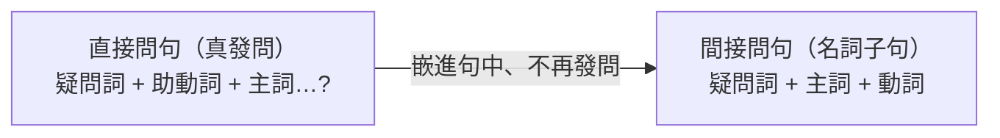

---
tags:
  - 文法/子句
  - 句型公式
  - 對比辨析
  - 圖表
  - 易錯點
source: https://app.notion.com/p/6430241b8c6945738f4a57243b4ac92b
difficulty: ⭐⭐
status: 學習中
style: 教學型重構
related: []
---

# 間接問句

<!-- 例句缺字與中譯已於 2026-07-15 回源 Notion「章節」子頁（直接問句及間接問句／間接問句的形成／特別注意的間接問句／練習）查證補齊 -->

> [!IMPORTANT]
> **一句話核心**
> 間接問句 = **疑問詞引導的名詞子句嵌入句中**。疑問詞放句中時，語序變回**直述句**（**疑問詞 + 主詞 + 動詞**）、去掉 do／does／did（**注意時態**）。**沒有疑問詞的 Yes/No 問句**改間接要用 **whether／if（是否）** 引導。標點符號**以主要子句為準**。

---

## 🧭 間接問句是什麼？——把問句塞進句子當名詞

一個問句，除了單獨站著直接發問，也能被「塞進」另一句話裡、當成一個名詞（名詞子句）用：
- **直接問句**（＝ WH 問句，真的在發問）：Who **is** that tall girl?（那高個子的女孩是誰？）
- **間接問句**（問句被嵌進句中、不再發問）：I have no idea **who that tall girl is**.（我不知道那高個子的女孩是誰。）

關鍵在——**間接問句「不是真的在問」**，它只是把問句的內容當名詞嵌進句子。既然不發問，就**不需要問句的倒裝語序**，於是語序變回**直述句**：疑問詞 + 主詞 + 動詞，並把只為發問而生的 do／does／did 去掉。

**三個轉換動作：**
1. **疑問詞留在子句開頭**——它同時兼當**連接詞**，把子句接進主要子句。
2. **語序變回直述句**：疑問詞 + 主詞 + 動詞。
3. **去掉 do／does／did**，但時態要**還原到動詞上**（did → 動詞用過去式）；有中文義的 didn't 與助動詞 can/will/must 則保留。

> [!WARNING]
> - 間接問句是**名詞子句**；疑問詞同時扮演**連接詞**。
> - 疑問詞放句中時，真正目的**不是發問**，故後面接**肯定句／否定句**（直述語序）。
> - **標點以主要子句為準**：主要子句是直述句 → 句號；是問句 → 問號。

---

## 📐 間接問句的形成

照著上面三個動作走，依子句裡的動詞情況分成幾種：

### be 動詞：疑問詞 + 主詞 + be
- I don't know **what this is**.（我不知道這是什麼。← What **is** this?）
- **修飾主詞的分詞片語要跟著主詞一起移到 be 前**：Do you know **who the girl standing at the door is**?（你知道站在門口的女孩是誰嗎？the girl standing at the door 整個是主詞、standing… 是補充說明非現在進行式）

### 一般動詞：疑問詞 + 主詞 + 一般動詞（注意時態，去 do／does／did）
- Where **does** she live?（她住在哪裡？）→ Let me know **where she lives**.（讓我知道她住在哪裡。）——沒助動詞 → 三單加 s
- When **did** they leave for Australia?（他們何時前往澳洲？）→ We'd like to know **when they left** for Australia.（我們想知道他們是何時前往澳洲的。）——did 去掉 → 動詞用過去式 left
- ⚠️ **有中文義的 didn't 不可去**：Why **didn't** you go to the office by bus?（你為何沒搭公車上班？）→ Please tell me why you **didn't** go to the office by bus.（請你告訴我你為何沒搭公車上班。）——didn't ＝「沒有」，保留

### 助動詞（can／will／must 有獨立意義，保留）：疑問詞 + 主詞 + 助動詞 + 原形
- How **can** the little boy move the large box?（這小男孩如何能搬動這大箱子？）→ I wonder **how the little boy can move** the large box.（我想知道這小男孩如何能搬動這大箱子。）——can 表「能力」有獨立意義，保留
- Please tell me why I **must take care of** the little girl.（請告訴我為什麼我必須照顧這小女孩。）——must ＝「必須」，保留

### 疑問詞本身即主詞：疑問詞 + 動詞（直接照抄）
疑問詞如果本來就是主詞，子句語序早就是「主詞 + 動詞」了，**不必再調整**（同 [[06 WH 問句、祈使句、感嘆句]] 疑問詞當主詞不倒裝）。
- What happened to you?（你怎麼了？）→ Will you let me know **what happened to you**?（請你讓我知道你怎麼了，好嗎？）
- Who broke the antique vase?（誰打破那個古董花瓶？）→ Do you know **who broke the antique vase**?（你知道是誰打破那個古董花瓶嗎？）

---

## ⚠️ 特別注意

### do you think／guess／say／imagine → 疑問詞提到句首
> 這類動詞問的是**想法**（不能答 Yes/No），故疑問詞要提到**最前面**。

- 直接問句 Who will be sent to the United States?（誰會被派去美國呢？）＋ Do you think?：
  - ❌ Do you think **who** will be sent to the United States?（助動詞開頭 → 只能答 Yes/No，但問的是「誰」，矛盾）
  - ✅ **Who do you think** will be sent to the United States?（你認為誰會被派去美國呢？）→ 答：I think (that) it will be Tom.（我認為是湯姆。）
- 對照：**Do you know** what the answer is?（你知道答案是什麼嗎？答 Yes/No）vs **What do you think** the answer is?（你認為答案是什麼？答想法：I think the answer is A.）
- 💡 **想知道什麼，就把那個疑問詞提到最前面。**

### 名詞片語：疑問詞 + to V（該…）
- The poor girl doesn't know **what to do**.（這可憐的女孩不知道她該做什麼。= what she has to do；have to = should = must）
- Do you know **where to go**（該去哪？）／**who to ask**（該問誰？）／**how to do it**（該如何做？）?（**how to do it** 有 it 指特定事物、**what to do** 無）
- **疑問詞 + to V 可當主詞／補語／受詞**（視為單數）：**Who to bell the cat** is a big problem.（誰來擔當這危險的任務是個大問題。）／The problem is **who to bell the cat**.（問題是誰來擔當危險的任務。）／We don't know **who to bell the cat**.（我們不知道誰來擔當危險任務。）——bell the cat ＝擔當危險任務（出自童話故事）

> [!NOTE]
> **wh- to V 的簡化條件　💬 AI 補充**
> 改寫自外部文章 [happyfish〈wh- to V〉](https://happyfish.blog/pattern-what-to-v/)（第三方文章）。
>
> 「wh- + to V」是一種**壓縮**寫法——把「疑問詞 + 主詞 + should／can + 動詞」整串縮成「疑問詞 + to V」。壓縮時丟掉了**主詞**與 **should／can** 兩樣東西；要能還原，就得滿足對應的兩個條件（**缺一不可**）。
>
> **①子句主詞 ＝ 主要子句的主詞（或受詞）**：`to V` 沒寫主詞，讀者只能回主要子句找「這動作是誰做的」；同一人才省得掉。
> - ✅ I don't know what **I** should do. → I don't know **what to do**.（前後都是 I）
> - ✅ 對到受詞也算：Tell **me** what I should do. → Tell me **what to do**.（做事的是 me）
> - ❌ I don't know what **he** should do.（主要子句是 I、子句是 he，不同人）→ **不可**簡化，否則寫成 what to do 會被讀成「**我**該做什麼」，把 he 弄丟。
>
> **②子句含 should／can（「該／能」這一類，含同義的 ought to／have to／must）**：`to V` 這形式天生帶「該／能」的意味（what to do ＝「該做什麼」），只有這類助動詞代得掉。
> - ✅ knew what he **could** do → knew **what to do**；knew where they **should** go → knew **where to go**；wonders when he **can** pop the question → wonders **when to pop the question**（何時求婚）。
> - ❌ knew what he **would** do（would ＝將要，不是該／能）、knew what he **did**（過去式、無助動詞可代）→ 皆**不可**簡化。

### Yes/No 問句 → whether／if（是否）引導
> Yes/No 問句沒有疑問詞，改間接會失去「嗎」的疑問 → 必須加 **whether／if** 來扛「是否」這個問。句型：`whether／if + 主詞 + 動詞`。

- Will he buy the convertible?（他要買那輛敞篷車嗎？）→ I don't know **whether／if he will buy** the convertible.（我不知道他是否要買那輛敞篷車。）
- Is it convenient for you to drive me home?（你載我回家方便嗎？）→ I'd like to know **whether／if it is convenient** for you to drive me home.（我想知道你載我回家是否方便。）

---

## ⚠️ 易錯點分析

> [!WARNING]
> **常見錯誤（皆為來源整理的重點）**
> - 間接問句語序＝**直述句（疑問詞 + 主詞 + 動詞）**，不是問句語序。
> - 去 do／does／did 但**注意時態**（did → 動詞用過去式 left）；**有中文義的 didn't 保留**。
> - 助動詞 **can／will／must 保留**（有獨立意義）。
> - **疑問詞本身當主詞 → 直接照抄**（what happened / who broke）。
> - **do you think 類 → 疑問詞提到句首**（不能答 Yes/No）。
> - **Yes/No 問句的間接問句用 whether／if**。
> - 標點符號**以主要子句為準**。

---

## 📝 來源練習
> 謝孟媛課程「練習」子頁原題（中文出題、英文作答）。

1. 你認為人類如何能解決污染問題呢？→ **How do you think** people can solve pollution problems?（先想 ❌ Do you think how…；問的是方法，故疑問詞提前）
2. 我不知道他們何時會達成目標。→ I don't know **when they will achieve** the goal.
3. 請告訴我們哪裡可以買到手工皮鞋。→ Please tell us **where to buy** hand-made shoes.（名詞片語：疑問詞 + to V，無主詞；hand-made 手工的）
4. 讓我知道他是不是愛上 Amy 了。→ Let me know **whether／if he fell in love with** Amy.（fall in love with + 人＝愛上某人）
5. 你猜誰要舉辦音樂會？→ **Who do you guess** will hold a concert?（Do you guess 要答 Yes/No，故疑問詞提前）

---

## 🔗 延伸與對比
- 相關主題：[[06 WH 問句、祈使句、感嘆句]]（直接問句）、[[15 附加問句]]、[[08 不定詞]]（疑問詞 + to V）、[[17 關係代名詞]]（另一種名詞後子句）

---

## 🧠 自我測驗　💬 AI 補充
> 複習時作答，答完再看下方答案。（此區為 AI 出題，非來源內容）

- [ ] Q1：改間接：Where does he live? → I don't know ___.
- [ ] Q2：改間接：When did the movie start? → Tell me ___.
- [ ] Q3：改間接：Is she a doctor? → I wonder ___.
- [ ] Q4：改正：Do you think who will win?
- [ ] Q5：簡化成 wh- to V：I don't know what I should do.

✅ 解答

A1：I don't know **where he lives**.（無助動詞 → 三單加 s）
A2：Tell me **when the movie started**.（did 去掉 → 動詞用過去式 started）
A3：Yes/No 問句 → whether/if：I wonder **whether／if she is a doctor**.
A4：think 問想法、疑問詞提前 → **Who do you think** will win?
A5：主詞相同＋含 should → I don't know **what to do**.

