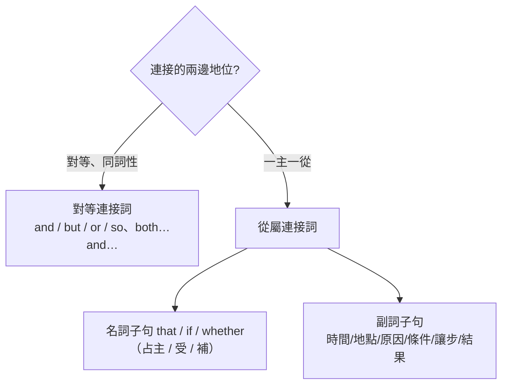

---
tags:
  - 文法/連接詞
  - 句型公式
  - 對比辨析
  - 圖表
  - 易錯點
source: https://app.notion.com/p/c8c4f666d3e1405295ee7b2a42ff0a73
difficulty: ⭐⭐⭐
status: 未讀
style: 教學型重構
related: []
---

# 連接詞

<!-- 例句缺字與中譯已於 2026-07-15 回源 Notion「章節」子頁（連接詞總類／連接詞的功能）查證補齊；as 倒裝、whether/if 兩則 💬 另回原文章查證 -->

> [!IMPORTANT]
> **一句話核心**
> 連接詞連接**單字／片語／子句**，分兩大類：**對等連接詞**（and／but／or／so 與相關連接詞，連接**同詞性**、地位對等者）與**從屬連接詞**（引導**名詞子句** that／if／whether，或**副詞子句** 時間／地點／原因／條件／讓步／結果）。對等連接詞放句中、連兩子句時前加逗號；**從屬連接詞放句首時中間加逗號**；**副詞子句**在主要子句為未來式時要用**現在式**。

---

## 🗺️ 兩大類：看「連接的兩邊地位平不平等」

連接詞把單字、片語或子句接起來。選哪一類，先看它連的兩邊**地位平不平等**：

- **對等連接詞**：連接**同詞性、地位對等**的東西——單字接單字、子句接子句，兩邊平起平坐（and／but／or／so 與 both…and 等相關連接詞）。
- **從屬連接詞**：連一個**主要子句**和一個**從屬子句**——從句被「降級」成主句的一個成分：當名詞（名詞子句，占主／受／補）或當修飾語（副詞子句）。

兩個標點習慣先記：對等連接詞連兩子句時**前面加逗號**；**從屬連接詞放句首時，主從句中間加逗號**。

---

## 🔗 對等連接詞（連接同詞性；主詞/動詞重複可省略，so 除外）

### and／but／or／so
- **and**（和／並且／那麼；連貫、一致）：We can have fresh air **and** enjoy beautiful scenery.（我們可以呼吸新鮮空氣並享受美麗的風景。）
- **but**（但是；相反、對比）：The little girl fell down **but** didn't cry.（那小女孩跌倒了，但沒有哭。）
- **or**（或者／否則；選擇或警告）：What would you prefer, coffee **or** tea?（你比較喜歡哪一種，咖啡或茶？）／Go to the shop at once, **or** it will be closed.（立刻去那家店，否則它要打烊了。）
- **so**（所以；⚠️ **只能連兩個子句**、**不可省重複**、**不可連單字片語**）：Some people never think of the future, **so** they only use things once and throw them away.（有些人從不考慮未來，所以東西只用一次就丟棄。）
- ⚠️ **祈使句後**：and＝「那麼」（動作連貫，Go to that bookstore, **and** you'll find foreign books. 去那家書店，你就會找到外文書。）、or＝「否則」（警告）。
- ⚠️ **because 和 so 不可同時出現**（一個連接詞就夠）。

### 對等相關連接詞（連兩主詞時，動詞依「後者」；both…and 除外）
> 記法：**動詞看「最靠近它」的那個主詞（就近原則）**——not only…but also、either…or、neither…nor 都取後者；只有 **both…and** 固定用複數、**as well as** 回頭強調前者 A。

| 相關連接詞 | 意思 | 連兩主詞時動詞 |
| --- | --- | --- |
| both … and | 兩者都 | **複數** |
| not only … but (also) | 不僅…而且 | **後者** |
| either … or | 不是…就是 | **後者** |
| neither … nor | 兩者都不 | **後者** |
| A **as well as** B | A 和 B（**強調前者 A**） | 依 **A**（前者） |

- Both French and German **are** spoken in this region.（這個區域說法文和德文。）／Not only I but also they **are** angry with you.（不僅我，連他們也生你的氣。依後者 they）／Either you or I **am** in the right.（不是你就是我對。依後者 I）／Neither my mother nor I **was** listening to the news on TV.（不是我媽，也不是我在收聽電視新聞。依後者 I）／Mr. Wang **as well as** the students **was** late for class.（不僅學生，就連王老師上課也遲到。依前者 Mr. Wang）

---

## 📎 從屬連接詞（引導名詞子句／副詞子句）
> 連接一個主要子句與一個從屬子句（**沒有連接詞的是主要子句**）——從句被「降級」成主句的一個成分。**從屬連接詞放句首時，中間加逗號**隔開主從句。

### 名詞子句（把整個子句當一個名詞：主詞／補語／受詞）
**that + 主詞 + 動詞**（that 無中文義，純連接）：
- **當主詞**（常用假主詞 it）：That she will come is almost certain. = **It** is almost certain **that** she will come.（幾乎可確定她會來。）
- **當補語**（be 動詞後，**that 不可省**）：The trouble is **that** I have no money with me.（麻煩的事是我身上沒有錢。）
- **當受詞**（一般動詞後，**that 可省**）：He says **(that)** he is thinking of moving his office from Taipei to Kaohsiung.（他說他正考慮把辦公室從台北搬到高雄。）
- ⚠️ and／but 連兩個 that 子句時：**第 1 個 that 可省、第 2 個不可省**（避免誤會第二句非同一人所說）：Mother said (that) you stayed home **and that** you had to do all housework.（媽媽說你待在家，並且說你必須做所有家事。）
- **當同位語**：I heard **the news that** a new student would join our class.（我聽到消息說我們班將有一名新生。）

**if／whether（是否）+ 主詞 + 動詞**：
- 當**主詞／補語** → **只能用 whether、不可用 if**：**Whether** he will come or not makes no difference.（他是否會來沒有差別。= It makes no difference whether he will come or not.）
- 當**受詞** → whether ＝ if：He asked me **if／whether** it would be fine tomorrow.（他問我明天是否是好天氣。）

> [!NOTE]
> **whether 不可用 if 取代的情形　💬 AI 補充**
> 改寫自外部文章 [apex〈whether/if〉](https://apex.get.com.tw/blog/post.aspx?ip=3646)：**可互換**＝子句當「動詞受詞」或接在「不確定意涵的形容詞」後；**只能 whether**＝子句當**主詞**、**同位語**、**介系詞受詞**，或**簡化成不定詞**（whether **to** V）。

### 副詞子句（把子句當修飾語，補充主句的時間、原因…）
> [!WARNING]
> **時態表現**：主要子句**現在式**→副詞子句現在式；**過去式**→過去式；**未來式**→副詞子句用**現在式**。（此規則只適用**副詞子句**；名詞子句依實際時間表現。）

| 語意 | 常用連接詞 |
| --- | --- |
| 時間 | after、as、before、since、until／till、when、while、as soon as |
| 地點 | where |
| 原因 | because、since、as（語氣 because ＞ since ＞ as） |
| 條件 | if |
| 讓步 | though、although、whether…or not、as |
| 結果／目的 | so…that、so that |

- **時間**：After I tell you the answers, please repeat them after me loudly.（在我告訴你們答案之後，請大聲地跟我覆誦一遍。）／**while** 引導的子句常用**進行式**（While I was sleeping, there was noise outside. 當我正在睡覺時，外面起了一陣噪音。）。
- **地點**：**Where** there is a will, there is a way.（有志者事竟成；字面「有意志的地方就有路」。where 不譯「哪裡」，仍表地點）。
- **原因**：⚠️ **because 與 so 不可同時**；**Why 問句要用 because** 回答（Why is he absent? → **Because** he is ill. 他為何缺席？因為他生病。）；**not because … but because**（不是因為…而是因為）只能用 because：He is absent **not because** he is busy **but because** he is ill.（他缺席不是因為忙，而是因為生病。）
- **條件**：If you keep eating fast food, you'll taste the bitter fruits before long.（如果你繼續吃速食，不久你將嚐到苦果。主要子句未來式 → if 子句用**現在式**）。
- **讓步**：**though／although**（雖然，**不與 but 同時**）：Though Taiwan is small, I love it.（台灣雖然不大，但我愛它。though／but 只能擇一）；**whether…or not**（無論是否）：Whether it rains or not, the final games will be played.（不論下雨與否，決賽都將舉行。）；**as**（雖然，需**倒裝**）：Teacher **as** she is, she isn't patient with children.（她雖然是老師，對小朋友卻沒耐心。= Although she is a teacher…）。
- **結果／目的**：**so…that**（如此…以致於，= too…to）：It was **so** heavy **that** we couldn't move it. = It was **too** heavy for us **to** move.（這東西太重，我們搬不動。）／**such a + 形容詞 + 名詞** = **so + 形容詞 + a + 名詞**：It was **such a cool** hairstyle that I want to imitate it. = It was **so cool a** hairstyle that I want to imitate it.（好酷的髮型，我想模仿。）

> [!NOTE]
> **as 當「雖然」的倒裝句型　💬 AI 補充**
> 改寫自外部文章 [happyfish〈as 當雖然〉](https://happyfish.blog/as-mean-although/)：把要強調的**名詞（去冠詞）／形容詞／副詞**移到 as 前：
> - **N（無冠詞）+ as + S + be**：**Child as** Leon is, he is fearless.（雖然 Leon 是孩子，他卻無所畏懼。）
> - **Adj + as + S + be/連綴動詞**：**Frightened as** Mike was, he tried to remain calm.（儘管 Mike 很害怕，他仍努力保持冷靜。）
> - **Adv + as + S + 一般動詞**：**Hard as** the student studied, he failed.（儘管這學生努力讀書，仍沒能通過。不可用 hardly）
> - **Try as + S + may/might**：**Try as** you may, you will find this puzzle extremely challenging.（儘管你努力嘗試，仍會發現這謎題極具挑戰。）

---

## ⚠️ 易錯點分析

> [!WARNING]
> **常見錯誤（皆為來源整理的重點）**
> - 對等連接詞連兩子句時**前加逗號**；**so 只連子句、不可省重複、不可連單字片語**。
> - **相關連接詞連兩主詞以「後者」為準**（both…and 用複數；**as well as 強調前者**）。
> - **because 與 so 不可同時**；**though／although 不與 but 同時**（一句一個連接詞）。
> - 名詞子句 that：**主詞/補語不可省、受詞可省**；並列時**第 2 個 that 不可省**。
> - **whether 當主詞/補語/介系詞受詞/接不定詞時不可用 if**。
> - **副詞子句**：主要子句未來式時，副詞子句用**現在式**。

---

## 🔗 延伸與對比
- **外部延伸閱讀**（第三方文章，非謝孟媛講義）：
  - [whether 不可用 if 取代的情形](https://apex.get.com.tw/blog/post.aspx?ip=3646)（重點已折入 💬）
  - [as 當「雖然」的用法](https://happyfish.blog/as-mean-although/)（重點已折入 💬）
- 相關主題：[[18 間接問句]]（whether／if 名詞子句）、[[08 不定詞]]（so…that = too…to）、[[07 比較]]（as…as）、[[17 關係代名詞]]（另一種子句）

---

## 🧠 自我測驗　💬 AI 補充
> 複習時作答，答完再看下方答案。（此區為 AI 出題，非來源內容）

- [ ] Q1：填動詞：Either you or he ___ (be) wrong.
- [ ] Q2：改錯：Because I was tired, so I went to bed early.
- [ ] Q3：填時態：I will call you when I ___ (arrive) home.
- [ ] Q4：that 可否省略？The fact ___ he lied is clear.（並說明）
- [ ] Q5：把 Although he is rich, he is unhappy. 用 so…that？不，改成 as 倒裝的讓步句。

✅ 解答

A1：either…or 依後者 he → **is**。
A2：because 與 so 不可同時 → 去掉 so：Because I was tired, I went to bed early.（或 I was tired, so I went to bed early.）
A3：主要子句未來式 → 副詞子句用現在式 → **arrive**。
A4：這是**同位語** that（The fact that he lied）→ **不可省略**。
A5：**Rich as** he is, he is unhappy.（形容詞 rich 提前 + as）。

